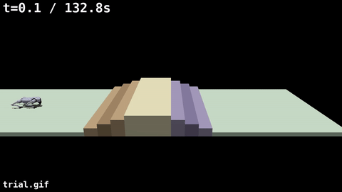
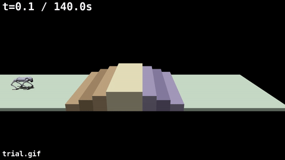
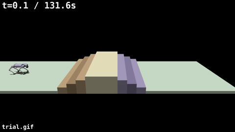
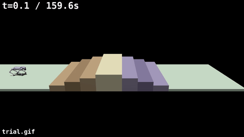
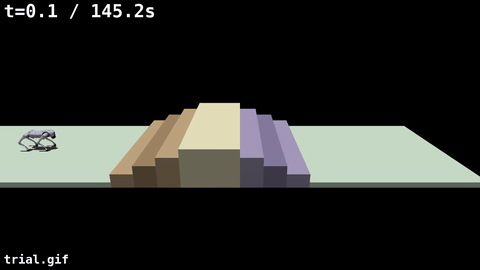
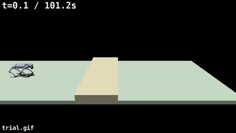
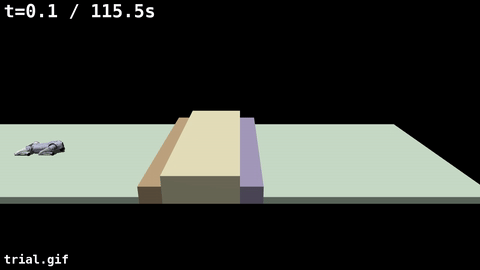
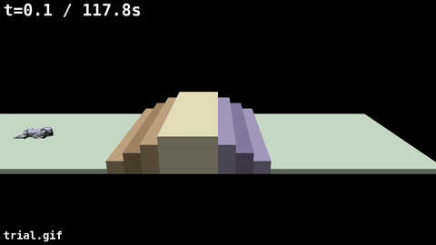
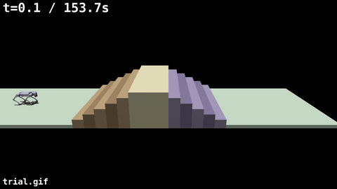
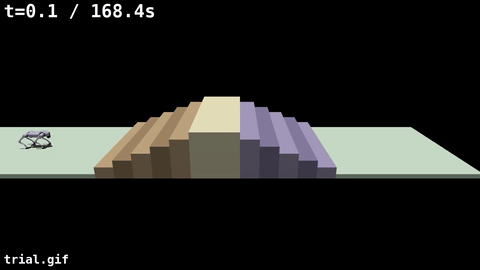

# MPC Dog

Go2 を Quad-SDK の NMPC で歩かせる。いま記録している地形は、平面、穴、階段の3系統である。各系統は制御を固定し、地形の変数だけを変える。GIF は、その条件の代表1本である。成功が無い階段だけ、1回目の失敗を置く。

開発の経緯は [DEVELOPMENT.md](./DEVELOPMENT.md) にある。環境構築は [Step 01](./agent_reports/step01/quad_sdk_environment_and_step01.md) にある。

歩容は3系統とも `external/quad-sdk/quad_utils/config/go2.yaml` のクロールである。周期 0.90 s、接地割合 0.75、位相 `[0.0, 0.75, 0.5, 0.25]`。

## 平面

制御は穴と同じ stop-only で、速度は 0.30 m/s である。world は `flat_wide.xml`、初期 x は 0 m、指令時間は 22 s である。

stop-only は `local_planner.yaml` の `multistep_planner.enabled: true`、`apply_stop_request: true`、`apply_foothold: false`、`edge_clearance: 0` である。一括で入れる処理は `scripts/trial/allscenarios_record.sh` にある。

```bash
SPAWN_X_M=0.0 GAP_WORLD=flat_wide.xml GAP_TAG=allrec_flat \
  FORWARD_VEL_MPS=0.30 DURATION_S=22 \
  bash scripts/trial/run_quadsdk_gap_1m.sh
```


## 穴

制御は平面と同じ stop-only とクロールである。変えるのは world、初期 x、指令時間、速度である。速度の既定は 0.30 m/s で、最後の1本だけ 0.50 m/s である。

```bash
SPAWN_X_M=<spawn> GAP_WORLD=<world> GAP_TAG=<tag> \
  FORWARD_VEL_MPS=<vel> DURATION_S=<duration> \
  bash scripts/trial/run_quadsdk_gap_1m.sh
```

回帰の記録は [Step 16](./agent_reports/steps/step_16_multistep_terrain_planner_full_regression.md) にある。

| 地形 | world | 初期 x | 秒 | 速度 | 結果 |
| --- | --- | ---: | ---: | ---: | --- |
| 幅 0.30 m の溝を間隔 2.0 m で複数本 | `flat_gaps_2m.xml` | 0 | 34 | 0.30 | 通過 |
| 15 cm の平地と 15 cm の穴を5本 | `flat_repgap_s15g15n5.xml` | 0 | 34 | 0.30 | 通過 |
| 単独トレンチ 15 cm | `flat_trench_s09_15.xml` | -2 | 28 | 0.30 | 通過 |
| 単独トレンチ 25 cm | `flat_trench_s09_25.xml` | -2 | 28 | 0.30 | 通過 |
| 単独トレンチ 30 cm | `flat_trench_s09_30.xml` | -2 | 28 | 0.30 | 通過 |
| 単独トレンチ 35 cm | `flat_trench_s09_35.xml` | -2 | 28 | 0.30 | 通過 |
| 単独トレンチ 50 cm | `flat_trench_s09_50.xml` | -2 | 26 | 0.30 | 手前で直立停止 |
| 単独トレンチ 100 cm | `flat_trench_s09_100.xml` | -2 | 26 | 0.30 | 手前で直立停止 |
| 15 cm 穴の連続のあと 1 m 穴 | `flat_repgap_s15g15n3_last100.xml` | 0 | 36 | 0.30 | 1 m 穴の手前で直立停止 |
| 単独トレンチ 30 cm | `flat_trench_s09_30.xml` | -2 | 24 | 0.50 | 落下 |

幅 0.30 m の溝を間隔 2.0 m で複数本。通過。


15 cm の平地と 15 cm の穴を5本。通過。


単独トレンチ 15 cm。通過。


単独トレンチ 25 cm。通過。


単独トレンチ 30 cm、0.30 m/s。通過。


単独トレンチ 35 cm。通過。


単独トレンチ 50 cm。手前で直立停止。


単独トレンチ 100 cm。手前で直立停止。


15 cm 穴の連続のあと 1 m 穴。1 m 穴の手前で直立停止。


単独トレンチ 30 cm、0.50 m/s。落下。


## 階段

制御は基準状態である。速度は 0.10 m/s、`PLAN_STARTUP_S=8`、`HOLD_S=5` である。`swing_terrain_check_mode` は `enforce`、`foothold_support_check_mode` は `shadow`、段端後退と支持三角形と前足の奥置きは `"off"` である。穴の stop-only とは別の設定である。

変えるのは高さ、踏面、上りと下りの段数である。world 名の `h10` は高さ 10 cm、`h12p5` は 12.5 cm、`d39` は踏面 39 cm、`n04` は上り4段と下り4段である。world は `external/quad-sdk/quad_simulator/quad_sim_scripts/worlds/` にある。

成功は、転倒前の最大 x が下り終端の 1.50 m 先以上で、終了の横ずれが 0.50 m 未満、高さが 0.20 m より大きく、ロールとピッチの絶対値が 0.50 rad 未満であることである。詳細は [Step 23 第17章](./agent_reports/steps/step_23_stair_robustness.md) にある。

```bash
QUADSDK_OVERLAY_SETUP=/tmp/mpc_dog_stack_release_install/setup.bash \
  PLAN_STARTUP_S=8 FORWARD_VEL_MPS=0.10 HOLD_S=5 \
  GAP_WORLD=<world> GAP_TAG=<tag> DURATION_S=<duration> \
  bash scripts/trial/run_quadsdk_stairs.sh
```

| 高さ | 踏面 | 段数 | world | 秒 | 結果 |
| ---: | ---: | --- | --- | ---: | --- |
| 10 cm | 39 cm | 上り4＋下り4 | `jp_stair_matrix_h10_d39_n04.xml` | 110 | 成功 |
| 10 cm | 30 cm | 上り4＋下り4 | `jp_stair_matrix_h10_d30_n04.xml` | 101 | 成功 |
| 12.5 cm | 39 cm | 上り4＋下り4 | `jp_stair_matrix_h12p5_d39_n04.xml` | 110 | 成功 |
| 12.5 cm | 30 cm | 上り4＋下り4 | `jp_stair_matrix_h12p5_d30_n04.xml` | 101 | 成功 |
| 15 cm | 60 cm | 上り4＋下り4 | `jp_stair_matrix_h15_d60_n04.xml` | 130 | 失敗 |
| 15 cm | 39 cm | 上り4＋下り4 | `jp_stair_matrix_h15_d39_n04.xml` | 110 | 失敗 |
| 15 cm | 30 cm | 上り1＋下り1 | `jp_stair_matrix_h15_d30_n01.xml` | 72 | 成功 |
| 15 cm | 30 cm | 上り2＋下り2 | `jp_stair_matrix_h15_d30_n02.xml` | 82 | 成功 |
| 15 cm | 30 cm | 上り4＋下り4 | `jp_stair_matrix_h15_d30_n04.xml` | 101 | 失敗 |
| 15 cm | 30 cm | 上り6＋下り6 | `jp_stair_matrix_h15_d30_n06.xml` | 120 | 成功 |
| 15 cm | 39 cm | 上り6＋下り6 | `jp_stair_matrix_h15_d39_n06.xml` | 135 | 失敗 |

高さ 10 cm、踏面 39 cm、上り4＋下り4。成功。


高さ 10 cm、踏面 30 cm、上り4＋下り4。成功。



高さ 12.5 cm、踏面 39 cm、上り4＋下り4。成功。



高さ 12.5 cm、踏面 30 cm、上り4＋下り4。成功。



高さ 15 cm、踏面 60 cm、上り4＋下り4。失敗。1回目。



高さ 15 cm、踏面 39 cm、上り4＋下り4。失敗。1回目。



高さ 15 cm、踏面 30 cm、上り1＋下り1。成功。



高さ 15 cm、踏面 30 cm、上り2＋下り2。成功。



高さ 15 cm、踏面 30 cm、上り4＋下り4。失敗。1回目。



高さ 15 cm、踏面 30 cm、上り6＋下り6。成功。



高さ 15 cm、踏面 39 cm、上り6＋下り6。失敗。1回目。



## Quadruped-PyMPC

別系統の記録は [DEVELOPMENT.md](./DEVELOPMENT.md) の末尾にある。
