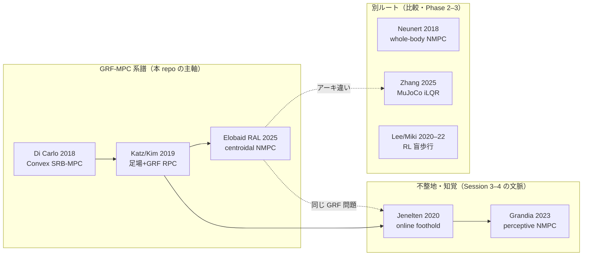

# mpc_dog — 四足 MPC ワークショップ & OSS 選定リポジトリ

四足ロボット（Unitree Go2）の **GRF · MPC · WBC** を、実機実績のある OSS で学習・デモ・コンサル説明するためのリポジトリです。

論文デモの単純再現ではなく、**実機実績 · 活発メンテ · 2024–2026 技術** を満たすスタックを選び、再現可能な教材（Notebook・GIF・パラメータスタudy）まで一式を揃えています。

---

## このリポジトリの位置づけ（OSS との関係）

### 上流 OSS 単体では何ができるか

[Quadruped-PyMPC](https://github.com/iit-DLSLab/Quadruped-PyMPC) を clone し、README に従って **acados ビルド・依存インストール** を済ませれば、MuJoCo 上で Go2 の **trot + SRB-MPC + 足場最適化 + WBC 相当層** が動きます。  
標準シーン（`flat` / `random_boxes` / `perlin` 等）での sim は上流だけで可能です。

**ただし「何もしなくても走る」わけではありません。** submodule・acados codegen・環境変数など、初回セットアップは必須です。

### mpc_dog が追加したもの（＝「発展」の中身）

新しい MPC アルゴリズムや WBC の研究実装を追加したリポジトリ **ではありません**。  
上流 PyMPC の制御コアはそのままに、**コンサル・2 日ワークショップ向けの統合・小拡張・試行錯誤の記録** を載せています。

| レイヤ | mpc_dog の追加 | 制御技術としての新規性 |
|--------|----------------|------------------------|
| **環境** | `uv` + `setup_uv_workshop.sh` + `.env.workshop` | なし（再現性のため） |
| **設定** | YAML preset → `config.py` パッチ（Session 1–4） | なし（教材用ワークフロー） |
| **地形** | `workshop_terrain.py` — `bumpy_flat` / `uphill` / `downhill` | 小（Perlin + 勾配のカスタムシーン登録） |
| **sim API** | `pympc_lab.py` — headless sim、**resilient モード**（転倒 reset + 累積距離） | 小（評価・デモ用ラッパー） |
| **試行錯誤** | Session 4: 5 kph × 凸凹坂の no-fall / resilient 探索と JSON ログ | なし（既存パラメータの調整記録） |
| **教材** | Notebook 00–11、GIF/MP4、20 シナリオ lab、QA マスタ | なし（説明・体感用） |

**一言で言うと:**  
上流 OSS（**acados 勾配 MPC + 足場最適化**）を土台に、**ワークショップ基盤（uv / preset / 教材）** と **Session 4 向けの小さな sim 拡張（凸凹坂地形・resilient 評価）** を足し、**中身の理解とパラメータ試行錯誤** を体系化したリポジトリです。

制御スタック自体の「次世代化」（Whole-body iLQR、OCS2 perceptive NMPC 等）は [docs/stack_selection.md](docs/stack_selection.md) に **Phase 2–3 候補** として整理しており、本 repo のメイン実装には含めていません。

---

## 活用している論文・技術

**mpc_dog 自身が論文アルゴリズムを新規実装しているわけではありません。**  
ワークショップで実際に sim を回しているのは `external/Quadruped-PyMPC` のコードであり、以下がその技術的出所です。

### ワークショップ sim で **実際に使っている** 技術

| 層 | 技術 | 論文・出典 | 本 repo での使い方 |
|----|------|------------|-------------------|
| **MPC（主経路）** | SRB **centroidal NMPC**（acados 勾配法） | Elobaid et al., **RAL 2025** — [Adaptive Non-linear Centroidal MPC with Stability Guarantees](https://arxiv.org/abs/2409.01144)（IIT DLS Lab + Honda R&D） | preset の `mpc_params.type: nominal`（Session 1–4 の既定）。最適化変数 = **GRF 12 次元** + 摩擦円錐 |
| **足場計画** | 足場最適化（foothold optimization） | Katz, Di Carlo & Kim, **IROS 2019** — [Footstep and GRF simultaneous optimization](https://doi.org/10.1109/IROS40897.2019.8968031)（MIT Cheetah 系） | Session 3–4 で `use_foothold_optimization: true` |
| **下位制御（WBC 相当）** | Swing / Stance Leg Control | **GRF-MPC + 下位トルク変換** の定番構成（Di Carlo et al., **IROS 2018** — [MIT Cheetah 3 Convex MPC](https://doi.org/10.1109/IROS.2018.8594448) が源流） | PyMPC の stance 制御が GRF→関節τ。フル QP WBC 論文の再実装ではない |
| **求解器** | **acados**（RTI / SQP） | Houska et al. — acados プラットフォーム | PyMPC が centroidal モデルを codegen |
| **シミュレータ** | **MuJoCo** | DeepMind MuJoCo | Go2 モデル + 地形（flat / boxes / perlin / 本 repo 追加の `bumpy_*`） |

**ワークショップの説明軸:** 「Di Carlo 2018 系の **GRF を MPC で計画 → 下位で関節トルクへ**」という 3 層パイプラインを、**2024–2025 の centroidal NMPC 実装（Quadruped-PyMPC）** で触る、という位置づけです。

### 技術的に親しい論文（系譜・比較）

ワークショップ sim の **直接実装** 以外に、同じ問題意識・同じアーキテクチャ族として **説明・比較で必ずセットに語られる** 文献です。



| 関係 | 論文 | なぜ「親しい」か | 本 repo |
|------|------|------------------|---------|
| **直接の系譜** | Di Carlo et al., **IROS 2018** — [Cheetah 3 Convex MPC](https://doi.org/10.1109/IROS.2018.8594448) | **GRF を QP/MPC で計画** する現代四足制御の原点。摩擦円錐・SRB・WBC 分離の教科書 | 説明の起点（PyMPC も同系） |
| **直接の系譜** | Katz / Kim et al., **IROS 2019** — [Footstep + GRF RPC](https://doi.org/10.1109/IROS40897.2019.8968031) | Di Carlo の **足位置固定** を解く足場+力同時最適化。PyMPC の foothold opt の前史 | Session 3–4 で使用 |
| **直接の系譜** | Elobaid et al., **RAL 2025** — [Adaptive centroidal MPC](https://arxiv.org/abs/2409.01144) | Convex → **非線形 centroidal NMPC** + 安定性。Quadruped-PyMPC の gradient 経路 | Session 1–4 の主 MPC |
| **予測モデル** | Orin & Goswami, **Autonomous Robots 2008** — [Centroidal dynamics of a humanoid robot](https://doi.org/10.1007/s10514-008-9100-0) | **Centroidal momentum** 方程式の基礎。SRB / centroidal NMPC の数学的背景 | 理論 NB・WORKSHOP で言及 |
| **同系の別実装** | Bellicoso et al., **ICRA 2016** — [Optimization-based locomotion (ANYmal)](https://doi.org/10.1109/ICRA.2016.7487272) | Cheetah 系と並ぶ **GRF-MPC + 最適化歩行** の ANYmal 定番 | 比較（ETH 系の入口） |
| **WBC 相当** | Herzog et al., **IROS 2016** — [Momentum control with hierarchical QP](https://doi.org/10.1109/IROS.2016.7759332) | **GRF / 運動量 → 関節トルク** の QP 型 WBC。ANYmal 系の定番 | PyMPC Stance 制御の説明対比 |
| **不整地 MPC** | Jenelten et al., **RA-L 2020** — [Online foothold optimization](https://doi.org/10.1109/LRA.2020.3007427) | 標高マップ + **オンライン足場**。Session 3 の perlin/boxes の「次の段階」 | 比較・お客様 QA（未実装） |
| **不整地 MPC** | Grandia et al., **TRO 2023** — [Perceptive NMPC](https://doi.org/10.1109/TRO.2023.3275384) | 知覚制約を NMPC に埋込む **ETH 系の完成形**。OCS2 Phase 3 の理論的背景 | `external/ocs2_ros2` 参照 |
| **ロバスト Convex** | Xu et al., **TRO 2023** — [Robust Convex MPC](https://doi.org/10.1109/TRO.2023.3299527) | **μ 不確か性・荷重変動** への Convex MPC 拡張。Session 2 の `mu` チューニングの理論的隣接 | 比較（preset 調整のみ） |
| **Whole-body 代替** | Neunert et al., **RA-L 2018** — [Whole-body NMPC](https://doi.org/10.1109/LRA.2018.2800124) | SRB を使わず **全身 NMPC**。GRF 層を省略する別設計 | 比較 |
| **Whole-body 代替** | Zhang et al., **2025** — [Whole-Body MPC with MuJoCo](https://arxiv.org/abs/2503.04613) | MuJoCo 全身 + iLQR。**GRF/WBC なし** の最新 whole-body 路線 | Phase 2 候補 |
| **RL 代替** | Lee et al., **Sci. Robotics 2020** — [Learning over challenging terrain](https://doi.org/10.1126/scirobotics.abc5986) | **盲歩行 RL** の代表。MPC 不整地と対比される定番 | Notebook 11 QA 比較 |
| **RL 代替** | Miki et al., **Sci. Robotics 2022** — [Robust perceptive locomotion in the wild](https://doi.org/10.1126/scirobotics.abk2822) | エキスロボ系 **知覚統合 RL**。Grandia NMPC の RL 側対偶 | Notebook 11 QA 比較 |
| **求解基盤** | Houska et al. — **acados** ([IFAC 2019](https://doi.org/10.1016/j.ifacol.2020.12.332)) | リアルタイム NMPC の **コード生成 + RTI**。PyMPC gradient 経路の求解器 | ビルド必須 |
| **教育用 OSS** | [go2-convex-mpc](https://github.com/erwincoumans/go2-convex-mpc) | Di Carlo 2018 の **Go2 向け再実装**。Convex SRB-MPC を最短で触る入口 | 本 repo は採用せず（比較理由は stack_selection） |

**読み方:** 上表の **「直接の系譜」4 本** が、ワークショップ sim の技術的な「近い親戚」です。Jenelten → Grandia は不整地の **発展方向**、Lee/Miki は **別パラダイム（RL）**、Zhang/Neunert は **GRF 層を省略する whole-body** として、Notebook 11 のお客様 QA で並べて説明しています。

### PyMPC に含まれるが、**ワークショップ既定 preset では使っていない** 技術

| 技術 | 論文 | 切り替え方 |
|------|------|------------|
| **GPU Sample-Based Stochastic MPC**（JAX / MPPI・CEM） | Turrisi et al., **IROS 2024** — [On the Benefits of GPU Sample-Based Stochastic Predictive Controllers](https://arxiv.org/abs/2403.11383) | `mpc_params.type: sampling` · **Notebook 12–15** · preset `session0X_*_sampling` |
| **Lyapunov stable centroidal NMPC** | Elobaid et al., **RAL 2025** — [Adaptive centroidal MPC](https://arxiv.org/abs/2409.01144) | `mpc_params.type: lyapunov` · **Notebook 16–19** · preset `session0X_*_lyapunov` |

### **文献・比較用**（`external/` に clone、本 repo の sim パイプラインでは未実行）

| スタック | 代表論文 | 用途 |
|----------|----------|------|
| MuJoCo MPC + iLQR | Zhang et al., **2025** — [Whole-Body MPC with MuJoCo](https://arxiv.org/abs/2503.04613) | Phase 2 比較（GRF 層を省略した全身 MPC） |
| OCS2 Perceptive NMPC | Grandia et al. 系 — elevation map 統合 NMPC | Phase 3 拡張候補（ROS2） |

### mpc_dog 独自コードに対応する論文

**なし。** `workshop_terrain.py`・`pympc_lab.py`・Notebook / GIF / preset は **教材・評価ラッパー** であり、査読論文の新規アルゴリズム実装ではありません。

**詳細サーベイ:** [docs/quadruped_mpc_rl_survey.md](docs/quadruped_mpc_rl_survey.md) · **2 スタック比較:** [docs/top2_stack_comparison.md](docs/top2_stack_comparison.md)

---

## 概要

| 項目 | 内容 |
|------|------|
| **主目的** | お客様向けコンサルで「接地反力 → MPC → WBC」を 2 日で説明・デモできる状態にする |
| **採用 OSS** | [Quadruped-PyMPC](https://github.com/iit-DLSLab/Quadruped-PyMPC)（IIT DLS Lab、Unitree 実機実績） |
| **ロボット** | Unitree Go2（MuJoCo sim） |
| **環境管理** | [uv](https://github.com/astral-sh/uv)（Python 3.11、`.venv`） |
| **教材** | Notebook 00–11（nominal acados）+ **12–15（IROS 2024 sampling MPPI）** + **16–19（RAL 2025 Lyapunov MPC）** + GIF/MP4 |

**制御パイプライン（3 層）**

```
速度指令 / ゲイト (trot)
        ↓
MPC (SRB)  … 最適化変数 = 接地反力 GRF（12 次元）· 摩擦円錐
        ↓
WBC 相当   … Stance: GRF→関節τ / Swing: 足軌道+PD
        ↓
MuJoCo Sim
```

ADAS 操舵 MPC 経験者向けの対応: 車両モデル → SRB、タイヤ力 → **GRF**、下位実行 → WBC。

---

## 背景

### なぜこのリポジトリがあるか

- 四足制御の定番は **GRF-MPC + WBC** の 3 段構成だが、OSS は MuJoCo iLQR・Convex MPC 再実装・RL など選択肢が多く、**コンサルで説明しやすい実装** を選ぶ必要がある。
- [go2-convex-mpc](https://github.com/erwincoumans/go2-convex-mpc) 等の 2018 系再実装は教育向きだが、実機実績・不整地・2024 以降の技術更新が不足（詳細: [docs/stack_selection.md](docs/stack_selection.md)）。
- Quadruped-PyMPC は **acados 勾配 MPC + 足場最適化 + Unitree 実機** を公開しており、「摩擦円錐 → GRF → 関節トルク」の流れをそのまま説明できる。

### 採用スタック（優先順）

| 優先 | スタック | 先端性 | 安定性 | 本リポジトリでの位置づけ |
|------|----------|--------|--------|--------------------------|
| **★1** | Quadruped-PyMPC | acados MPC + 足場 opt | Unitree 実機、IROS'24/RAL'25 | **メイン・ワークショップ土台** |
| **★2** | mujoco_mpc + deploy | Whole-body iLQR | DeepMind / CMU、Go2 実機 | Phase 2 拡張候補 |
| **★3** | ocs2_ros2 + quadruped_ros2_control | ETH OCS2 NMPC | ROS2 産業向け | 知覚統合 NMPC 拡張候補 |

---

## 目的

1. **学習:** GRF / MPC / WBC の役割を数式・Notebook・sim 結果で理解する  
2. **チューニング:** `mu` / `step_freq` / 足場 opt 等を変え、**成功と失敗のパターン** を体感する  
3. **デモ:** 平坦 → パラメータ変更 → 不整地の順で、計算結果（GIF・グラフ）を見せながら説明する  
4. **再現:** uv 環境 + 1 コマンド（`run_workshop_pipeline.py`）で教材を再生成できる

**非目標:** 実機 ROS2 デプロイ、RL 実装、acados 内部モデル編集（参考リンクのみ）

### 学習 Notebook（`notebook/`）の合否

進め方の正本は [docs/block-curriculum/00_README.md](docs/block-curriculum/00_README.md) §3.8 である。ワークショップ教材（`docs/pympc_2day/`）とは別系列。

| 段 | 連続時間 | 歩行 | ゲイト |
|---|---|---|---|
| `notebook/00`–`04` | \(\ge 5.0\,\mathrm{s}\)（完了） | 求めない | — |
| `notebook/05` その場足踏み | \(\ge 10.0\,\mathrm{s}\)（完了） | その場 | PyMPC trot 窓 |
| 非制御（`full_stance` など） | \(\ge 10.0\,\mathrm{s}\) | 求めない | 足は上げない |
| `notebook/06` 以降の歩く（制御） | \(\ge 20.0\,\mathrm{s}\) | \(\ge 10.0\,\mathrm{m}\) | 上流ゲイト窓。duty 上げは不合格 |

duty \(0.96\) の直立や数 mm リフトは、hold が長くても不合格である。数字の正本は各 Notebook の背景。

**1試行のサイクル:** 仮説を一つ変えた走行が終わったら、数値ログと新しいファイル名の GIF（接地反力・合力）を残し、成功でも失敗でも `origin/main` に push する。複数試行を溜めない。次の番号へ進むのは背景数値を満たしたあとだけ。フェーズ 3 の最後までこの順を止めない。詳細は [docs/block-curriculum/00_README.md](docs/block-curriculum/00_README.md) §3.8.1。

---

## 結論

| 論点 | 結論 |
|------|------|
| **出発点 OSS** | Quadruped-PyMPC を採用。GRF を明示最適化し、WBC 相当層まで一気通貫 |
| **環境** | conda ではなく **uv** で `.venv` を管理（再現性・依存の明示化） |
| **教材形式** | Markdown（WORKSHOP.md）+ **実行済み Notebook** + **生成済み assets**（GIF/MP4/JSON） |
| **検証** | 5 セッション preset の headless / resilient sim OK、Notebook 00–11 実行済み |
| **拡張方針** | 不整地・犬速度 → PyMPC ベース。必要なら MuJoCo iLQR または OCS2 perceptive へ（[top2_stack_comparison.md](docs/top2_stack_comparison.md)） |

---

## 環境構築

### 前提

- **OS:** Linux（Ubuntu 22.04 / 24.04 想定）
- **CPU/GPU:** x86_64。headless sim は EGL（`MUJOCO_GL=egl`）
- **ツール:** `git`, `cmake`, `gcc`, `python3`（3.10+）
- **uv:** 未インストールなら setup スクリプトが `pip install --user uv` を試行

### 手順（初回）

```bash
git clone <this-repo> mpc_dog && cd mpc_dog

# 1. Quadruped-PyMPC を external/ に取得
./scripts/setup_references.sh

# 2. uv で .venv 作成 + 依存 + acados ビルド + PyMPC インストール
./scripts/setup_uv_workshop.sh

# 3. セッション有効化（毎回）
source .venv/bin/activate
. .env.workshop
```

**初回所要時間:** acados ビルド含め **30–90 分**（2 回目以降は数秒〜数分）。

### 動作確認

```bash
source .venv/bin/activate && . .env.workshop

# 一括: param study + headless + GIF/MP4 + Notebook 実行
python scripts/run_workshop_pipeline.py

# Notebook のみ再実行
python scripts/run_workshop_pipeline.py --from-step notebooks

# Jupyter で教材を開く
jupyter lab docs/pympc_2day/notebooks/
```

カーネル名: `mpc-dog-workshop`（uv `.venv`）

### トラブルシュート

| 症状 | 対処 |
|------|------|
| `acados submodule missing` | `./scripts/setup_references.sh` の後、`cd external/Quadruped-PyMPC && git submodule update --init --recursive` |
| acados codegen 失敗 | `ACADOS_WITH_SYSTEM_BLASFEO=OFF` でビルド（`setup_uv_workshop.sh` 反映済み） |
| 初回 sim が遅い | acados codegen + t_renderer ダウンロードで ~5 min。2 回目以降はキャッシュで高速 |
| Notebook が import 失敗 | `source .venv/bin/activate && . .env.workshop` を確認 |

---

## フォルダ構成

```
mpc_dog/
├── README.md                          # 本ファイル — リポジトリ概要・環境構築
├── pyproject.toml                     # uv プロジェクト定義（sim + workshop 依存）
├── uv.lock                            # 依存バージョン固定
├── .gitignore
├── .env.workshop                      # acados / MuJoCo 環境変数（setup 時に生成）
│
├── configs/
│   └── pympc_presets/                 # セッション別 PyMPC 設定（YAML → config.py）
│       ├── session01_flat_smoke*.yaml # S1 平坦スモーク
│       ├── session02_flat_tune.yaml   # S2 パラメータチューニング
│       ├── session03_rough_*.yaml     # S3 不整地（boxes / perlin）
│       └── session04_*.yaml           # S4 5 kph × 凸凹坂
│
├── notebook/                          # ★ 学習本体（進め方は docs/block-curriculum/00_README.md）
│   ├── 00_mujoco_go2_demo.ipynb … 04_height_p.ipynb   # 5.0 s 判定（プラント〜高さ P）
│   ├── 05_inplace_trot.ipynb …                        # 05 完了（10 s）。歩く制御は 20 s / 10 m
│   └── assets/                        # 接地反力つき GIF
│
├── docs/
│   ├── block-curriculum/              # ★ 学習の順番・成功条件（§3.8）
│   ├── pympc_2day/                    # 2 日間ワークショップ教材（→ 詳細は下記）
│   │   ├── README.md                  #   教材インデックス
│   │   ├── LEARNER_GUIDE.md           #   受講者向けガイド
│   │   ├── INSTRUCTOR_GUIDE.md        #   講師向けガイド
│   │   ├── TUNING_GUIDE.md            #   パラメータ調整早見表
│   │   ├── MPC_TUNING_JOURNEY.md      #   MPC 設計者体験（fail/success）
│   │   ├── WORKSHOP.md                #   統合技術資料
│   │   ├── SPEED_TERRAIN_TRIAL_LOG.md #   S4 試行錯誤ログ
│   │   ├── notebooks/                 #   実行済み Jupyter（00 理論 + 01–11 デモ・シナリオ）
│   │   └── assets/                    #   GIF / MP4 / PNG / JSON 計算結果
│   ├── stack_selection.md             # OSS 選定の評価軸と結論
│   ├── top2_stack_comparison.md       # PyMPC vs MuJoCo iLQR 比較
│   ├── quadruped_mpc_rl_survey.md     # 論文・技術サーベイ
│   └── learning_paths_for_consulting.md  # コンサル到達の学習パス
│
├── scripts/                           # セットアップ・sim・教材生成
│   ├── setup_references.sh            #   external/ へ Quadruped-PyMPC を clone
│   ├── setup_uv_workshop.sh           #   uv .venv + acados ビルド
│   ├── run_workshop_pipeline.py       #   教材一括再生成（入口）
│   ├── pympc_lab.py                   #   Notebook 用 sim API・TUNING_GUIDE
│   ├── apply_pympc_preset.py          #   YAML preset → config.py パッチ
│   ├── capture_demo_frames.py         #   S1–S3 デモ GIF キャプチャ
│   ├── capture_speed_terrain_demos.py #   S4 デモ GIF キャプチャ
│   ├── workshop_terrain.py            #   凸凹坂カスタム地形（bumpy_*）
│   ├── generate_workshop_notebooks.py #   Notebook テンプレ生成
│   ├── run_parameter_study.py         #   μ / step_freq スイープ
│   ├── run_pympc_headless.py          #   headless sim 検証
│   └── run_speed_terrain_benchmark.py #   S4 速度×地形ベンチマーク
│
├── tests/                             # 単体テスト（preset パッチ等）
├── prompts/                           # Cursor 用タスクメモ
│
├── external/                          # Quadruped-PyMPC（gitignore · clone 先）
├── logs/                              # preset バックアップ・sim ログ（gitignore）
└── .venv/                             # uv 仮想環境（gitignore）
```

**ワークショップ教材の詳細ツリー:** [docs/pympc_2day/README.md](docs/pympc_2day/README.md)

---

## ファイル構成（背景 · 目的）

### ドキュメント

| ファイル | 背景 · 目的 |
|----------|-------------|
| [docs/pympc_2day/README.md](docs/pympc_2day/README.md) | **教材インデックス**（受講者 / 講師 / 技術資料への入口） |
| [docs/pympc_2day/LEARNER_GUIDE.md](docs/pympc_2day/LEARNER_GUIDE.md) | **受講者向け** — 2 日スケジュール・セッション別チェックリスト |
| [docs/pympc_2day/INSTRUCTOR_GUIDE.md](docs/pympc_2day/INSTRUCTOR_GUIDE.md) | **講師向け** — タイムテーブル・デモ台本・Q&A |
| [docs/pympc_2day/MPC_TUNING_JOURNEY.md](docs/pympc_2day/MPC_TUNING_JOURNEY.md) | **MPC 設計者体験** — 失敗・成功・Phase 1–4 + lab 連携 |
| [docs/pympc_2day/TUNING_GUIDE.md](docs/pympc_2day/TUNING_GUIDE.md) | **パラメータ調整早見表** — 成功/失敗パターン |
| [docs/pympc_2day/WORKSHOP.md](docs/pympc_2day/WORKSHOP.md) | **統合技術資料**。理論・数式・アーキ・コードリンク・デモ結果 GIF |
| [docs/pympc_2day/SPEED_TERRAIN_TRIAL_LOG.md](docs/pympc_2day/SPEED_TERRAIN_TRIAL_LOG.md) | Session 4 試行錯誤ログ（5 kph × 凸凹地形） |
| [docs/pympc_2day/notebooks/](docs/pympc_2day/notebooks/) | **Step-by-step 実習**。理論 NB + セッション別デモ NB（00–11） |
| [docs/pympc_2day/assets/](docs/pympc_2day/assets/) | **計算結果**。GIF/MP4/PNG、param study JSON、headless 検証結果 |
| [docs/stack_selection.md](docs/stack_selection.md) | OSS 選定の評価軸と Phase 1–3 結論 |
| [docs/top2_stack_comparison.md](docs/top2_stack_comparison.md) | PyMPC vs MuJoCo iLQR の比較（コンサル説明用） |
| [docs/quadruped_mpc_rl_survey.md](docs/quadruped_mpc_rl_survey.md) | 論文・技術サーベイ（GRF/MPC/WBC/RL の位置づけ） |
| [docs/block-curriculum/00_README.md](docs/block-curriculum/00_README.md) | **学習の進め方の正本。** リポジトリ根 `notebook/` で式を書き、一段ずつ動かす |
| [notebook/](notebook/) | 学習用 `.ipynb`（00 プラント → 14 ハイブリッド関節）。失敗セルと GIF を残す |

### スクリプト

| ファイル | 背景 · 目的 |
|----------|-------------|
| [scripts/setup_references.sh](scripts/setup_references.sh) | `external/Quadruped-PyMPC` の clone / 取得 |
| [scripts/setup_uv_workshop.sh](scripts/setup_uv_workshop.sh) | **環境構築の入口**。uv venv、workshop 依存、acados ビルド、`.env.workshop` 生成 |
| [scripts/run_workshop_pipeline.py](scripts/run_workshop_pipeline.py) | **実行の入口**。param study → headless → GIF → Notebook 一括 |
| [scripts/pympc_lab.py](scripts/pympc_lab.py) | Notebook 用 sim・プロット・MPC 設計者向け TUNING_GUIDE |
| [scripts/apply_pympc_preset.py](scripts/apply_pympc_preset.py) | YAML preset → `external/.../config.py` パッチ |
| [scripts/run_parameter_study.py](scripts/run_parameter_study.py) | μ / step_freq スイープ → assets JSON/PNG |
| [scripts/run_pympc_headless.py](scripts/run_pympc_headless.py) | 8 s headless sim 検証（パイプラインから呼び出し） |
| [scripts/capture_demo_frames.py](scripts/capture_demo_frames.py) | offscreen フレーム → GIF/MP4 生成（S1–S3） |
| [scripts/capture_speed_terrain_demos.py](scripts/capture_speed_terrain_demos.py) | S4 凸凹坂デモ GIF キャプチャ |
| [scripts/workshop_terrain.py](scripts/workshop_terrain.py) | カスタム地形 bumpy_flat / uphill / downhill |
| [scripts/run_speed_terrain_benchmark.py](scripts/run_speed_terrain_benchmark.py) | Session 4 速度×地形ベンチマーク |
| [scripts/generate_workshop_notebooks.py](scripts/generate_workshop_notebooks.py) | Notebook テンプレ再生成（編集後に実行） |
| [scripts/tuning_labs.py](scripts/tuning_labs.py) | **MPC 調整 lab** — fail/success 再現（Notebook 06 連携） |
| [scripts/verify_workshop_assets.py](scripts/verify_workshop_assets.py) | デモ GIF/PNG・JSON が要件を満たすか自動検証 |

### 設定 · その他

| ファイル | 背景 · 目的 |
|----------|-------------|
| [pyproject.toml](pyproject.toml) | uv プロジェクト定義（sim 依存 + `[workshop]` extra: Jupyter 等） |
| [configs/pympc_presets/*.yaml](configs/pympc_presets/) | セッション別 PyMPC 設定（平坦スモーク / チューニング / 不整地） |
| [tests/test_apply_pympc_preset.py](tests/test_apply_pympc_preset.py) | preset パッチの単体テスト |
| `external/Quadruped-PyMPC/` | 上流 OSS（gitignore）。sim・MPC・acados の本体 |
| `.env.workshop` | acados パス・`LD_LIBRARY_PATH`・`MUJOCO_GL`（setup 時に生成） |
| `logs/pympc_sessions/` | preset 適用バックアップ・headless ログ（gitignore） |

### プリセット一覧

| preset | 目的 |
|--------|------|
| `session01_flat_smoke` | 平坦 trot。足場 opt OFF。初回動作確認 |
| `session01_flat_smoke_retry` | ref_z 微増・歩調保守。転倒時の retry 用 |
| `session02_flat_tune` | μ / step_freq / gain チューニングのベースライン |
| `session03_rough_boxes` | 段差 terrain + 足場 opt ON |
| `session03_rough_perlin` | 連続起伏 terrain。本番デモ用 |
| `session04_speed_bumpy_base` | Session 4 共通ベース（5 kph・足場 opt ON） |
| `session04_bumpy_{flat,uphill,downhill}` | Session 4 地形別勝ちパラメータ |

---

## ワークショップの進め方（2 日目安）

| 日 | 午前 | 午後 |
|----|------|------|
| **1 日目** | [00 理論 NB](docs/pympc_2day/notebooks/00_theory_grf_mpc_wbc.ipynb) + [01 平坦デモ](docs/pympc_2day/notebooks/01_demo_session01_flat_smoke.ipynb) | [02 チューニング](docs/pympc_2day/notebooks/02_demo_session02_flat_tune.ipynb) |
| **2 日目** | [03a boxes](docs/pympc_2day/notebooks/03_demo_session03a_rough_boxes.ipynb) + [03b perlin](docs/pympc_2day/notebooks/04_demo_session03b_rough_perlin.ipynb) | [05 Session 4](docs/pympc_2day/notebooks/05_demo_session04_speed_bumpy.ipynb) + **[06 調整ジャーニー](docs/pympc_2day/notebooks/06_mpc_tuning_journey.ipynb)** |

---

## 参考リンク

- [Quadruped-PyMPC（上流）](https://github.com/iit-DLSLab/Quadruped-PyMPC)
- [muse（実機推定）](https://github.com/iit-DLSLab/muse)
- [MuJoCo MPC](https://github.com/google-deepmind/mujoco_mpc)
- [OCS2 ROS2](https://github.com/legubiao/ocs2_ros2)
