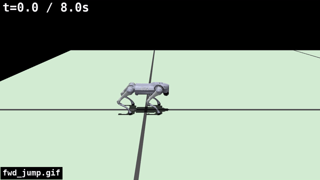

# MPC Dog

Go2 を Quad-SDK の NMPC で動かす。いま記録している例は、平面、穴、階段、ジャンプの4系統である。平面・穴・階段は制御を固定し、地形の変数だけを変える。ジャンプは平地で、前方離陸速度だけを変える。GIF は、その条件の代表1本である。成功が無い階段だけ、1回目の失敗を置く。

開発の経緯は [DEVELOPMENT.md](./DEVELOPMENT.md) にある。環境構築は [Step 01](./agent_reports/step01/quad_sdk_environment_and_step01.md) にある。

## Quad-SDK main からの変更

分類は [元コードからの変更まとめ](./agent_reports/quadsdk_original_code_tuning_summary.md) と同じ。比較先は `robomechanics/quad-sdk` main。

### 追加機能

#### 最終的に使用

- 目的A1: 無効な足場を NMPC に渡さない
  - 手段: Phase 2A `stop_on_invalid_foothold: true`
  - 手段: Phase 1 `FootholdResult`（成否。位置は従来どおり）
- 目的A2: 無効な足場の手前で止まる
  - 手段: Phase 2B `safe_stop_latch: true`（`cmd_vel` を 0）
- 目的A3: 渡れない穴の手前で止まる
  - 手段: `multistep_planner.enabled` + `apply_stop_request: true`
  - 手段: 生 `z` の NaN 幅 `uncrossable_nan_width` 0.52 m
- 目的A4: 振り足を段や穴縁より上へ上げる
  - 手段: `swing_terrain_check_mode: enforce`（平地は従来頂点）

#### 一時的に有効だが、最終的には不使用

- 目的B1: 穴縁を渡れる穴と断崖に分ける
  - 手段: Phase 3 `edge_clearance`（試験 0.15。最終 0）
  - 手段: `safe_stop_lookahead` 2.5 m（`edge_clearance` が 0 なので動かない）
- 目的B2: 脚が届かない足場で止まる
  - 手段: Phase 4 `ik_reach_check`（試験 true。最終 false）
- 目的B3: 計画した足場列を着地点へ入れる
  - 手段: `apply_foothold`（試験 true。最終 false）
- 目的B4: 足先全体が載る候補だけを選ぶ
  - 手段: `foothold_support_check_mode: enforce`（最終 `shadow`。選択は変えない）
- 目的B5: 足を段の内側へ寄せる
  - 手段: `foothold_edge_inset_mode: enforce`（最終 `"off"`）
- 目的B6: 胴体を支持している3脚の内側へ寄せる
  - 手段: `support_triangle_shift_mode: enforce`（最終 `"off"`）
- 目的B7: 前足を次の段の奥へ置く
  - 手段: `front_next_tread_mode: enforce`（最終 `"off"`）
- 目的B8: 最上段で頭を下げる
  - 手段: `top_nose_down_pitch_rad` 0.10（最終 0）

### パラメータ修正

#### 最終的に使用

- 目的C1: 穴の近くで同時に3脚以上を着ける
  - 手段: 歩容 trot → crawl
  - 手段: `period` 0.36 → 0.90 s
  - 手段: `duty_cycles` 0.5 → 0.75
  - 手段: `phase_offsets` `[0, 0.5, 0.5, 0]` → `[0, 0.75, 0.5, 0.25]`
- 目的C2: 穴の反対側まで足場を探す
  - 手段: `foothold_search_radius` 0.25 → 0.70 m
- 目的C3: 遊脚を穴縁より高く上げる
  - 手段: `ground_clearance` 0.07 → 0.10 m
- 目的C4: クロール1周期を先読みに収める
  - 手段: `horizon_length` 26 → 40（0.78 → 1.20 s）
- 目的C5: 0.10 m/s の指令で歩き始める
  - 手段: `stand_cmd_vel_threshold` 0.1 → 0.05
- 目的C6: 180°を超える旋回のヨー参照を追従する
  - 手段: ヨー境界 ±π → ±10 rad
- 目的C7: 段の手前の平地で、胴体を段の方へ傾けない
  - 手段: `smooth_surface_normals` 半径 0.40 → 0.10 m

#### 一時的に有効だが、最終的には不使用

- 目的D1: 段の手前だけ高さの平滑を狭くする
  - 手段: `z_smooth` 半径 0.08 m（階段実行中のみ。最終 0.20 m）

### ビルド・実行

- 線形ソルバ: `ma27` → `mumps`
- `reference`: `gbpl` → `twist`
- ロボット: Spirit → Go2
- 速度: 平面と穴は `cmd_vel` 0.30 m/s、階段は 0.10 m/s

### 変更なし

- 剛体の運動方程式、摩擦円錐、胴体の `x_weights`

## 平面

制御は穴と同じ stop-only で、速度は 0.30 m/s である。world は `flat_wide.xml`、初期 x は 0 m、指令時間は 22 s である。

stop-only は `local_planner.yaml` の `multistep_planner.enabled: true`、`apply_stop_request: true`、`apply_foothold: false`、`edge_clearance: 0` である。一括で入れる処理は `scripts/trial/allscenarios_record.sh` にある。

```bash
SPAWN_X_M=0.0 GAP_WORLD=flat_wide.xml GAP_TAG=allrec_flat \
  FORWARD_VEL_MPS=0.30 DURATION_S=22 \
  bash scripts/trial/run_quadsdk_gap_1m.sh
```


## 穴

制御は平面と同じ stop-only とクロールである。変えるのは world、初期 x、指令時間、速度である。速度の既定は 0.30 m/s で、最後の1本だけ 0.50 m/s である。

```bash
SPAWN_X_M=<spawn> GAP_WORLD=<world> GAP_TAG=<tag> \
  FORWARD_VEL_MPS=<vel> DURATION_S=<duration> \
  bash scripts/trial/run_quadsdk_gap_1m.sh
```

回帰の記録は [Step 16](./agent_reports/steps/step_16_multistep_terrain_planner_full_regression.md) にある。

| 地形 | world | 初期 x | 秒 | 速度 | 結果 |
| --- | --- | ---: | ---: | ---: | --- |
| 幅 0.30 m の溝を間隔 2.0 m で複数本 | `flat_gaps_2m.xml` | 0 | 34 | 0.30 | 通過 |
| 15 cm の平地と 15 cm の穴を5本 | `flat_repgap_s15g15n5.xml` | 0 | 34 | 0.30 | 通過 |
| 単独トレンチ 15 cm | `flat_trench_s09_15.xml` | -2 | 28 | 0.30 | 通過 |
| 単独トレンチ 25 cm | `flat_trench_s09_25.xml` | -2 | 28 | 0.30 | 通過 |
| 単独トレンチ 30 cm | `flat_trench_s09_30.xml` | -2 | 28 | 0.30 | 通過 |
| 単独トレンチ 35 cm | `flat_trench_s09_35.xml` | -2 | 28 | 0.30 | 通過 |
| 単独トレンチ 50 cm | `flat_trench_s09_50.xml` | -2 | 26 | 0.30 | 手前で直立停止 |
| 単独トレンチ 100 cm | `flat_trench_s09_100.xml` | -2 | 26 | 0.30 | 手前で直立停止 |
| 15 cm 穴の連続のあと 1 m 穴 | `flat_repgap_s15g15n3_last100.xml` | 0 | 36 | 0.30 | 1 m 穴の手前で直立停止 |
| 単独トレンチ 30 cm | `flat_trench_s09_30.xml` | -2 | 24 | 0.50 | 落下 |

幅 0.30 m の溝を間隔 2.0 m で複数本。通過。


15 cm の平地と 15 cm の穴を5本。通過。


単独トレンチ 15 cm。通過。


単独トレンチ 25 cm。通過。


単独トレンチ 30 cm、0.30 m/s。通過。


単独トレンチ 35 cm。通過。


単独トレンチ 50 cm。手前で直立停止。


単独トレンチ 100 cm。手前で直立停止。


15 cm 穴の連続のあと 1 m 穴。1 m 穴の手前で直立停止。


単独トレンチ 30 cm、0.50 m/s。落下。


## 階段

制御は基準状態である。速度は 0.10 m/s、`PLAN_STARTUP_S=8`、`HOLD_S=5` である。`swing_terrain_check_mode` は `enforce`、`foothold_support_check_mode` は `shadow`、段端後退と支持三角形と前足の奥置きは `"off"` である。穴の stop-only とは別の設定である。

変えるのは高さ、踏面、上りと下りの段数である。world 名の `h10` は高さ 10 cm、`h12p5` は 12.5 cm、`d39` は踏面 39 cm、`n04` は上り4段と下り4段である。world は `external/quad-sdk/quad_simulator/quad_sim_scripts/worlds/` にある。

成功は、転倒前の最大 x が下り終端の 1.50 m 先以上で、終了の横ずれが 0.50 m 未満、高さが 0.20 m より大きく、ロールとピッチの絶対値が 0.50 rad 未満であることである。詳細は [Step 23 第17章](./agent_reports/steps/step_23_stair_robustness.md) にある。

```bash
QUADSDK_OVERLAY_SETUP=/tmp/mpc_dog_stack_release_install/setup.bash \
  PLAN_STARTUP_S=8 FORWARD_VEL_MPS=0.10 HOLD_S=5 \
  GAP_WORLD=<world> GAP_TAG=<tag> DURATION_S=<duration> \
  bash scripts/trial/run_quadsdk_stairs.sh
```

| 高さ | 踏面 | 段数 | world | 秒 | 結果 |
| ---: | ---: | --- | --- | ---: | --- |
| 10 cm | 39 cm | 上り4＋下り4 | `jp_stair_matrix_h10_d39_n04.xml` | 110 | 成功 |
| 10 cm | 30 cm | 上り4＋下り4 | `jp_stair_matrix_h10_d30_n04.xml` | 101 | 成功 |
| 12.5 cm | 39 cm | 上り4＋下り4 | `jp_stair_matrix_h12p5_d39_n04.xml` | 110 | 成功 |
| 12.5 cm | 30 cm | 上り4＋下り4 | `jp_stair_matrix_h12p5_d30_n04.xml` | 101 | 成功 |
| 15 cm | 60 cm | 上り4＋下り4 | `jp_stair_matrix_h15_d60_n04.xml` | 130 | 失敗 |
| 15 cm | 39 cm | 上り4＋下り4 | `jp_stair_matrix_h15_d39_n04.xml` | 110 | 失敗 |
| 15 cm | 30 cm | 上り1＋下り1 | `jp_stair_matrix_h15_d30_n01.xml` | 72 | 成功 |
| 15 cm | 30 cm | 上り2＋下り2 | `jp_stair_matrix_h15_d30_n02.xml` | 82 | 成功 |
| 15 cm | 30 cm | 上り4＋下り4 | `jp_stair_matrix_h15_d30_n04.xml` | 101 | 失敗 |
| 15 cm | 30 cm | 上り6＋下り6 | `jp_stair_matrix_h15_d30_n06.xml` | 120 | 成功 |
| 15 cm | 39 cm | 上り6＋下り6 | `jp_stair_matrix_h15_d39_n06.xml` | 135 | 失敗 |

高さ 10 cm、踏面 39 cm、上り4＋下り4。成功。


高さ 10 cm、踏面 30 cm、上り4＋下り4。成功。


高さ 12.5 cm、踏面 39 cm、上り4＋下り4。成功。


高さ 12.5 cm、踏面 30 cm、上り4＋下り4。成功。


高さ 15 cm、踏面 60 cm、上り4＋下り4。失敗。1回目。


高さ 15 cm、踏面 39 cm、上り4＋下り4。失敗。1回目。


高さ 15 cm、踏面 30 cm、上り1＋下り1。成功。


高さ 15 cm、踏面 30 cm、上り2＋下り2。成功。


高さ 15 cm、踏面 30 cm、上り4＋下り4。失敗。1回目。


高さ 15 cm、踏面 30 cm、上り6＋下り6。成功。


高さ 15 cm、踏面 39 cm、上り6＋下り6。失敗。1回目。


## ジャンプ

制御は歩行と別である。`reference` は `gbpl`、`jump_mode` は `force_leap`、world は `flat_wide.xml`、穴は使わない。踏切は四脚対称で、`JUMP_PRELOAD_FRACTION=1.0`、`JUMP_FRONT_LAND_FRACTION=0.0`、NMPC の roll/pitch 追従重みは 20 である。歩容は duty 0.98、位相は全 0、`stand_pos_error_threshold` は 0.15 である。変えるのは前方離陸速度 `JUMP_TAKEOFF_VX` である。0 がその場、0.3 が短い前方である。

その場は、実行された 12 回すべてが直立着地で、転倒 0、NMPC 失敗 0 である。胴体は +0.20〜0.25 m、四脚離地は 238〜290 ms である。短い前方は、後脚が +0.386 m 進み、四脚離地は 314 ms、着地後 2 s のロールとピッチは 0.003 rad 未満である。詳細は [Step 17](./agent_reports/steps/step_17_forward_jump_rear_leg_push.md) と [Step 17b](./agent_reports/steps/step_17b_vertical_jump_gait_and_wbc_plan.md) にある。

```bash
JUMP_TAKEOFF_VX=<vx> JUMP_DZ_LO=1.1 JUMP_DZ_HI=1.5 \
  JUMP_TS_LO=0.20 JUMP_TS_HI=0.28 \
  JUMP_PRELOAD_FRACTION=1.0 JUMP_FRONT_LAND_FRACTION=0.0 \
  JUMP_ATT_WEIGHT=20 STEP_TAG=<tag> \
  bash scripts/trial/run_step17_jump.sh
```

| 種類 | `JUMP_TAKEOFF_VX` | 結果 |
| --- | ---: | --- |
| その場 | 0 | 成功 |
| 短い前方 | 0.3 | 成功 |

その場。`JUMP_TAKEOFF_VX=0`。成功。


短い前方。`JUMP_TAKEOFF_VX=0.3`。成功。



## Quadruped-PyMPC

別系統の記録は [DEVELOPMENT.md](./DEVELOPMENT.md) の末尾にある。
