# Squad-SDK のためのREADME

 - [README](./agent_reports/step01/quad_sdk_environment_and_step01.md)
 - [PyMPCとSquad-SDKの使い分け](./agent_reports/step01/quad_sdk_pympc_selection_and_distribution.md)

## Quad-SDK

 - [Step 01 検証記録(経緯・実験ログ)](./agent_reports/step01/quad_sdk_step01_investigation.md)
 - [Step 01 引き継ぎ資料(前進歩行の到達点・未完了事項・変更ファイル一覧)](./agent_reports/handoff/quadsdk_step01_handoff.md)
 - [Step 01 変更点と実行方法(要点まとめ)](./agent_reports/step01/quad_sdk_step01_changes_and_usage.md)
 - [記録ハーネス(quadsdk_step01_baseline.py)の構造説明](./agent_reports/step01/quadsdk_step01_baseline_py_structure.md)
 - [Step 01 の制御パイプライン(map → sensing → MPC → WBC のノード構成)](./agent_reports/quadsdk_step01_control_pipeline.md)
 - [Step 01 の地形マップ(map)の作り方とデータ構造(事実と推測を分離)](./agent_reports/quadsdk_step01_terrain_map.md)
 - [Step 01 のセンシング(状態推定)の仕組みとデータ構造(事実と推測を分離)](./agent_reports/quadsdk_step01_sensing.md)
 - [Step 01 の MPC(NMPC)の理論・コスト・制約・最適化とパラメータ(事実と推測を分離)](./agent_reports/quadsdk_step01_mpc.md)
 - [Step 01 の WBC(脚コントローラ/逆動力学)の理論・コード・パラメータ(事実と推測を分離)](./agent_reports/quadsdk_step01_wbc.md)
 - [Step 01 の GAIT(歩容)と MPC の関係 — 理論式・コード(事実と推測を分離)](./agent_reports/quadsdk_step01_gait_and_mpc.md)
 - [NMPC の simple モデルと complex モデルの差分 / MPC でできることの違い(事実と推測を分離)](./agent_reports/quadsdk_step01_mpc_simple_vs_complex.md)
 - [simple モデルで地形対応(高さ考慮の足場選び・穴超え)はどこまでできるか(事実と推測を分離)](./agent_reports/quadsdk_step01_simple_model_terrain_and_gaps.md)
 - [go2 の寸法・質量・関節・パラメータ(Quad-SDK モデル + 公称スペック)](./agent_reports/quadsdk_go2_dimensions_and_params.md)
 - [Quad-SDK 元コードからの変更・チューニングまとめ(ビルド/実行修正・歩容/探索/ホライズン/地形表現の調整・診断機能追加。何をなぜ変えたか一覧)](./agent_reports/quadsdk_original_code_tuning_summary.md)
 - [穴対応 Foot Placement 改善:**まとめ(現状・成果・GIF)** — 1 枚で現状がわかる。フェーズ一覧(2A/3(A)/2B/4 実装済み)、5 シナリオの結果と実行 GIF、既存挙動を壊していない根拠](./agent_reports/quadsdk_gap_foothold_summary.md)
 - [穴対応 Foot Placement 改善:**全体の考え方(概観)** — 安全のための 4 段(認識/足場選択/gate/停止シーケンス)、フェーズ ↔ 何を足したか ↔ どのシナリオで確かめたか、シナリオ一覧と現状、ユーザー判断の履歴](./agent_reports/quadsdk_gap_foothold_overview.md)
 - [穴対応 Foot Placement 改善:**試行錯誤の記録** — 外した見立て(15cm連続穴は成立困難 / gate だけで安全停止)、踏んだC++バグ(非voidの return 忘れ→UBで無限ループ / THROTTLE がms巨大値でログ0件)、Phase 3 を2回作り直した経緯、効いた作業のやり方](./agent_reports/quadsdk_gap_foothold_trial_and_error.md)
 - [穴対応:Foot Placement と NMPC 連携のコード解析(資料⇔コード照合表・terrain map の式・足場計画の入出力・NMPC への受け渡し・資料主張の再判定・改善フェーズ計画)](./agent_reports/quadsdk_gap_foothold_mpc_code_analysis.md)
 - [穴対応:**なぜ穴の自動検知は中サイズの穴を見逃すのか(データの流れとロジックの中身)** — 大学院初心者向け。PLY→grid_map→フィルタ連鎖(穴埋め処理 radius 0.4)→「安全度」レイヤ→穴チェック①/②の疑似コード、30/40/50/100 cm で安全度の断面がどう変わるか、危険帯 0.35〜0.9 m、`MESH_MARGIN` の落とし穴、Phase 5 の直し方](./agent_reports/quadsdk_gap_foothold_probe_and_inpaint.md)
 - [穴対応 Foot Placement 改善:フェーズ実施ログ(何をどのコミットで変えたか。Phase 0 資料訂正 / Phase 1 FootholdResult 診断値)](./agent_reports/quadsdk_gap_foothold_phase_progress.md)
 - [穴対応 Foot Placement 改善:次チャットへの引き継ぎ(現状・次の 1 ステップ・Phase 2A をブロックしている確認事項・守るべきルール・ファイルの場所)](./agent_reports/handoff/quadsdk_gap_foothold_handoff.md)
 - [Step 03_1m / 04_1m:1m 深の穴を「足を入れずに」複数本連続で渡る(成功／歩容をクロールに調整・大学院初心者向け解説つき)](./agent_reports/steps/step_03_04_1m_quadsdk_gap_crossing.md)
 - [Step 03_1m / 04_1m(gbpl 版):global_body_planner で穴を渡る試み + Quad-SDK 公式マニュアルに基づく正しい設定方法 + センシング→foot plan→MPC→WBC→トルクの工程別ボトルネック分析(穴 1 本は跳んで可・連続区間は未達)](./agent_reports/steps/step_03_04_1m_quadsdk_gbpl.md)
 - [Step 05:15 cm 平地・15 cm 穴の連続区間 — **go2 は N=2〜5 で安定して渡り切った**(Phase 3(A) が 15 cm 穴を「渡れる穴」と判定・クロール歩容で 5 cm メッシュ帯を跨ぐ)。事前調査の「成立困難寄り」は実測で覆った](./agent_reports/steps/step_05_quadsdk_repeated_15cm_gaps.md)
 - [Step 05b:安全停止の検証 — Phase 2A 単独では受動 PD ホールドが勢いを止めきれず転落。**Phase 3(`EDGE_TOO_CLOSE`、進行方向 forward-probe)を足すと、30 cm の穴は跨いで渡り・100 cm の穴の手前で直立停止**(渡れる穴は渡る/渡れない穴の手前で安全に止まる)](./agent_reports/steps/step_05b_quadsdk_phase2a_safe_stop.md)
 - [Step 06:15 cm 穴 ×2 → 1 m 穴 の複合地形で「落ちずに止まれるか」 — **Phase 2B で達成(3/3 で 15 cm 穴群の手前で直立静止・転倒なし)**。plan を凍結せず `cmd_vel:=0` で減速停止 + NMPC ホライズンより長い前方 lookahead(2.5 m)で 1 m 穴を早期検知。既存シナリオ(step03/04・Step 05・Step 05b)も回帰 OK](./agent_reports/steps/step_06_quadsdk_last_gap_1m.md)
 - [Step 07:Phase 4(`IK_UNREACHABLE`)の動作確認 — **30 cm / 100 cm × `ik_reach_check` OFF/ON の 4 通り**。Phase 4 ON でも 30 cm は渡り切る(機能後退なし)、100 cm は手前で停止。初版は IK の `is_exact` フラグで平地足場まで拾い 30 cm 渡りを止めた → midstance hip からの幾何距離判定に修正](./agent_reports/steps/step_07_quadsdk_phase4_ik_reach.md)
 - [Step 08:穴の数・間隔・幅を振った **全 18 シナリオの回帰スイープ** — 16/18 は期待どおり(≤30 cm は回帰なしで渡り・≥100 cm は手前で直立停止)。**~0.4〜0.9 m の穴で「渡れず・止まらず・転倒」**。※当初「真因は `InpaintFilter` が穴を埋めるから」としたが、Step 09 の計測で **誤りと判明**(下記/Step 09 参照)](./agent_reports/steps/step_08_quadsdk_full_gap_sweep.md)
 - [Step 09:Terrain Map と足場判断の **セル単位の定量計測**(制御変更なし、env ガード計装)— 15/25/30/35/50/100 cm の断面 CSV + 足場 CSV。**50 cm 転倒の因果を数値で確定**:向こう岸へのスナップ(B)は無し、`traversability` は穴の内側を正しく unsafe にしている。落ちるのは(1)既定 `edge_clearance:0` で幅チェックが走らず(2)スナップが **物理 void の縁 1 セル**(ぼかしで `traversability`=1.0 だが生 `z`=NaN)に足を置くため。`max_crossable_gap` を ≤0.44 に下げれば 50 cm は捕まる(Step 08 の「閾値では直らない」を訂正)](./agent_reports/steps/step_09_terrain_grid_and_foothold_measurement.md)
 - [なぜ 50 cm の穴で「数歩手前で止まる」がまだできないのか — **指示書 ↔ 実施の突き合わせ** — 指示書は Step 09〜16 の 8 段階で、「M 歩手前で停止」は Step 14 のゴール。いまは指示書 §9 が限定した **Step 09(計測のみ・制御不変)しか終えていない**ので止める処理が 1 行も入っていない。Step 10(未来脚順序)→11(到達可能な足場候補)→12(複数歩足場列)→13(停止余裕 M 歩)→14(graceful stop 接続)が必要](./agent_reports/steps/step_09b_why_50cm_not_stopping.md)
 - [Step 10:現在の gait 位相から未来の脚着地順序・時刻を再構成(shadow・制御変更なし)。3 地形で脚順一致・間隔誤差 ≤3 ms](./agent_reports/steps/step_10_future_gait_event_prediction.md)
 - [Step 11:1 歩の可到達領域と `traversability` 安全足場候補の列挙(shadow・制御変更なし)。30 cm は候補が残り、50/100 cm は候補が消える](./agent_reports/steps/step_11_reachable_safe_foothold_candidates.md)
 - [Step 12:複数歩ぶんの足場列を前方へ探索し `BLOCKED_AT_STEP_K` を出す(shadow・制御変更なし)。判定は生 `z` の NaN 帯幅で行う](./agent_reports/steps/step_12_multistep_foothold_sequence_shadow.md)
 - [Step 13:平地で latch → 停止させて `d_stop` を実測し `a_safe≈0.44 m/s²` を同定。`final_stop_steps = max(M, required)` を Step 12 の verdict に当てる(shadow・制御変更なし)](./agent_reports/steps/step_13_step_margin_and_stopping_distance.md)
 - [Step 14:多歩足場列の判定を既存の Phase 2B graceful stop につなぐ(opt-in・**初めて制御パスに触れる**が全パラメータ既定 OFF)。`enabled:=true` + `apply_stop_request:=true` で **50/100 cm 空洞を 6/6 直立 SAFE-STOP・空洞縁まで ≈0.95 m の余裕**、15/30/35 cm は不要停止なし、feature OFF は Step 08 と一致](./agent_reports/steps/step_14_multistep_planner_safe_stop_integration.md)
 - [Step 15:計画足場列を足場ノミナルへ差し込む(`apply_foothold:=true`、既定 OFF)。目前の 1 着地だけ、穴の上の Raibert ノミナルを計画足場側へ前方 ≤0.12 m 寄せる。**15/30 cm は 3/3 直立完走・planned↔actual がログで追え・NMPC 負荷は OFF と同水準**、50/100 cm は差し込まず(applied=0)Step 14 停止。world 座標直入れ→チャタリング→後ろ引き の 3 回の転倒を経て前方ナッジまで限定](./agent_reports/steps/step_15_multistep_foothold_nmpc_integration.md)
 - [Step 16:全回帰と限界 Map — 穴幅 15〜100 cm × {OFF, shadow, stop-only, foothold-apply} × v=0.30/0.50 を掃引(非決定条件は各 6 回)。**保護機能 ON の 18 run すべてで ≥50 cm への落下ゼロ**。stop-only は ≤35 cm 通過 / ≥50 cm 直立停止の境界が素直で NMPC 負荷も一定 → 実運用向け。foothold-apply は 25/35 cm 単独トレンチで 1/6〜2/6 転倒(実験段階)。当初課題「50 cm で数歩手前に止まれない」は stop-only 有効化で解決](./agent_reports/steps/step_16_multistep_terrain_planner_full_regression.md)
 - [上流の判断機は今どこまで「汎用」か(Step 16 時点の整理・大学院初心者向け)— 判断機の骨組み(歩容予測・生 `z` の NaN 判定・reach 判定・速度依存の停止距離)は汎用。「穴が何 m 以上で渡れないか」の境界値 `uncrossable_nan_width = 0.52 m` だけが試験の溝幅に合わせた固定値で、これは想定どおりの現状。速度非依存なので Step 16 で「30 cm は v=0.50 で落下」が出た。汎用化の道筋(能力から `max_crossable_gap(v, gait, ...)` を計算)を記載](./agent_reports/steps/step_16b_upstream_decider_genericity.md)
 - [Step 17(実装前分析):Go2 前方ジャンプ — 後脚踏切パイプラインの現状と問題。現在の「リープ」は実質「四脚接地スクワット→(運が良ければ)四脚同時飛翔→四脚接地」で、`REAR_PUSH`(後脚のみ支持)も `FRONT_LAND`(前脚のみ着地)も**到達不能**(`local_footstep_planner.cpp:531-538` はデッドコード)。課題の問題 A〜E は行番号付きで全て実在を確認。GBP は点質量+単一合力モデルで後脚荷重配分・ピッチモーメントを表現不可、踏切の水平力の向きは乱数、NMPC/ID は計画接触のみ使用、primitive ID は 3 ファイルに重複定義、NMPC 脚別 GRF 上限 150 N/脚 は必要ピーク(推定 ≈477 N)に届かない。**レイヤ横断の大改修が必要**と判定し実装前に整理](./agent_reports/steps/step_17_forward_jump_code_analysis.md)
 - [Step 17(実装・進行中):前方ジャンプ。方針を「平地・穴なし・その場ジャンプ・後脚位置で計測」に絞り、`jump_mode:=force_leap` で GBP が RRT を回さず 1 回のジャンプ経路を決定論的に publish、NMPC+ID が追従。**計測**(`flat_wide`):その場ジャンプ `step17_hop_sym2`/`step17_hop_rep1` = 胴体 +0.22 m・四脚離地 ≈260 ms・着地後直立維持・NMPC 失敗 0・転倒なし(2/2 再現、ただし飛翔中ピッチが一時 ~0.33 rad)。短前方ジャンプ `step17_fwd_b` = **後脚前進 +0.386 m(≥30 cm)**・四脚離地 314 ms・着地後直立維持。REAR_PUSH/FRONT_LAND を実際に効かせる(姿勢発散回避のため現状は四脚対称ホップ)と穴シナリオは残課題。`colcon test` 112 pass。ブランチ `feature/jump`](./agent_reports/steps/step_17_forward_jump_rear_leg_push.md)
 - [Step 17b(分析・計画):その場・垂直ジャンプを「こけずに」着地させる — gait と WBC(NMPC/逆動力学)の調整計画(大学院初心者向け)。**結論**:強制ジャンプ経路は既に gait をほぼバイパスしており(接触は primitive 上書き、着地後は四脚 hold→STAND)、こけた `hop_v0` の原因は gait でなく WBC 側 — 後脚のみ踏切で前脚支持なし・NMPC の roll/pitch 追従重みが既定 0.5 で弱い・点質量プランの鉛直速度が不連続。堅牢化は主に WBC:姿勢重みの恒常引き上げ・PRELOAD の GRF 形状づけ・滑らかなしゃがみ→伸展の胴体高さ基準・horizon 延長・飛翔中 Cartesian swing ゲイン有効化・着地 kd。gait 側は「着地後の四脚 hold 保証」など限定的。Stage A〜F の段階計画つき](./agent_reports/steps/step_17b_vertical_jump_gait_and_wbc_plan.md)

### 実行例(時系列)

各 Step の試行錯誤ごと残す。上ほど古い。GIF は固定カメラ、`reference:=twist` +
クロール歩容。地形マップは静的メッシュ由来。

---

#### Step 03 / 04:深さ 1 m・幅 0.3 m の溝を、足を入れずに複数本連続で渡る(成功)

歩容をトロット → クロールに落として達成。詳細・CSV 根拠は
[Step 03_1m / 04_1m の検証記録](./agent_reports/steps/step_03_04_1m_quadsdk_gap_crossing.md)。
別アプローチ(global_body_planner)は連続区間で未達 →
[gbpl 版](./agent_reports/steps/step_03_04_1m_quadsdk_gbpl.md)。

| step03(溝の間隔 2.0 m、0.15 m/s、12–35 s 切り抜き) | step04(溝の間隔 1.5 m、0.3 m/s、15–40 s 切り抜き) |
|---|---|
| 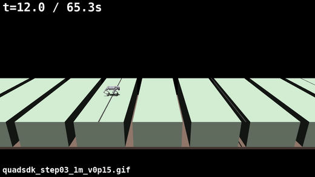 | 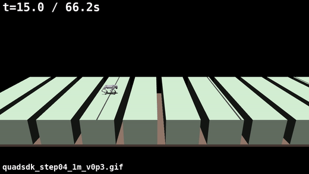 |

---

#### Step 05:15 cm 平地 / 15 cm 穴 ×5 をクロールで渡る(成功)

`edge_clearance:=0.15`、0.3 m/s。Phase 3(A) が 15 cm 穴を「渡れる穴」と判定し、
クロール歩容で 5 cm メッシュ帯を跨ぐ。N=2〜5 いずれも再現性を持って通過。
事前調査の「地図 1 セル・幾何学的に成立困難寄り」は実測で覆した。詳細は
[Step 05 の検証記録](./agent_reports/steps/step_05_quadsdk_repeated_15cm_gaps.md)。

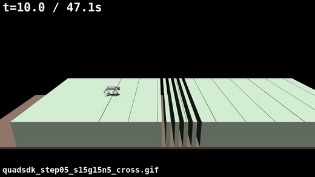

---

#### Step 05b:Phase 2A 単独では止まれない → Phase 3(`EDGE_TOO_CLOSE`)を足して安全停止

**試行錯誤**:無効足場を NMPC に渡さない gate(Phase 2A)だけでは、受動 PD
ホールドが勢いを止めきれず、穴の縁で前傾して落ちる(左)。→ 進行方向 forward-probe
で穴の縁を早期検知する Phase 3 を足すと、渡れる穴は跨ぎ、渡れない穴の手前で
直立停止する(右)。詳細は
[Step 05b の検証記録](./agent_reports/steps/step_05b_quadsdk_phase2a_safe_stop.md)。

| Phase 2A 単独:縁で一瞬止まって前傾転落 | Phase 3 追加:穴の 0.7 m 手前で直立停止 |
|---|---|
|  | 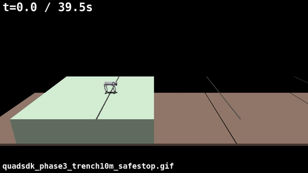 |

Phase 3 有効時(`edge_clearance:=0.15`)の代表:

| 30 cm 深穴：跨いで渡り切る(15–30 s 切り抜き) | 100 cm 幅の穴：手前で直立停止(15–25 s 切り抜き) |
|---|---|
| 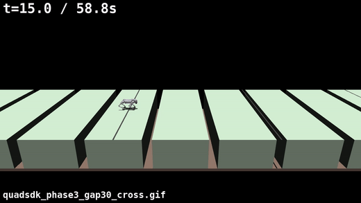 | 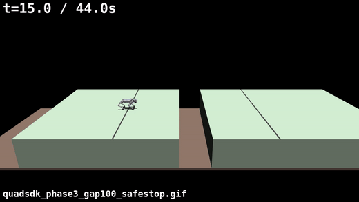 |

---

#### Step 06:15 cm 穴 ×2 → 1 m 穴 の複合地形 — Phase 2B で 15 cm 穴群の手前に直立停止

**試行錯誤**:NMPC ホライズン(≈0.36 m 先)では 1 m 穴の認識が遅すぎ、plan を丸ごと
凍結すると手前の 15 cm 穴を渡る遊脚中に凍結して転倒(左)。→ Phase 2B:plan を
凍結せず `cmd_vel:=0` で減速 + 胴体前方 2.5 m の lookahead で 1 m 穴を早期検知
(右、3/3 で転倒なし)。既存シナリオ(step03/04・Step 05・Step 05b)も回帰 OK。詳細は
[Step 06 の検証記録](./agent_reports/steps/step_06_quadsdk_last_gap_1m.md)。

| Phase 2B 前:手前の 15 cm 穴で断続停止 → 転倒(10–30 s) | Phase 2B 後:1 m 穴を早期検知 → 手前で直立停止(10–30 s) |
|---|---|
| 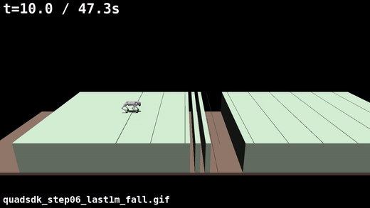 | 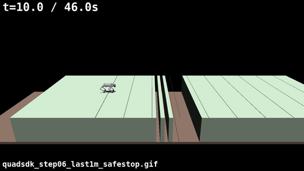 |

---

#### Step 07:Phase 4(`IK_UNREACHABLE`)— 脚が届かない足場を検知して手前で停止

**試行錯誤**:初版は IK の `is_exact` フラグで判定 → 平地の足場まで拾って 30 cm
渡りを止めた(機能後退)。→ midstance hip からの幾何距離判定に修正。`ik_reach_check`
既定 OFF。専用地形(助走側の地図を削り、前脚の名目足場を midstance hip から
~0.75 m > `ik_max_reach`(0.45 m)にスナップさせる)で確認。詳細は
[Step 07 の検証記録](./agent_reports/steps/step_07_quadsdk_phase4_ik_reach.md)。

| `ik_reach_check:=false`:届かない足場を実行 → 転倒 | `ik_reach_check:=true`:`IK_UNREACHABLE` 検知 → 直立停止 |
|---|---|
| 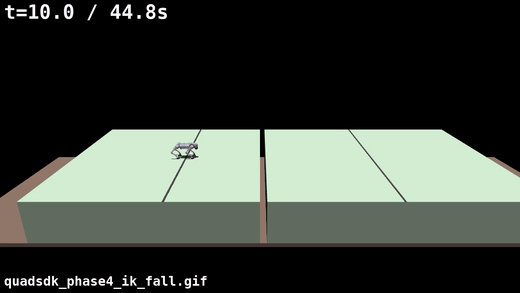 | 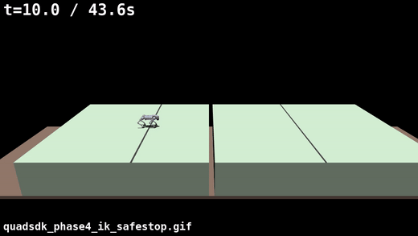 |

Phase 4 ON でも 30 cm の溝は渡り切る(機能後退なし):
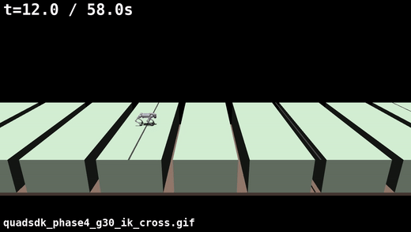

**機能 ON/OFF の比較(30 cm の溝 / 100 cm の穴)**:
ON = `edge_clearance:=0.15`。OFF = `stop_on_invalid_foothold:=false` +
`safe_stop_latch:=false` + `edge_clearance:=0`(この穴対応の作業を全部無効化 =
素の Quad-SDK 挙動)。100 cm は助走を見せるため spawn を x=−2.0 に後退
(`SPAWN_X_M=-2.0`、地形は不変、穴の近縁 x=2.0)。

| | 機能 OFF | 機能 ON |
|---|---|---|
| **30 cm の溝** | 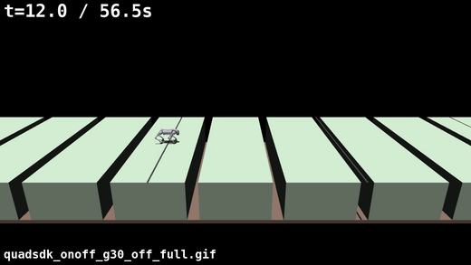 渡り切る(x≈11.7) | 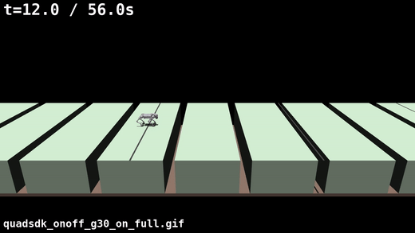 渡り切る(x≈11.1) |
| **100 cm の穴** (spawn x=−2.0) | 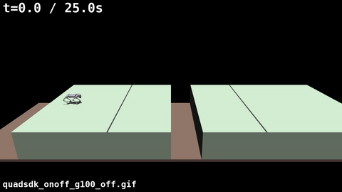 4.6 m 歩いて**穴に落下** | 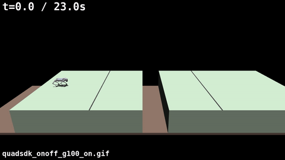 2.2 m 歩いて**穴の手前で直立停止**(standoff ≈ `safe_stop_lookahead 2.5 − max_crossable_gap 0.6`) |

---

#### Step 08:穴の数・平地幅・穴幅を振った全 18 シナリオの回帰スイープ

`edge_clearance:=0.15`。**16/18 は期待どおり**(≤0.30 m は回帰なしで渡り・
≥1.0 m は手前で直立停止)。**残り 2/18 = 幅 0.5 m の穴で「渡れず・止まらず・転倒」**
を発見。詳細は
[Step 08 の検証記録](./agent_reports/steps/step_08_quadsdk_full_gap_sweep.md)。

**タスク結果:穴幅 → 挙動**(単独トレンチ。`scripts/trial/step08_chart.py`)

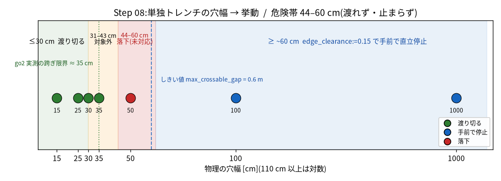

参考 GIF:

| ✅ 幅 ≤0.30 m:渡り切る | ✅ 幅 ≥1.0 m:手前で直立停止 | ❌ 幅 0.5 m:落下(未対応) |
|---|---|---|
|  |  | 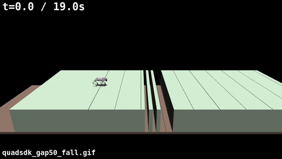 |

**試行錯誤(この時点の見立ては後に Step 09 で訂正)**:当初は「`max_crossable_gap`
を 0.6→0.54 に下げても直らない → 真因は `InpaintFilter` が穴を `traversability`
まで埋めているから」と結論した。→ **Step 09 で誤りと判明**(下記)。

---

#### Step 09:セル単位の計測で 50 cm 転倒の因果を数値で確定(制御変更なし)

env ガード計装で 15/25/30/35/50/100 cm の地図断面 CSV + 足場 CSV を採取。詳細は
[Step 09 の検証記録](./agent_reports/steps/step_09_terrain_grid_and_foothold_measurement.md)。

| ✅ 30 cm:渡り切る | ❌ 50 cm:縁で転倒 |
|---|---|
| 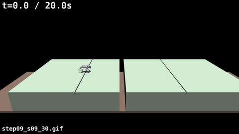 | 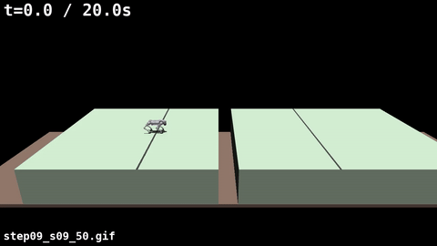 |

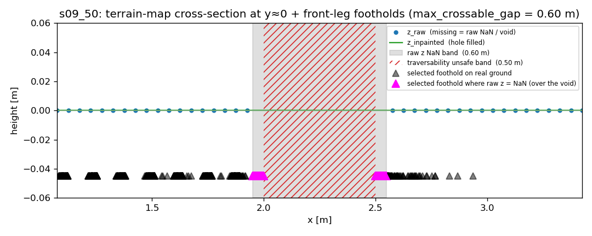

灰 = 生 `z` が NaN の帯(物理 void、0.60 m)。赤斜線 = `traversability` が unsafe の帯
(0.50 m)。マゼンタ▲ = 足場が置かれたセルで生 `z`=NaN(= void の縁の上)。
赤斜線の内側(穴の中心)には足場は 1 件も無く、B(向こう岸スナップ)も 0 件。

**確定した因果(Step 08 の見立てを訂正)**:

- `traversability` は **どの幅の穴でも内側を正しく unsafe(NaN)** にしている。
  unsafe 帯の幅 ≈ 物理の穴幅(50 cm → 0.50 m、100 cm → 1.00 m)。
  「`InpaintFilter` が穴を埋めるから」は誤りで、埋まるのは高さ(`z_inpainted`)だけ。
- `max_crossable_gap = 0.6 m` は「0.6 m 以内で地面が戻れば渡れる穴」の意味。50 cm の
  unsafe 帯(0.50 m)はこれ未満なので **「渡れる穴」に分類され止めない**。100 cm
  (1.00 m)だけがしきい値を超えて安全停止する。
- 既定 `edge_clearance:0` では幅チェック自体が走らず、足場は `traversability > 0.6`
  の最近傍セル = **物理 void の縁 1 セル**(縁ぼかしで `traversability`=1.0 だが
  生 `z`=NaN = 未支持地面)にスナップし、そこに足を置いて転倒する。
- → `max_crossable_gap` を **≤0.44** に下げれば 50 cm(0.50 m)は `EDGE_TOO_CLOSE`
  になり、30 cm(0.30 m)は crossable のまま。Step 08 の 0.54 は 0.50 より大きく
  外れていただけ。

**教訓**:

1. **「データを疑う」も、実データを取ってから。** Step 08 と解説 doc では「`InpaintFilter`
   が `traversability` まで埋める」と推測で書いたが、Step 09 でセル値を取ると
   **穴の内側は正しく NaN**。誤りは「しきい値 vs データ」ではなく
   「しきい値の値が穴幅に対して大きすぎる」+「既定でチェックが走らない」だった。
2. **計装で 1 段ずつ値を出す。** `z_raw / z_inpainted / hole_mask / traversability` を
   セル単位で並べて初めて「埋めているのは高さだけ」が見えた。
3. **地図の帯幅 ≠ 物理の穴幅、だが規則的。** `生 NaN 帯 = 物理 + 2×MESH_MARGIN`、
   `traversability unsafe 帯 = 生 NaN 帯 − 2×0.05(縁ぼかし)≈ 物理幅`。
4. **1 本の試行を信じない。** go2 の twist 歩容は非決定的で起動失敗フレークが混ざる。
5. **中断した回帰検証は最後まで回す。** 幅を振って回す回帰でしか出ない抜けがあった。

---

#### Step 10:現在歩容から未来の脚順序を再構成(shadow・制御変更なし)

指示書の 8 段(Step 09〜16)の 2 段目。いまの gait 位相から「この先どの脚がどの順で
着地するか」を `computeContactSchedule` の出力そのものから取り出して記録し、実接触
(`state_log.csv` の `contact_*` 立ち上がり)と照合。詳細は
[Step 10 の検証記録](./agent_reports/steps/step_10_future_gait_event_prediction.md)。

**タスク結果:予測 touchdown ↔ 実接触**(色 = 脚。`scripts/trial/step10_analyze.py`)

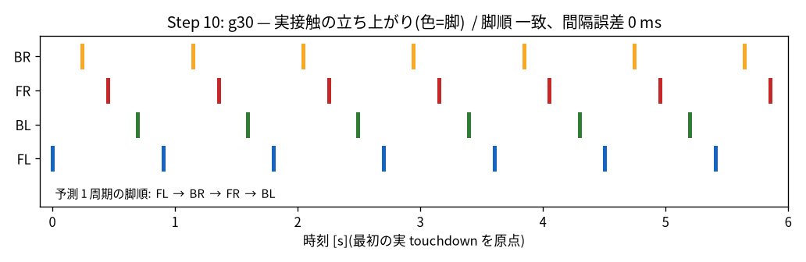

| 地形 | 予測 脚順 | 実 脚順 | 一致 | touchdown 間隔 誤差 |
|---|---|---|---|---|
| 平地 | `FL→BR→FR→BL` | `FL→BR→FR→BL` | ✅ | 3 ms |
| 30 cm 穴 | `FL→BR→FR→BL` | `FL→BR→FR→BL` | ✅ | 0 ms |
| 連続 15 cm | `FL→BR→FR→BL` | `FL→BR→FR→BL` | ✅ | 0 ms |

3 地形とも脚順一致・間隔誤差 ≤3 ms(sim 1 tick 未満)。→ Step 11(1 歩の可到達領域と
安全足場候補生成)へ。

---

#### Step 11:1 歩の可到達領域と安全足場候補の列挙(shadow・制御変更なし)

各脚の hip 周りの地図セルを走査し、**reach 内**(`‖セル − hip‖ ≤ ik_max_reach`、
Phase 4 と同じ 3D 距離 + 粗い前後左右ボックス)**+ 安全**(`traversability > 0.6`、
足裏 4 近傍も安全)**+ 観測済み**(生 `z` 有限)を満たす数 `n_valid` を記録。詳細は
[Step 11 の検証記録](./agent_reports/steps/step_11_reachable_safe_foothold_candidates.md)。

**タスク結果:前脚の有効足場候補数 `n_valid` vs hip 位置**(`scripts/trial/step11_analyze.py`)

| 30 cm 穴:候補が残る(最小 43) | 100 cm 穴:穴の手前で 0 に落ちる |
|---|---|
| 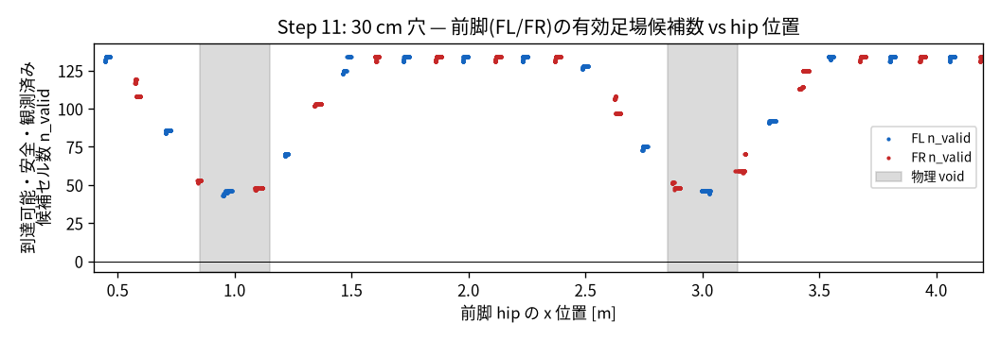 | 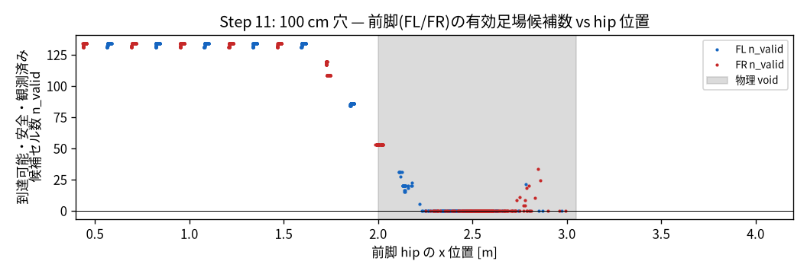 |

| 地形 | `n_valid` 最小(穴の近く) | 選択足場が全判定を通る率 | |
|---|---:|---:|---|
| 平地 | 131 | 100 % | ✅ |
| 30 cm 穴 | **43** | 32 % | ✅ 候補は残る(縁足場が選ばれるのは選択ロジックの問題=Step 12〜) |
| 50 cm 穴 | **0** | 17 % | ✅ 向こう岸は reach 外 |
| 100 cm 穴 | **0** | 0 % | ✅ 穴全域で候補なし |

→ 「30 cm は候補が残る / 50・100 cm は候補が消える」という Step 12(複数歩足場列)が
`BLOCKED_AT_STEP_K` を出すための信号が取れた。

---

#### Step 12:複数歩足場列の探索(shadow・制御変更なし)

5 サイクルに 1 回、クロール順(`FL→BR→FR→BL`)で胴体を前方投影しながら 1 歩ずつ
足場を置き、判定を出す(`FEASIBLE_TO_RANGE` / `BLOCKED_AT_STEP_K` / `UNKNOWN_BEFORE_RANGE`)。
幅 1 の貪欲 + ステップ長上限 0.45 m。詳細は
[Step 12 の検証記録](./agent_reports/steps/step_12_multistep_foothold_sequence_shadow.md)。

**タスク結果:判定の推移(緑=FEASIBLE / 赤=BLOCKED)+ 1 サイクル分の予定足場列**

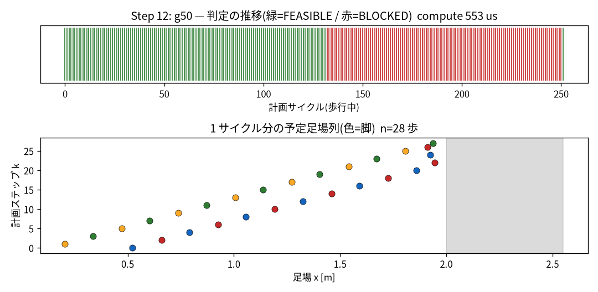

50 cm 穴:胴体が近づくと判定が緑 → 赤に移り、予定足場列は穴の近縁 x=2.0 で止まる。

| 地形 | 判定 | BLOCKED の k | 計算時間 中央値/最大 |
|---|---|---|---|
| 平地 | FEASIBLE 100 % | – | 0.6 / 3.4 ms |
| 連続 15 cm | FEASIBLE 87 %(BLOCKED 0) | – | 0.6 / 3.3 ms |
| 30 cm 単独 | FEASIBLE 72 % | 4〜31 | 0.6 / 2.6 ms |
| 30 cm `flat_gaps_2m` | ⚠️ BLOCKED 60 %(保守的・§10) | 4〜31 | 0.5 / 1.9 ms |
| **50 cm** | **BLOCKED 47 %**(接近で k 減少) | 4〜30 | 0.6 / 3.7 ms |
| **100 cm** | **BLOCKED 47 %** | 2〜30 | 0.5 / 1.8 ms |

計算時間は周期(≈33 ms)に十分収まる。50/100 cm で `BLOCKED_AT_STEP_K` が
取れたので Step 13(停止余裕 M 歩)へ。`flat_gaps_2m`(危険帯 0.40 m)が保守的に
BLOCK する件は MESH_MARGIN 由来で既知(Step 13〜15 で精緻化)。

---

#### Step 13:停止距離の同定と M 歩マージン(shadow・制御変更なし)

平地で latch → 停止させて `d_stop` を実測し、`d_stop = v·t_delay + v²/2a_safe` から
`a_safe ≈ 0.44 m/s²` を同定。`required_stop_steps = ceil(d_stop / (v·0.225))` →
`final_stop_steps = max(M, required)`。Step 12 の `BLOCKED_AT_STEP_K` に当てて
shadow の `PASS / SLOW / STOP_REQUEST` を出す。詳細は
[Step 13 の検証記録](./agent_reports/steps/step_13_step_margin_and_stopping_distance.md)。

**タスク結果:速度 → 必要停止距離・歩数**(`scripts/trial/step13_analyze.py`)

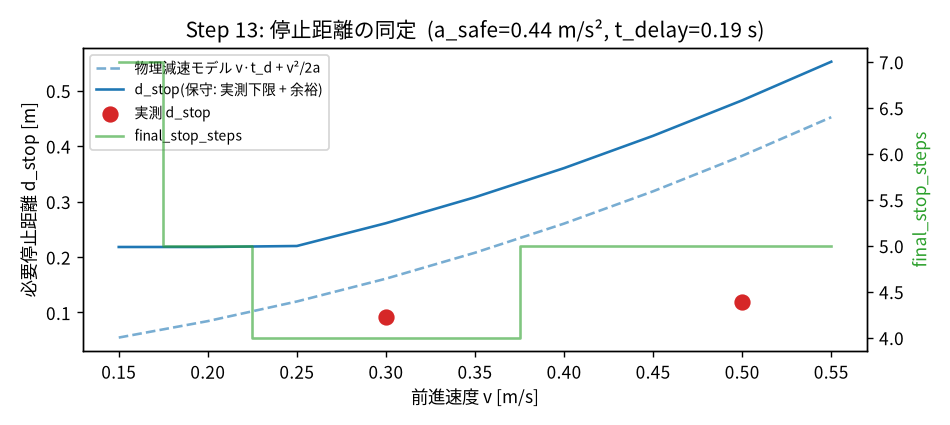

| v | 実測 d_stop | 保守 d_stop | required_stop_steps |
|---:|---:|---:|---:|
| 0.30 m/s | **0.092 m** | 0.26 m | 4 |
| 0.50 m/s | **0.118 m** | 0.48 m | 5 |

d_stop は v とともに増える。**latch 後の物理減速は 0.1 m 程度と短い**(既存の
`safe_stop_lookahead` が穴の ~1.9 m 手前で先に latch するため)。

shadow 挙動(v=0.30、`final_stop_steps=4`):

| 地形 | STOP_REQUEST | SLOW | |
|---|---:|---:|---|
| 平地 / 15 cm 連続 / 30 cm 単独 | **0 %** | 0〜14 % | ✅ 不要な停止を出さない |
| 50 cm / 100 cm | 5 % | 34〜35 % | ✅ 遠くで SLOW → 近づいて STOP_REQUEST |

⚠️ STOP_REQUEST 点のマージンは +0.01 m と薄い(d_stop が小さいため)。
`stop_margin_steps` M を 2 → 4〜6 に上げるのが Step 14 の課題。

---

#### Step 14:多歩足場列の判定を graceful stop につなぐ(opt-in・初めて制御パスに触れる)

Step 12 の `BLOCKED_AT_STEP_K` を Step 13 の M 歩マージンに当て、既存の Phase 2B
graceful stop(`cmd_vel:=0` → STEP → STAND、plan は止めない)を発火させる。
block が `final_stop_steps` 以内なら **停止**、より遠ければ `cmd_vel` を
`slow_factor` 倍に **減速**(creep floor 0.12 m/s でクランプ)。新パラメータ
`local_planner.multistep_planner`(`enabled` / `apply_stop_request` ほか)は
**すべて既定 OFF**。詳細は
[Step 14 の検証記録](./agent_reports/steps/step_14_multistep_planner_safe_stop_integration.md)。

**タスク結果:停止位置(`scripts/trial/step14_analyze.py`、spawn x=−2.0、v=0.3 m/s、`edge_clearance` は 0)**

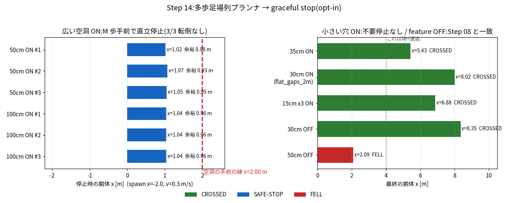

| シナリオ | mode | 判定 | 停止/最終 x | 空洞縁(x=2.0)までの余裕 |
|---|---|---|---:|---:|
| 50 cm 空洞 ×3 | ON | **SAFE-STOP**(直立) | 1.02 / 1.07 / 1.05 | 0.93〜0.98 m |
| 100 cm 空洞 ×3 | ON | **SAFE-STOP**(直立) | 1.04 / 1.04 / 1.04 | 0.96 m |
| 15 cm ×3 / 30 cm / 35 cm | ON | CROSSED(不要停止なし) | 6.88 / 8.02 / 5.43 | − |
| 30 cm / 50 cm | OFF | CROSSED / FELL(= Step 08) | 8.35 / 2.09 | − |

**試行錯誤(§9 に詳細)**:①block を `traversability` 候補数で決めていて 30/35 cm を
誤停止 → **生 `z` の NaN 帯幅**(≥0.52 m で block)に差し替え。②`SLOW` を 333 Hz で
毎周期 `×0.4` して指令速度が `0.4ⁿ` で潰れ、穴の 1.5 m 手前で失速 → **0.12 m/s の
creep floor** でクランプ。③前方走査 1.5 m が長すぎて `STOP_REQUEST` が早すぎた
(x=0.49) → NaN 帯は「1 歩の到達距離 `R`=0.45 m 以内で始まる」ときだけ block、
走査も `R+帯幅+0.15 ≈ 1.12 m` に短縮 → 停止 x が 0.49 → 1.04 m、余裕 ≈0.95 m に収束。

**Step 14 の結論**:多歩足場列プランナ ON(`enabled:=true` + `apply_stop_request:=true`)で
**50/100 cm 空洞を 6/6 直立 SAFE-STOP、空洞の縁まで約 0.95 m の余裕**。渡れる
15/30/35 cm は不要停止ゼロ。feature OFF は Step 08 と一致(30 cm 通過 / 50 cm 転倒)。
`edge_clearance` を有効化しなくても、**生 `z` の NaN 帯 ≥ 0.52 m(物理でおよそ
≥0.42〜0.50 m)の穴は block → 手前で停止**できるようになった(実測は 50/100 cm)。
ただし NaN 帯が 0.52 のすぐ下(物理 ~0.35〜0.45 m)は block されず、速度次第で
落下しうる(Step 16、[判断機の汎用性の整理](./agent_reports/steps/step_16b_upstream_decider_genericity.md))。

---

#### Step 15:計画足場列を Local Planner / NMPC へ差し込む(opt-in)

Step 12 で探索した足場列を、いよいよ既存の足場ノミナルへ差し込む
(`multistep_planner.apply_foothold:=true`、既定 OFF)。各脚の **目前の 1 着地
だけ**、① 予測胴体 x が計画の前提と一致し ② Raibert ノミナルが穴の上で
③ 計画足場が前方向、のとき Raibert を計画足場側へ **前方 ≤0.12 m** 寄せる。
寄せた後も既存スナップを最終微修正として通す。詳細は
[Step 15 の検証記録](./agent_reports/steps/step_15_multistep_foothold_nmpc_integration.md)。

**タスク結果:計画足場の差し込み量 と NMPC 負荷(`scripts/trial/step15_analyze.py`)**

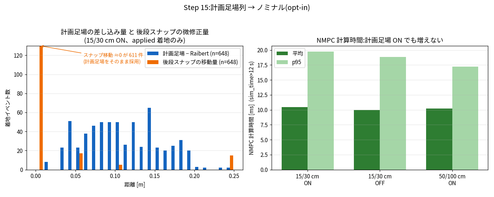

| シナリオ | mode | 判定 | applied | 計画足場−Raibert(中央値) | スナップ移動 |
|---|---|---|---:|---:|---:|
| 15 cm 連続 ×3 | ON | CROSSED(直立) | 53〜107 | +0.084〜0.091 m | 0.000 m |
| 30 cm ×3 | ON | CROSSED(直立) | 126〜147 | +0.120〜0.128 m | 0.000 m |
| 50 / 100 cm 空洞 | ON | SAFE-STOP(直立) | **0** | − | − |
| 15 cm 連続 / 30 cm | OFF | CROSSED | 0 | − | − |

NMPC 計算時間・iteration・cost・plan age は **ON でも OFF と同水準**。差し込んだ
648 着地のうち 611 は後段スナップが動かさず(計画足場がそのまま NMPC へ)。

**試行錯誤(§9 に詳細)**:①計画足場の world 座標をそのまま入れて転倒(胴体が
前進すると古い点になる)。②遠い着地を毎周期いじって足場がチャタリングして転倒。
③step12 の足場は Raibert より系統的に ~0.1 m 後ろで、入れると歩幅が縮んで転倒。
→ **目前・胴体 x 一致・穴の上・前方向のみ・0.12 m クランプ**まで絞って直立完走。

**Step 15 の結論**:計画足場 ↔ 実着地の対応がログで追え、NMPC 負荷は増えず、
50/100 cm では到達不能足場を渡さず(applied=0)Step 14 停止が働き、feature OFF
は回帰維持。ただし現状の差し込みは「穴回避の前方ナッジ」止まりで、0.3 m 級の
穴を 1 歩でまたぐ足場列を積極的に組む用途には未到達(Step 16 の課題)。

---

#### Step 16:全回帰と限界 Map

穴幅 15/25/30/35/50/100 cm(単独トレンチ)× feature モード {OFF, shadow,
stop-only, foothold-apply} を v=0.30/0.50 m/s・クロールで掃引し、
**通過・停止・失敗の境界**を 1 枚にまとめた。非決定条件は各 6 回。詳細は
[Step 16 の検証記録](./agent_reports/steps/step_16_multistep_terrain_planner_full_regression.md)。

**タスク結果:限界 Map(`scripts/trial/step16_analyze.py`、v=0.30 m/s)**

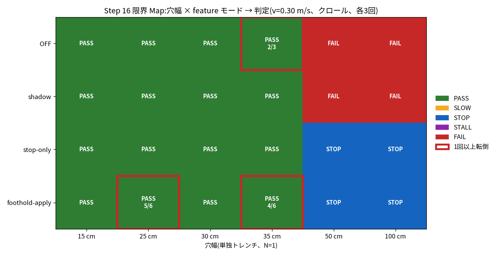

| | ≤35 cm(渡れる穴) | ≥50 cm(渡れない穴) | NMPC 計算時間 p95 |
|---|---|---|---|
| **OFF / shadow** | 通過(35 cm は 1/3 で落下) | **落下**(Step 08 ベースライン) | 40〜116 ms(穴で thrash) |
| **stop-only**(Step 14) | 通過(15〜35 cm 全 6/6) | **直立停止 3/3**(縁の約 1 m 手前) | 16〜19 ms(一定) |
| **foothold-apply**(Step 15) | 通過だが **25 cm 5/6・35 cm 4/6**(縁で転倒) | **直立停止 3/3** | 37〜76 ms(25/35 cm) |

- **危険な穴(≥50 cm)への落下:保護機能 ON の 18 run すべてでゼロ。** 最優先条件を達成。
- **stop-only が実運用向け**:≤35 cm 通過 / ≥50 cm 停止の境界が最も素直、NMPC 負荷も一定。
- **foothold-apply は narrow trench(25/35 cm)で 1/6〜2/6 転倒**(前方ナッジが縁で
  効きすぎる、Step 15 §9.4)。既定 OFF のまま、実験用。
- **速度限界**:30 cm は v=0.30 で全モード 3/3 通過だが v=0.50 では 1〜2/6 で落下。
  渡れる穴の上限は速度とともに縮む(block 閾値は速度非依存)。50 cm は v=0.50 でも 3/3 停止。
- **未確認**:40/75 cm(world 無し)、トロット歩容、N≥2、平地幅掃引。

**Step 16 の結論(= 8 段まとめ)**:当初の課題「50 cm の穴で数歩手前に止まれない」は
**stop-only(`enabled` + `apply_stop_request`)の有効化で解決**(空洞縁の約 1 m 手前で
3/3 直立停止、v=0.30/0.50 とも)。既定 OFF の回帰は全穴幅で維持。`apply_foothold` は
narrow trench で不安定なため実験段階のまま。

---

#### Step 17:その場・垂直ジャンプ(平地・穴なし)

`jump_mode:=force_leap` で `global_body_planner` が RRT を回さず、ロボットが静止した
瞬間に 1 回のジャンプ経路(`PRELOAD→FLIGHT→SETTLE`)を組み立てて `body_plan` に流し、
NMPC + 逆動力学がそれを追従する。四脚対称踏切、NMPC の roll/pitch 追従重みを
0.5→20。詳細は
[Step 17 実装記録](./agent_reports/steps/step_17_forward_jump_rear_leg_push.md) と
[Step 17b 分析・計画](./agent_reports/steps/step_17b_vertical_jump_gait_and_wbc_plan.md)。

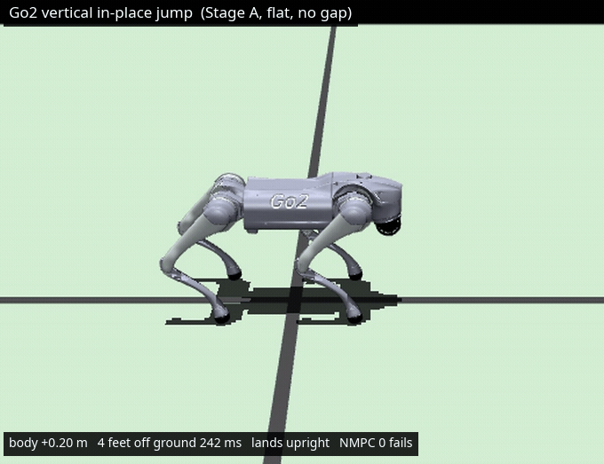

しゃがみ → 四脚で伸び上がり → **四脚同時に離地** → 前脚から接地 → 直立へ収束(1.3 倍スロー)。

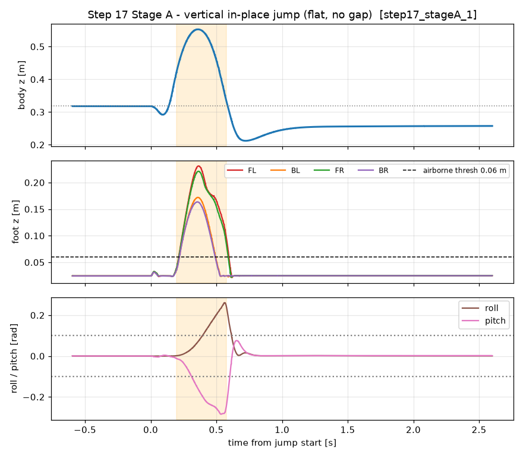

上=胴体高さ、中=4 脚の足先高さ(破線 0.06 m 超で離地)、下=roll/pitch。オレンジ帯が飛翔相。
足先が 4 本とも閾値を超えて **270 ms 離地**、着地後は roll/pitch が ±0.01 rad へ収束。
飛翔相で pitch が一時 −0.27 rad(≈15°)まで振れて戻る(= 余裕は小さい)。

**計測(`flat_wide`、その場、Step 17b Stage A 設定 = gait 実質STAND / stand_pos_error 0.15 /
NMPC roll・pitch 重み 20)**:`scripts/trial/step17_stageA.sh` で複数回実行し、
**実行された 12 回のジャンプすべてが直立着地・転倒 0・NMPC ソルバ失敗 0**。
胴体 0.318 → 0.52〜0.55 m(**+0.20〜0.25 m**)、四脚が同時に離地している時間
**238〜290 ms**、着地後 2 s の \|roll\|,\|pitch\| は 11/12 で < 0.1 rad、最大関節トルク
≈ 40 Nm。飛翔中にピッチが一時 ≈ 0.3 rad まで振れて戻る(詰めは Step 17b の Stage C/D)。
後脚のみ踏切(`REAR_PUSH`)を効かせる版と穴シナリオは残課題。

---

### 全シナリオ動作確認(制御設定を stop-only に固定し、world だけ変える)

**制御パラメータは 1 セットに固定**した:
`multistep_planner.enabled=true` + `apply_stop_request=true`(= "stop-only")、
`apply_foothold=false`、`edge_clearance=0`、クロール歩容、v=0.30 m/s(最後の 1 本のみ 0.50)。
シナリオ(world)だけを変えて、これまで扱った地形を一通り走らせた
(録画・変換: `scripts/trial/allscenarios_record.sh` / `allscenarios_gif.sh`)。
GIF は固定カメラ、左上に時刻。

#### 渡れる地形 — 不要な停止をせず通過(既存回帰も維持)

**1. 平地の前進** — 通過(x=5.2)

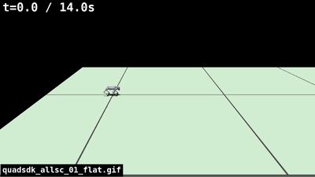

**2. 深さ 1 m・幅 0.3 m の溝を複数本連続(Step 03/04 の地形)** — 通過(x=8.2、回帰維持)

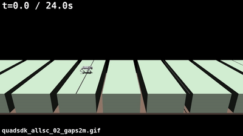

**3. 15 cm 平地 / 15 cm 穴 ×5 連続(Step 05 の地形)** — 通過(x=8.0、回帰維持)

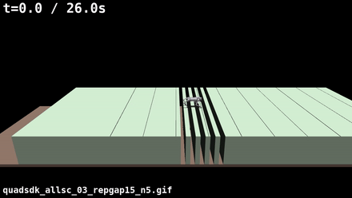

**4. 単独トレンチ 15 cm** — 通過

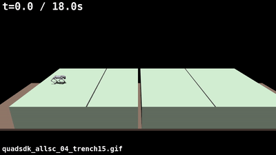

**5. 単独トレンチ 25 cm** — 通過

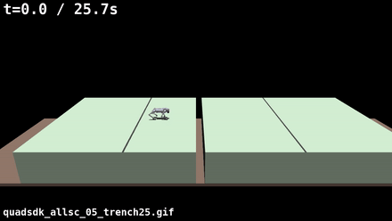

**6. 単独トレンチ 30 cm** — 通過(不要停止なし)

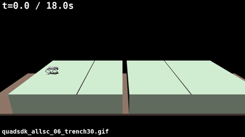

**7. 単独トレンチ 35 cm** — 通過

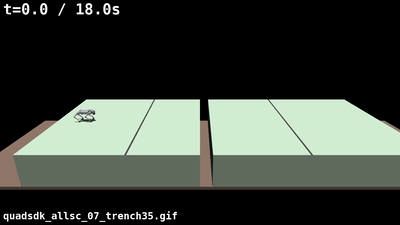

#### 渡れない地形 — 手前で直立停止

**8. 単独トレンチ 50 cm** — 縁の約 1 m 手前で直立停止(`[multistep-stop] latching`)

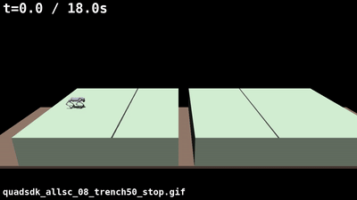

**9. 単独トレンチ 100 cm** — 縁の約 1 m 手前で直立停止

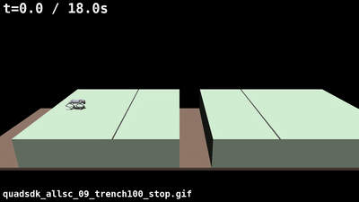

**10. 15 cm 穴 ×3 連続 → 1 m 穴 の複合地形(Step 06 の地形)** — 15 cm 帯は渡り、1 m 穴の手前で直立停止

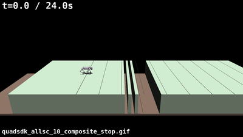

#### 既知の限界 — 判断機の境界値が速度非依存

**11. 単独トレンチ 30 cm を v=0.50 m/s で** — 落下

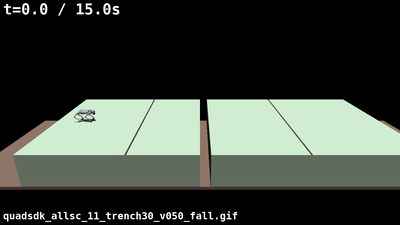

30 cm(NaN 帯 0.40 m)は block 閾値 `uncrossable_nan_width=0.52 m` を超えないので止まらず、
高速だとクロールの安定余裕が足りず落ちる。閾値が固定値で速度を見ていないのが原因
([判断機の汎用性の整理](./agent_reports/steps/step_16b_upstream_decider_genericity.md))。

**まとめ**:1 つの固定設定(stop-only)で、既存の通過シナリオ(平地・0.3 m 溝連続・
15/15 連続・単独 ≤35 cm)は不要停止なく通過し、渡れない穴(単独 ≥50 cm・複合地形の
1 m 穴)は手前で直立停止する。シナリオごとのパラメータ調整は不要。ただし NaN 帯が
閾値 0.52 m のすぐ下(物理 ~0.35〜0.45 m)の穴を高速で渡ろうとすると落下しうる。

---

### 現在の到達点(Step 16 時点):できること / できないこと

**できること**

| 内容 | 根拠 |
|---|---|
| 平地の前進歩行(起立 → 歩行 → 停止)が安定 | Step 01 |
| **幅 ≤0.30 m の穴/溝を、足を入れずに複数本連続で渡る**(回帰なし) | Step 03/04、Step 05 |
| **幅 ≥1.0 m の穴/断崖の手前で直立停止**(`edge_clearance:=0.15` 有効化時)。胴体前方 2.5 m をプローブ → `cmd_vel:=0` で減速 | Step 05b、Step 06 |
| 脚が届かない足場の検知(`ik_reach_check:=true`、専用地形で確認。既定 OFF) | Step 07 |
| **幅 ≥0.50 m の穴/断崖の手前で M 歩手前に直立停止**(`multistep_planner.enabled:=true` + `apply_stop_request:=true` = "stop-only"、既定 OFF)。生 `z` の NaN 帯を着地脚ごとに前方 1 歩ぶん走査 → 遠い block は減速・近い block は Phase 2B 停止。50/100 cm で **v=0.30/0.50 とも 3/3 直立停止**・空洞縁まで ≈1 m の余裕、≤35 cm は不要停止なし(6/6 通過)、NMPC 負荷は一定(Step 16) | Step 10〜14、Step 16 |
| **計画足場列を足場ノミナルへ差し込む**(`apply_foothold:=true`、既定 OFF・**実験段階**)。目前の 1 着地だけ、穴の上の Raibert ノミナルを計画足場側へ前方 ≤0.12 m 寄せる。planned↔actual がログで追え、NMPC 負荷は増えず、50/100 cm では差し込まない(applied=0)。ただし 25/35 cm 単独トレンチで 1/6〜2/6 転倒(Step 16) | Step 15、Step 16 |

**できないこと(既知の穴)**

| 内容 | 詳細 |
|---|---|
| 物理でおよそ 0.35〜0.45 m の穴を「渡れる」と誤判定して速度次第で落下 | stop-only を有効にしても、生 `z` の NaN 帯がこの範囲(≈0.45〜0.54 m)だと block 閾値 `uncrossable_nan_width=0.52 m` を超えないので止まらず、渡ろうとする。v=0.30 なら渡れることが多いが v=0.50 で落下しうる。閾値が試験の溝幅に合わせた固定値で速度非依存なのが原因。汎用化の道筋は [判断機の汎用性の整理](./agent_reports/steps/step_16b_upstream_decider_genericity.md)(**未着手**) |
| 30 cm の穴を高速で渡れると誤判定 | 30 cm(NaN 帯 0.40 m)は v=0.30 で全モード 3/3 通過だが v=0.50 では stop-only/apply とも 1〜2/6 で落下(同じく閾値が速度非依存、Step 16) |
| 既定 OFF のままだと 0.44〜0.60 m の穴で落下 | 素の Quad-SDK 挙動(`max_crossable_gap` 0.6 m が「渡れる穴」と誤判定、`edge_clearance:0` で幅チェックも走らない)。**stop-only を有効化すれば ≥0.50 m は手前で直立停止する**(Step 14/16、実測 50/100 cm) |
| 0.3 m 級の穴を 1 歩でまたぐ足場列を積極的に組む | 未到達。`apply_foothold` は「穴の上の足を前方へ寄せる回避ナッジ」止まりで、25/35 cm 単独トレンチで 1/6〜2/6 転倒。`step12PlanSequence` を Raibert ポリシ準拠に作り直す必要(Step 15/16) |
| 斜め穴・旋回中の穴、未観測領域と穴の区別、実センサからの地図生成 | 前方走査は +x 固定・全幅横断穴のみ。地図上「未観測」と「穴」はどちらも `NaN`。地図は MuJoCo メッシュ由来のみ |
| 40/75 cm 単独トレンチ、トロット歩容、穴 N≥2、平地幅掃引 | Step 16 で未計測(world 不足・スコープ外) |

**安全機能のスイッチ(`local_planner.yaml` 既定)**:
Phase 2A(無効足場を NMPC に渡さない)= **ON** /
Phase 2B(検知時に減速停止)= **ON**(健全地形では no-op)/
Phase 3(A)(渡れる穴/渡れない穴の区別、`edge_clearance`)= **OFF** /
Phase 4(届かない足場の検知、`ik_reach_check`)= **OFF** /
多歩足場列プランナ(`multistep_planner.enabled` / `apply_stop_request` / `apply_foothold`)= **OFF**。
OFF の 3 つは、その実行で明示的に有効化したときだけ動く(既定では素の Quad-SDK 挙動)。
危険な穴の手前で止めたい場合は **stop-only(`enabled` + `apply_stop_request`)を推奨**
(Step 16 で ≤35 cm 通過 / ≥50 cm 直立停止・NMPC 負荷一定を確認)。`apply_foothold`
は narrow trench で不安定なため実験用。

1 枚まとめ:[まとめ doc](./agent_reports/quadsdk_gap_foothold_summary.md)。

## Quadruped-PyMPC

 - [環境構築(acadosビルド・インストール)と実行方法](./agent_reports/step01/pympc_step01_changes_and_usage.md)
 - [Step 01 検証記録(経緯)](./agent_reports/steps/step_01_reference_baseline.md)
 - [記録ハーネス(step_01_baseline.py)の構造説明](./agent_reports/step01/step_01_baseline_py_structure.md)
 - [Step 02 検証記録(平面マップ・歩容周波数と前進速度／成功)](./agent_reports/steps/step_02_frequency.md)
 - [Step 03 検証記録(前進方向に並ぶ穴／轍を落ちずに越える・大学院初心者向け解説つき／成功)](./agent_reports/steps/step_03_gap_crossing.md)
 - [Step 04 検証記録(穴の間隔を 1.5 m に詰めて同様／大学院初心者向け解説つき／成功)](./agent_reports/steps/step_04_gap_crossing_1p5m.md)