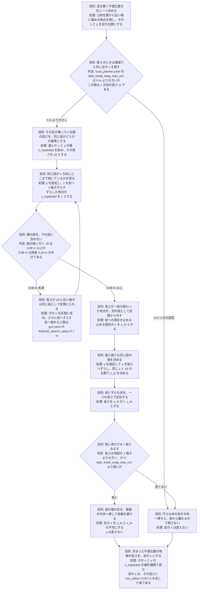
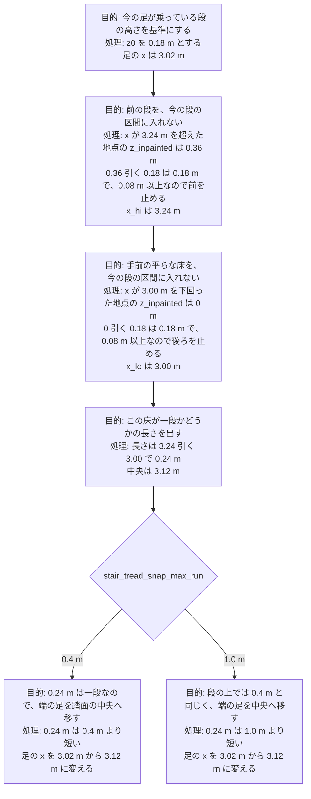
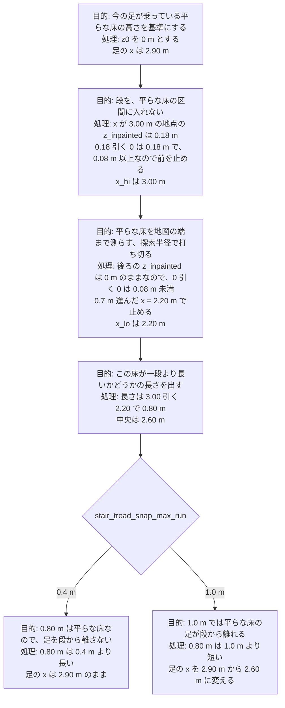

# 足場の高さと初期位置

## 第1章 概要

- 次の階段走行の初期位置は、最初の蹴上 x=3 m の 1 m 手前、x=2 m である
- 歩容の周期と接地比は、足場の z を見ない
- 着地の z と振り足の頂点は、xy を決めたあと `z_inpainted` を足す
- 段の中央へ足を寄せる処理はソースにあるが、いま動いている `local_planner_node` は 2026-08-29 のままで、`stair_tread_snap_max_run` は 0 である
- `z_inpainted` は地形地図 `/mapping/terrain_map` の高さの層で、層 `z` が数値ならその高さを持ち、NaN なら半径 0.4 m の隣の高さで埋めた値を持つ
- この処理の目的は、段の端に置かれた足の x を踏面の中央へ移し、平らな床の足の x は移さないことである
- 測定は、選んだ足の `z_inpainted` を z0 とし、y を固定してずらした地点の `z_inpainted` を z とし、絶対値 z 引く z0 が 0.08 m 以上ならその方向を止める
- 測った x 方向の長さが地図の 1 格子より大きく、かつ `stair_tread_snap_max_run` より短いときだけ、足の x を区間の両端の平均にする
- 足の x を変えたあとも変えなかったあとも、その x と y の `z_inpainted` に `toe_radius` 0.022 m を足した値を足の z にする
- 1 段目の端 x=3.02 m では長さが 0.24 m になり、`stair_tread_snap_max_run` が 0.4 m でも 1.0 m でも足の x は 3.12 m になる
- 段の手前 x=2.90 m では長さが 0.80 m になり、0.4 m では足の x は 2.90 m のままで、1.0 m では足の x は 2.60 m になる

## 第2章 初期位置

### 概要

- `run_quadsdk_jp_stair.sh` の `APPROACH_M` を 3 から 1 にした
- 最初の蹴上 `FIRST_RISER_X_M` は 3 のままなので、胴体の初期 x は 2 になる
- 地面の平面そのものは x=-1 から x=3 まで残し、後ろ足が床の端に掛からないようにする
- いま走っている試行は起動時の x=0 のままなので、この初期位置は次の起動から効く

### 詳細

- `run_quadsdk_jp_stair.sh` の `APPROACH_M` を 3 から 1 にした
  - 経路長は、この 1 m と、上り 10 段の踏面と、踊り場 2 m と、下り 9 段の踏面と、段のあと 3 m を足す
  - 停止位置は x=12.56 m のままである
- 最初の蹴上 `FIRST_RISER_X_M` は 3 のままなので、胴体の初期 x は 2 になる
  - 初期姿勢は `init_pose` の `-x` に、`FIRST_RISER_X_M - APPROACH_M` を入れる
- 地面の平面そのものは x=-1 から x=3 まで残し、後ろ足が床の端に掛からないようにする
  - 床の横幅は `Y_HALF` 1.5 m のままである
- いま走っている試行は起動時の x=0 のままなので、この初期位置は次の起動から効く

## 第3章 現状の足場 z

### 概要

- 接触の時刻は `period` 0.9 s、`duty_cycles` 0.75、`phase_offsets` `[0.0, 0.75, 0.5, 0.25]` だけで決まる
- 足の xy は Raibert の着地予想から、`traversability` が 0.6 を超える近いセルへ半径 0.7 m で寄る
- その xy の z は、そのあと `z_inpainted` に `toe_radius` 0.022 m を足した値である
- 振りの頂点は、前後の足場 z の高い方に `ground_clearance` 0.1 m を足し、股の下 `hip_clearance` 0.1 m を超えないようにする
- 胴体の高さは足場 z ではなく `z_smooth` であり、傾きは `smooth_normal_vectors` である

### 詳細

- 接触の時刻は `period` 0.9 s、`duty_cycles` 0.75、`phase_offsets` `[0.0, 0.75, 0.5, 0.25]` だけで決まる
  - `setTemporalParams` が作る `nominal_contact_schedule_` に、地図の z は入らない
- 足の xy は Raibert の着地予想から、`traversability` が 0.6 を超える近いセルへ半径 0.7 m で寄る
  - `kin_cost` は xy の距離だけで、高い段を優先する項は無い
  - 公称位置から近い順の探索は、段では段鼻のセルで止まる
- その xy の z は、そのあと `z_inpainted` に `toe_radius` 0.022 m を足した値である
  - 公称位置の z は `INTER_NEAREST`、選んだあとの z は `INTER_LINEAR` である
  - z が有限でなければ `FootholdStatus::NONFINITE_HEIGHT` になる
- 振りの頂点は、前後の足場 z の高い方に `ground_clearance` 0.1 m を足し、股の下 `hip_clearance` 0.1 m を超えないようにする
  - `computeSwingApex` は振りの途中の地面の最大高さを見ない
  - 下限は股の高さから 0.35 m を引いた値である
- 胴体の高さは足場 z ではなく `z_smooth` であり、傾きは `smooth_normal_vectors` である
  - `local_planner.cpp` は `z_des_ + getTerrainHeight` を胴体 z にする
  - `getTerrainSlope` は `getSurfaceNormalFiltered` を読む

## 第4章 用意されている機能

### 概要

- 足場 z を着地と振りに載せる処理は、溝渡りと同じ実行ファイルの中で動いている
- 段の高さが近い x 方向の連なりを踏面と見て、その中央へ x を移す処理はソースだけにある
- 複数歩の計画足場を目前の着地へ最大 0.12 m 寄せる処理は、スイッチが偽である
- 無効な足場で速度を零にする処理はオンだが、段の高低そのものでは発火しない

### 詳細

- 足場 z を着地と振りに載せる処理は、溝渡りと同じ実行ファイルの中で動いている
  - 使う層は `z_inpainted` で、平滑した `z_smooth` ではない
  - `ground_clearance` 0.1 m は蹴上 0.18 m より低いので、前後の足場 z の差が小さいと振りが蹴上を越えない
- 段の高さが近い x 方向の連なりを踏面と見て、その中央へ x を移す処理はソースだけにある
  - `local_planner.yaml` の `stair_tread_snap_max_run` は 0 なので、ソースが載った実行ファイルでも足の x は段鼻のままである
  - いまの `local_planner_node` は 2026-08-29 であり、この分岐を含まない
- 複数歩の計画足場を目前の着地へ最大 0.12 m 寄せる処理は、スイッチが偽である
  - `multistep_planner.apply_foothold` が真のとき、生の `z` が NaN の穴の上だけ公称 xy を動かす
  - 段の高さの差では動かない
- 無効な足場で速度を零にする処理はオンだが、段の高低そのものでは発火しない
  - `stop_on_invalid_foothold` と `safe_stop_latch` は真である
  - 発火は、探索半径内に `traversability` が 0.6 を超えるセルが無いときと、z が有限でないときである

## 第5章 段の中央へ足の x を移す判断

### 概要

- `z_inpainted` は地形地図 `/mapping/terrain_map` の高さの層で、層 `z` が数値ならその高さを持ち、NaN なら半径 0.4 m の隣の高さで埋めた値を持つ
- この処理の目的は、段の端に置かれた足の x を踏面の中央へ移し、平らな床の足の x は移さないことである
- 測定は、選んだ足の `z_inpainted` を z0 とし、y を固定してずらした地点の `z_inpainted` を z とし、絶対値 z 引く z0 が 0.08 m 以上ならその方向を止める
- 測った x 方向の長さが地図の 1 格子より大きく、かつ `stair_tread_snap_max_run` より短いときだけ、足の x を区間の両端の平均にする
- 足の x を変えたあとも変えなかったあとも、その x と y の `z_inpainted` に `toe_radius` 0.022 m を足した値を足の z にする
- 1 段目の端 x=3.02 m では長さが 0.24 m になり、`stair_tread_snap_max_run` が 0.4 m でも 1.0 m でも足の x は 3.12 m になる
- 段の手前 x=2.90 m では長さが 0.80 m になり、0.4 m では足の x は 2.90 m のままで、1.0 m では足の x は 2.60 m になる

### 詳細

- `z_inpainted` は地形地図 `/mapping/terrain_map` の高さの層で、層 `z` が数値ならその高さを持ち、NaN なら半径 0.4 m の隣の高さで埋めた値を持つ
  - `filter_chain.yaml` の filter2 `inpaint` が、入力の層 `z` を読み、出力の層 `z_inpainted` を書く
  - 半径 0.4 m は、NaN の格子を埋めるときに見る隣の範囲である
  - 1 段目の踏面には面があるので、その `z_inpainted` は 0.18 m である
  - 平らな床の `z_inpainted` は 0 m で、次の段の `z_inpainted` は 0.36 m である
  - 胴体の高さが読む `z_smooth` は、この層を filter3 でさらに平均した別の層である
- この処理の目的は、段の端に置かれた足の x を踏面の中央へ移し、平らな床の足の x は移さないことである
  - 公称位置から近い順の探索は、段では段鼻の格子を足の x にする
  - 段鼻は踏面の端なので、足を踏面の中央の x へ移す
  - 平らな床で同じ移し方をすると、段の手前では足の x が段から離れる

- 測定は、選んだ足の `z_inpainted` を z0 とし、y を固定してずらした地点の `z_inpainted` を z とし、絶対値 z 引く z0 が 0.08 m 以上ならその方向を止める
  - z0 は、すでに選んだ足の位置の `z_inpainted` である
  - z は、y を変えずに x だけを前または後ろへずらした地点の `z_inpainted` である
  - 比べる差は、この z と z0 の差であり、足の z と胴体の z の差ではない
  - 0.08 m は `local_footstep_planner.cpp` に書いてあり、蹴上 0.18 m の半分である
  - 隣の段との差は 0.18 m なので 0.08 m 以上になり、測定は段の境で止まる
  - 同じ踏面の差はおよそ 0 m なので 0.08 m 未満になり、測定は踏面の中を進む
  - 高さの差が出ない平らな床では、`go2.yaml` の `foothold_search_radius` 0.7 m まで進んで測定を止める
- 測った x 方向の長さが地図の 1 格子より大きく、かつ `stair_tread_snap_max_run` より短いときだけ、足の x を区間の両端の平均にする
  - 長さは x_hi 引く x_lo で、単位は m であり、高さではない
  - `stair_tread_snap_max_run` は `local_planner.yaml` の x 方向の長さで、いまの値は 0 である
  - 長さが 1 格子以下のときは、足の x を変えない
  - 長さが `stair_tread_snap_max_run` 以上のときも、足の x を変えない
  - 足の x を変えるときは、x_lo と x_hi の平均だけを新しい x にし、y は変えない
- 足の x を変えたあとも変えなかったあとも、その x と y の `z_inpainted` に `toe_radius` 0.022 m を足した値を足の z にする
  - 読む補間は `INTER_LINEAR` である
  - この z は、x を中央へ移したあとの地点の高さである
- 1 段目の端 x=3.02 m では長さが 0.24 m になり、`stair_tread_snap_max_run` が 0.4 m でも 1.0 m でも足の x は 3.12 m になる
  - 踏面は x が 3.00 m から 3.24 m までで、その `z_inpainted` は 0.18 m なので z0 は 0.18 m である
  - 前は、x が 3.24 m を超えた地点の `z_inpainted` 0.36 m と z0 0.18 m の差 0.18 m が 0.08 m 以上なので止まり、x_hi は 3.24 m である
  - 後ろは、x が 3.00 m を下回った地点の `z_inpainted` 0 m と z0 0.18 m の差 0.18 m が 0.08 m 以上なので止まり、x_lo は 3.00 m である
  - 長さ 0.24 m は 0.4 m より短く、1.0 m よりも短い
  - 足の x は 3.02 m から、3.00 m と 3.24 m の平均 3.12 m に変わる

- 段の手前 x=2.90 m では長さが 0.80 m になり、0.4 m では足の x は 2.90 m のままで、1.0 m では足の x は 2.60 m になる
  - その地点の `z_inpainted` は 0 m なので z0 は 0 m である
  - 前は、x が 3.00 m の地点の `z_inpainted` 0.18 m と z0 0 m の差 0.18 m が 0.08 m 以上なので止まり、x_hi は 3.00 m である
  - 後ろは、`z_inpainted` が 0 m のままなので差は 0.08 m 未満で、0.7 m 進んだ x=2.20 m で探索の上限に達し、x_lo は 2.20 m である
  - 長さ 0.80 m は 0.4 m より長いので、足の x は 2.90 m のままである
  - 長さ 0.80 m は 1.0 m より短いので、足の x は 2.20 m と 3.00 m の平均 2.60 m になり、段から離れる
  - 0.4 m は踏面の長さ 0.24 m より大きく、段の手前の長さ 0.80 m より小さい

## 結論

- 初期位置の変更は、次の起動で胴体を x=2 m、最初の蹴上の 1 m 手前に置くことである
- 現状の歩容は、接触の時刻では z を見ず、着地と振りの高さだけ `z_inpainted` を使う
- 登るときに `stair_tread_snap_max_run` へ置く値は 0.4 m であり、踏面の長さ 0.24 m より大きく、段の手前で測る長さ 0.80 m より小さいので、段の上の足の x だけが中央へ移る
- 1.0 m は段の手前の足の x を 2.90 m から 2.60 m へ移し、足が段から離れる
- 段の中央へ寄せる機能はソースに用意してあるが、パラメータ 0 と 2026-08-29 の実行ファイルのため、階段の走行では足の x は段鼻のままである
