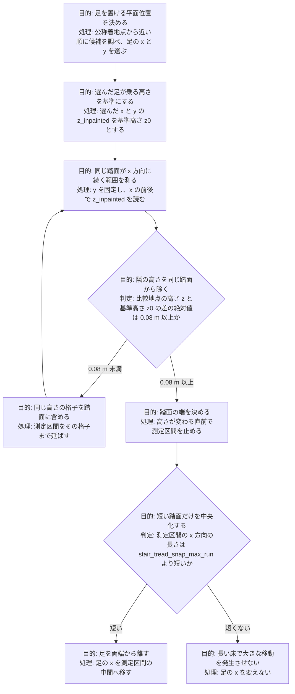
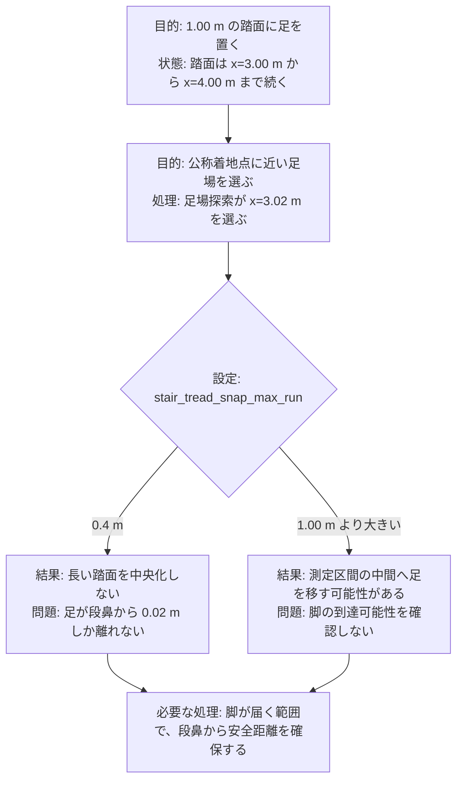
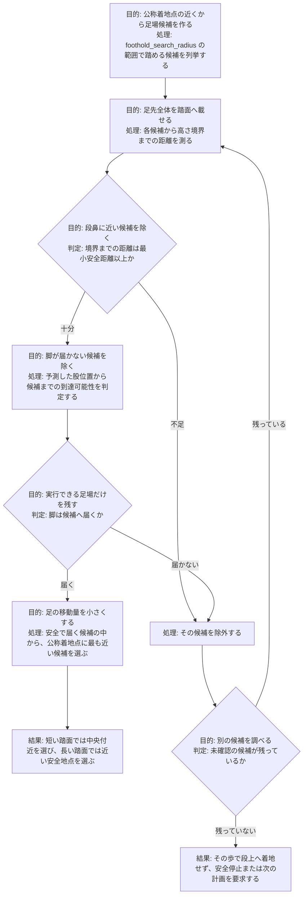

# 踏面の長さに応じた足場位置の計画

## 第1章 概要

- 現在の追加ソースは、短い踏面を検出すると、足の x を踏面の手前端と奥端の中間へ移す
- 今回の階段は踏面の x 方向の長さが 0.24 m なので、足の移動量は最大で約 0.12 m になり、短い踏面の中央化を適用できる
- 踏面の x 方向の長さが 1.00 m の場合は、踏面の中央が手前端から 0.50 m 先になるので、脚が中央へ届かない可能性がある
- `stair_tread_snap_max_run` を 0.4 m にすると、現在の追加ソースは 1.00 m の踏面を中央化の対象から外すが、段鼻から足を離す処理も行わない
- 今後の足場計画は、踏面全体の中央ではなく、段の端から安全距離を確保し、かつ脚が届く候補の中から、公称着地点に最も近い地点を選ぶ
- 今後の検証は、0.24 m の短い踏面、1.00 m の長い踏面、平地の順に行い、足場の安全距離、脚の到達可能性、既存走行との後方互換性を確認する

## 第2章 用語と座標

### 概要

- 踏面は、ロボットが足を載せる一段分の水平面である
- 踏面の中央は、階段の横幅方向の中央ではなく、進行方向 x における手前端と奥端の中間である
- 段鼻は、踏面の手前側または奥側にある高さの変化位置である
- 安全地点は、足先全体が踏面に載り、脚が到達できる地点である

### 詳細

- 踏面は、ロボットが足を載せる一段分の水平面である
  - 今回の1段目は、x=3.00 m から x=3.24 m までが踏面である
  - 今回の1段目は、`z_inpainted` が 0.18 m の水平面である
- 踏面の中央は、階段の横幅方向の中央ではなく、進行方向 x における手前端と奥端の中間である
  - 今回の1段目は、x=3.00 m と x=3.24 m の中間である x=3.12 m が踏面の中央である
  - 中央化の処理は足の x だけを変え、足の y を変えない
- 段鼻は、踏面の手前側または奥側にある高さの変化位置である
  - 足を段鼻の近くへ置くと、足先の一部が踏面から外れる可能性がある
  - `toe_radius` 0.022 m は、足先が点ではなく半径を持つことを表す
- 安全地点は、足先全体が踏面に載り、脚が到達できる地点である
  - 安全地点は、段の端から `toe_radius` と追加余裕を合わせた距離を確保する
  - 安全地点は、現在の胴体と股の位置から脚が届く範囲にも入る

## 第3章 現在の短い踏面用処理

### 概要

- 現在の追加ソースは、選んだ足場の高さを基準高さ z0 として、y を固定し、x の前後に同じ高さが続く長さを測る
- 現在の追加ソースは、測った長さが `stair_tread_snap_max_run` より短いときだけ、足の x を測定区間の中間へ移す
- `stair_tread_snap_max_run` を 0.4 m にすると、長さ 0.24 m の踏面を中央化し、長さ 0.80 m 以上の床を中央化しない
- 現在の `local_planner.yaml` は `stair_tread_snap_max_run` を 0 m にしており、現在の実行ファイルもこの追加処理を含まない

### 詳細

- 現在の追加ソースは、選んだ足場の高さを基準高さ z0 として、y を固定し、x の前後に同じ高さが続く長さを測る
  - 基準高さ z0 は、選んだ足場の x と y における `z_inpainted` である
  - 比較高さ z は、y を固定し、x を1格子ずらした地点における `z_inpainted` である
  - 絶対値 z 引く z0 が 0.08 m 未満なら、現在の追加ソースはその格子を同じ踏面に含める
  - 絶対値 z 引く z0 が 0.08 m 以上なら、現在の追加ソースはその地点を別の高さとして測定を止める
  - 前後それぞれの測定距離は、`foothold_search_radius` 0.7 m を上限にする
- 現在の追加ソースは、測った長さが `stair_tread_snap_max_run` より短いときだけ、足の x を測定区間の中間へ移す
  - 測定区間の手前端を x_lo とし、奥端を x_hi とする
  - 現在の追加ソースは、足の x を x_lo と x_hi の平均へ移す
  - 現在の追加ソースは、足の y を変えない
- `stair_tread_snap_max_run` を 0.4 m にすると、長さ 0.24 m の踏面を中央化し、長さ 0.80 m 以上の床を中央化しない
  - 今回の1段目で足場探索が x=3.02 m を選んだ場合は、踏面の範囲が x=3.00 m から x=3.24 m になる
  - 現在の追加ソースは、長さ 0.24 m が 0.4 m より短いので、足の x を x=3.12 m へ移す
  - 足の x が x=3.12 m にある場合は、手前端と奥端までの距離がそれぞれ 0.12 m になる
- 現在の `local_planner.yaml` は `stair_tread_snap_max_run` を 0 m にしており、現在の実行ファイルもこの追加処理を含まない
  - 値 0 m は中央化の分岐を無効にする
  - 2026-08-29 の `local_planner_node` は、この追加処理を含まない
  - 値 0.4 m の動作は、再ビルドと走行試験を行うまで未確認である

## 第4章 1.00 m の踏面で残る問題

### 概要

- 1.00 m の踏面では、踏面中央が手前端から 0.50 m 先になるため、脚が中央へ届かない可能性がある
- `stair_tread_snap_max_run` を 1.00 m より大きくすると、現在の追加ソースは脚の到達可能性を確認せず、足の x を測定区間の中間へ移す可能性がある
- `stair_tread_snap_max_run` を 0.4 m にすると、現在の追加ソースは長い踏面の中央化を避けるが、選んだ足を段鼻から離さない
- `foothold_search_radius` 0.7 m は測定距離も制限するので、現在の追加ソースは選んだ地点によって 1.00 m の踏面全体を測れない

### 詳細

- 1.00 m の踏面では、踏面中央が手前端から 0.50 m 先になるため、脚が中央へ届かない可能性がある
  - 踏面が x=3.00 m から x=4.00 m までの場合は、踏面中央が x=3.50 m になる
  - 足場探索が x=3.02 m を選んだ場合は、中央までの移動量が 0.48 m になる
  - 中央までの移動量は、今回の 0.24 m の踏面で必要な最大移動量 0.12 m より大きい
- `stair_tread_snap_max_run` を 1.00 m より大きくすると、現在の追加ソースは脚の到達可能性を確認せず、足の x を測定区間の中間へ移す可能性がある
  - 現在の中央化の分岐は、移動後の足場に対する股からの到達距離を判定しない
  - `ik_reach_check` は現在の設定で偽なので、別の到達可能性判定も働かない
- `stair_tread_snap_max_run` を 0.4 m にすると、現在の追加ソースは長い踏面の中央化を避けるが、選んだ足を段鼻から離さない
  - 足場探索が x=3.02 m を選んだ場合は、手前端 x=3.00 m までの余裕が 0.02 m になる
  - 余裕 0.02 m は `toe_radius` 0.022 m より小さいので、足先の一部が踏面から外れる可能性がある
- `foothold_search_radius` 0.7 m は測定距離も制限するので、現在の追加ソースは選んだ地点によって 1.00 m の踏面全体を測れない
  - x=3.02 m から前へ測る場合は、測定が最大で x=3.72 m までになり、奥端 x=4.00 m に届かない
  - この場合は、測定区間の中間と踏面全体の中央が一致しない
  - 長い踏面へ `stair_tread_snap_max_run` の値だけを増やす方法は、この測定制限も解決しない

## 第5章 今後に採用する足場選択

### 概要

- 今後の足場選択は、踏面の長さだけで中央化の有無を決めず、踏面の端からの距離と脚の到達可能性を候補ごとに判定する
- 今後の足場選択は、安全条件を満たす候補の中から、公称着地点に最も近い地点を選ぶ
- 今後の足場選択は、短い踏面では中央付近を選び、長い踏面では段鼻から必要な距離だけ離れた近い地点を選ぶ
- 今後の足場選択は、安全条件を満たす候補へ脚が届かない場合に、その歩で段上へ着地しない

### 詳細

- 今後の足場選択は、踏面の長さだけで中央化の有無を決めず、踏面の端からの距離と脚の到達可能性を候補ごとに判定する
  - 候補の足先外周が踏面から外れないために、候補から高さ境界までの距離を調べる
  - 最小安全距離は、`toe_radius` 0.022 m と追加余裕を合わせて決める
  - 最小安全距離の初期候補は 0.10 m とし、最終値は走行結果から決める
  - 脚の到達可能性は、予測した着地時の股位置から候補までの距離で判定する
- 今後の足場選択は、安全条件を満たす候補の中から、公称着地点に最も近い地点を選ぶ
  - 候補選択は、踏面全体の中央を固定目標にしない
  - 候補選択は、足を不必要に大きく移動させない
  - 候補選択は、前回計画した足場への距離も現在の `kin_cost` と同様に評価する
- 今後の足場選択は、短い踏面では中央付近を選び、長い踏面では段鼻から必要な距離だけ離れた近い地点を選ぶ
  - 長さ 0.24 m の踏面で安全距離を両端に 0.10 m 確保すると、安全な x の範囲は x=3.10 m から x=3.14 m になる
  - 長さ 1.00 m の踏面で手前端から 0.10 m 離す場合は、x=3.10 m が最も近い安全地点になる
  - 長い踏面では、足を x=3.50 m の中央まで移さず、x=3.10 m の安全地点に置ける
- 今後の足場選択は、安全条件を満たす候補へ脚が届かない場合に、その歩で段上へ着地しない
  - 計画器は、安全条件と到達可能性を同時に満たさない候補を無効にする
  - 計画器は、段の手前に足場を残し、次の計画周期で別の着地を計画する
  - 停止条件に該当する場合は、既存の `stop_on_invalid_foothold` と `safe_stop_latch` が安全停止を要求する

## 第6章 実施計画

### 概要

- 第1段階は、足場選択を地図とロボット制御から分離した関数にし、人工的な踏面で単体試験を行う
- 第2段階は、機能を無効にしたときに既存の平地走行と溝渡りの足場を変えないことを確認する
- 第3段階は、0.24 m の踏面で段鼻からの距離と脚の到達可能性を確認する
- 第4段階は、1.00 m の踏面で足を中央へ移さず、最寄りの安全地点を選ぶことを確認する
- 第5段階は、MuJoCo の10段階段で、上り、踊り場、下り、退出平地までの走行を確認する

### 詳細

- 第1段階は、足場選択を地図とロボット制御から分離した関数にし、人工的な踏面で単体試験を行う
  - 単体試験は、0.24 m の踏面、1.00 m の踏面、連続した平地、上り段、下り段、地図端を含める
  - 単体試験は、候補の x と y、境界までの距離、股からの距離、選択結果を確認する
  - 単体試験は、安全な候補がない場合の状態を確認する
- 第2段階は、機能を無効にしたときに既存の平地走行と溝渡りの足場を変えないことを確認する
  - 新しい機能は、明示した設定で有効にする
  - 無効時は、現在の公称位置から近い順の足場探索をそのまま使う
  - 回帰試験は、既存の平地歩行と成功済みの溝渡りを対象にする
- 第3段階は、0.24 m の踏面で段鼻からの距離と脚の到達可能性を確認する
  - 足場は、x=3.10 m から x=3.14 m の安全範囲を初期候補にする
  - 記録は、公称足場、選択前の足場、安全条件適用後の足場、境界までの距離、股からの距離を残す
  - 合格条件は、足先外周が踏面に入り、移動後の足場へ脚が届くことである
- 第4段階は、1.00 m の踏面で足を中央へ移さず、最寄りの安全地点を選ぶことを確認する
  - 足場探索が x=3.02 m を選んだ場合は、x=3.10 m 付近を初期目標にする
  - 合格条件は、足を x=3.50 m の中央へ移さず、段鼻から最小安全距離を確保することである
  - 合格条件は、足場が脚の到達可能範囲に入ることである
- 第5段階は、MuJoCo の10段階段で、上り、踊り場、下り、退出平地までの走行を確認する
  - 最初の試行は、低速 0.10 m/s を使う
  - 最初の試行は、一つの変更だけを追加し、失敗原因と次の変更を分けて記録する
  - 成功後に、要求された残りの速度へ段階的に広げる

## 結論

- 現在の `stair_tread_snap_max_run` は、0.24 m の短い踏面を中央化する候補として 0.4 m を使えるが、1.00 m の長い踏面を安全に扱う機能ではない
- 1.00 m の踏面に対して `stair_tread_snap_max_run` を 1.00 m より大きくする方法は、脚の到達可能性と測定距離の制約を解決しない
- 今後の計画は、踏面全体の中央を固定目標にせず、段の端から安全距離を確保し、脚が届く候補の中から、公称着地点に最も近い地点を選ぶ
- 新しい選択方法は、短い踏面、長い踏面、平地、既存の溝渡りを別々に検証し、機能を無効にしたときの後方互換性を維持する
