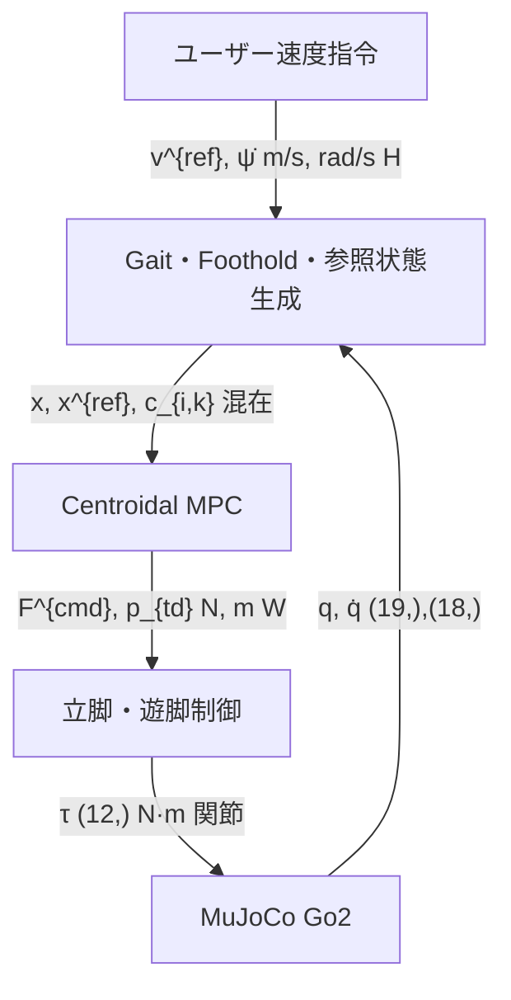

# Quadruped-PyMPC 理論・コード学習ガイド

## 1. 目的

このディレクトリは、`iit-DLSLab/Quadruped-PyMPC`を理論とコードの両面から理解し、Cursorで継続的に分析・更新するための学習・研究ノートである。

対象は、ユーザー速度指令からGait、Foothold、Centroidal MPC、立脚・遊脚制御、関節トルク、MuJoCo全身運動までの閉ループである。

本文（`00`–`19` と appendices A–F）が学習資料の正本である。照合の途中経過は[analysis-logs](analysis-logs/README.md)に残し、本文へ転記しない。

## 2. Quadruped-PyMPC本体との関係

本ノートは **wrapper リポジトリ `mpc_dog` 内の学習資料** である。制御コードの正本は次である。

| 層 | 場所 | 役割 |
|---|---|---|
| 入口 | `external/Quadruped-PyMPC/simulation/simulation.py` | `run_simulation()` |
| コントローラ | `external/Quadruped-PyMPC/quadruped_pympc/` | Gait、Foothold、MPC、Stance/Swing |
| Plant API | `.venv` の gym-quadruped 1.1.5 | `QuadrupedEnv`、Go2 XML |
| 上流 | [iit-DLSLab/Quadruped-PyMPC](https://github.com/iit-DLSLab/Quadruped-PyMPC) | 本treeはzip展開。`.git`なし |

ノートがコードと食い違ったら、コードを正とし、ノートを直す。制御コードは分析フェーズでは変更しない。

## 3. 対象CommitとBaseline

この更新で照合した対象:

- wrapper `mpc_dog` HEAD: `3adfad9f814c499fb996cf046c8fb4ac3a574e55`（`https://github.com/est2mzd/MPC_DOG.git`）
- Quadruped-PyMPC: `external/Quadruped-PyMPC`（git管理外。初版zip commentは `cc145a2`。現行treeとの同一性は未再ハッシュ）
- gym-quadruped 1.1.5（`.venv` の `site-packages/gym_quadruped`）
- Python 3.11.16 / MuJoCo 3.11.0 / CasADi 3.7.2 / acados_template 0.5.1
- 標準: `type='nominal'`、`gait='trot'`、`dt=0.002`、`mpc_frequency=100`（`simulation_params`）、`visual_foothold_adaptation='blind'`、`optimize_step_freq=False`
- Go2: gym同梱 `robot_model/go2/go2.xml`（`nq=19`, `nv=18`, `nu=12`）

`3adfad9` を PyMPC commit とした旧記の理由は[E](appendices/E_Corrections_and_Clarifications.md) §15。Menagerie Go2は上流参照であり実行時未ロード。[F](appendices/F_Open_Questions.md)。

ディスク上の他フラグは[16](16_Code_Map_and_Call_Graph.md) §4 と[C](appendices/C_Parameter_Index.md)。

## 4. 記述の区別

各章で次を混同しない。

| 区分 | 意味 | 置き場 |
|---|---|---|
| **実装事実** | 現行コードに存在する処理 | 各本文 |
| **理論** | 実装を説明する数式・原理 | 各本文。索引は[B](appendices/B_Equation_Index.md) |
| **推奨改善** | コードに無いが明示・堅牢にする案 | 「推奨改善」と明記 |
| **未確認事項** | 公開コードだけでは確定できない | [F](appendices/F_Open_Questions.md) |

標準経路に無いPlanner、速度再計画、Contact-implicitなどは **未実装** であり、推奨改善またはFである。旧説明の理由だけ[E](appendices/E_Corrections_and_Clarifications.md)。

## 5. 26ファイル一覧

| 順序 | ファイル | 目的 | 対応コード | 前提資料 | 次に読む資料 |
|---|---|---|---|---|---|
| 0 | [00_README.md](00_README.md) | 入口、経路、26ファイル、検証 | — | — | `02` または最短理解 |
| 1 | [01_MuJoCo_Go2_Plant_Model.md](01_MuJoCo_Go2_Plant_Model.md) | Go2 Plant | `go2.xml`, `quadruped_env.py` | `00` | `02` |
| 2 | [02_System_Architecture_and_Dataflow.md](02_System_Architecture_and_Dataflow.md) | 閉ループ境界・周期・最終確認 | `simulation.py`, wrapper | `00` | `03` または `16` |
| 3 | [03_User_Command_and_Reference_Generation.md](03_User_Command_and_Reference_Generation.md) | 指令と`ref_state` | `quadruped_env.py`, `wb_interface.py` | `02` | `04` |
| 4 | [04_Gait_Generator_and_Contact_Schedule.md](04_Gait_Generator_and_Contact_Schedule.md) | 位相と接地列 | `periodic_gait_generator.py` | `03` | `05` |
| 5 | [05_Foothold_Reference_and_Terrain_Adaptation.md](05_Foothold_Reference_and_Terrain_Adaptation.md) | 着地点と地形推定 | `foothold_reference_generator.py`, `terrain_estimator.py` | `04` | `06` |
| 6 | [06_Centroidal_SRBD_Model.md](06_Centroidal_SRBD_Model.md) | SRBD状態・力学 | `centroidal_model_nominal.py` | `01` | `07` |
| 7 | [07_MPC_Formulation.md](07_MPC_Formulation.md) | OCPコスト・制約・失敗 | `centroidal_nmpc_nominal.py` | `06` | `08` |
| 8 | [08_Gait_MPC_Coupling.md](08_Gait_MPC_Coupling.md) | \(c_{i,k}\) を力学へ入れる | 同上 + PGG | `04`, `06` | `09` |
| 9 | [09_MPC_Output_and_Receding_Horizon.md](09_MPC_Output_and_Receding_Horizon.md) | 先頭`u`、Mask、3段GRF | `srbd_controller_interface.py` | `07` | `10` |
| 10 | [10_Stance_and_Swing_Control.md](10_Stance_and_Swing_Control.md) | 立脚・遊脚トルク | `wb_interface.py`, swing | `09` | `11` |
| 11 | [11_Joint_Torque_and_MuJoCo_Closed_Loop.md](11_Joint_Torque_and_MuJoCo_Closed_Loop.md) | clip、`action`、`mj_step` | `simulation.py`, `env.step` | `10` | `12` または実験 |
| 12 | [12_Speed_Frequency_Duty_and_Stride.md](12_Speed_Frequency_Duty_and_Stride.md) | \(v=fL\)、周波数候補 | `config.py`, batched（標準OFF） | `04`, `05` | `13` |
| 13 | [13_Feasibility_on_Rough_Terrain.md](13_Feasibility_on_Rough_Terrain.md) | 3集合。標準は未実装交差 | VFA（標準OFF） | `05` | `14` |
| 14 | [14_MPC_and_Controller_Tuning.md](14_MPC_and_Controller_Tuning.md) | 症状と調整順 | `set_weight()`, `config.py` | `07` | `15` または `C` |
| 15 | [15_Automatic_Tuning_and_Sim_to_Real.md](15_Automatic_Tuning_and_Sim_to_Real.md) | 自動化ON/OFF、Outer未実装 | `config.py` | `14` | `18` |
| 16 | [16_Code_Map_and_Call_Graph.md](16_Code_Map_and_Call_Graph.md) | 関数木と無効経路 | wrapper全体 | `02` | `D` |
| 17 | [17_Cursor_Analysis_Workflow.md](17_Cursor_Analysis_Workflow.md) | Cursorでの分析手順 | — | `00`, `02`, `16` | 対象章 |
| 18 | [18_Experiments_and_Research_Roadmap.md](18_Experiments_and_Research_Roadmap.md) | 実験段階と公平比較 | ログ設計（未実装） | `02`, `14` | `19` |
| 19 | [19_Conversation_Coverage_Map.md](19_Conversation_Coverage_Map.md) | 論点→正本 | — | 本文一式 | 欠損確認 |
| A | [A_Variable_Dictionary.md](appendices/A_Variable_Dictionary.md) | 変数のshape/単位/frame | 閉ループ変数 | `02` | 対象章 |
| B | [B_Equation_Index.md](appendices/B_Equation_Index.md) | 数式→正本章 | 各章の対応コード | 理論経路 | 正本章 |
| C | [C_Parameter_Index.md](appendices/C_Parameter_Index.md) | 調整パラメータ | `config.py`, `set_weight()` | `14` | `07` |
| D | [D_File_Function_Index.md](appendices/D_File_Function_Index.md) | ファイル・関数1行 | 主要`.py` | `16` | 正本章 |
| E | [E_Corrections_and_Clarifications.md](appendices/E_Corrections_and_Clarifications.md) | 旧誤りの理由 | — | 本文 | 正本章 |
| F | [F_Open_Questions.md](appendices/F_Open_Questions.md) | 未確認・研究残 | — | 本文 | 実験または再照合 |

## 6. 学習経路

### 6.1 最短理解

```text
User command → Gait → MPC → GRF → Torque → MuJoCo
```

| 段階 | 資料 | コード |
|---|---|---|
| 全体の矢印 | [02](02_System_Architecture_and_Dataflow.md) | `run_simulation` → `compute_actions` |
| User command | [03](03_User_Command_and_Reference_Generation.md) | `_sample_ref_vel`, `target_base_vel` |
| Gait | [04](04_Gait_Generator_and_Contact_Schedule.md) | `PeriodicGaitGenerator.run`, `compute_contact_sequence` |
| MPC | [07](07_MPC_Formulation.md)、[09](09_MPC_Output_and_Receding_Horizon.md) | `Acados_NMPC_Nominal.compute_control` |
| GRF | [09](09_MPC_Output_and_Receding_Horizon.md) §6 | `SRBDControllerInterface` の Mask |
| Torque | [10](10_Stance_and_Swing_Control.md) | `compute_stance_and_swing_torque` |
| MuJoCo | [11](11_Joint_Torque_and_MuJoCo_Closed_Loop.md) | clip、`action`、`env.step` |

### 6.2 理論理解

```text
MuJoCo Plant → SRBD → MPC formulation → Gait coupling → Receding horizon → Stance/Swing
```

| 段階 | 資料 | コード |
|---|---|---|
| MuJoCo Plant | [01](01_MuJoCo_Go2_Plant_Model.md) | `go2.xml`, `QuadrupedEnv` |
| SRBD | [06](06_Centroidal_SRBD_Model.md) | `centroidal_model_nominal.forward_dynamics` |
| MPC formulation | [07](07_MPC_Formulation.md) | `set_weight`, `create_friction_cone_constraints` |
| Gait coupling | [08](08_Gait_MPC_Coupling.md) | 段ごと `solver.set(j,"p",...)` |
| Receding horizon | [09](09_MPC_Output_and_Receding_Horizon.md) | `get(0,"u")`, `perform_scaling` |
| Stance/Swing | [10](10_Stance_and_Swing_Control.md) | `-J.T @ F`, Cartesian PD |

### 6.3 研究・改造

```text
Logging → Tuning → Rough terrain → Auto-tuning → Gradient/Sampling比較 → Sim-to-Real
```

| 段階 | 資料 | コード |
|---|---|---|
| Logging | [18](18_Experiments_and_Research_Roadmap.md) §8 | `get_obs`, メモリ履歴。H5は`recording_path`時 |
| Tuning | [14](14_MPC_and_Controller_Tuning.md)、[C](appendices/C_Parameter_Index.md) | `set_weight()`, `gait_params` |
| Rough terrain | [13](13_Feasibility_on_Rough_Terrain.md)、[05](05_Foothold_Reference_and_Terrain_Adaptation.md) | 標準`blind`。VFAは非blind |
| Auto-tuning | [15](15_Automatic_Tuning_and_Sim_to_Real.md) | 標準ONは慣性再計算とfoothold optのみ。Outerは未実装 |
| Gradient/Sampling | [18](18_Experiments_and_Research_Roadmap.md) §4、[F](appendices/F_Open_Questions.md) | `type='sampling'`。Costは一致しない |
| Sim-to-Real | [15](15_Automatic_Tuning_and_Sim_to_Real.md)、[F](appendices/F_Open_Questions.md) | 実機重み・遅延は未確認 |

## 7. コード分析順序

Cursorに渡す順。毎回リポジトリ全体を渡さない。[17](17_Cursor_Analysis_Workflow.md)。

1. 本ファイル → [02](02_System_Architecture_and_Dataflow.md) → [16](16_Code_Map_and_Call_Graph.md)
2. `simulation.py` の1ループと `compute_actions`
3. [03](03_User_Command_and_Reference_Generation.md)–[11](11_Joint_Torque_and_MuJoCo_Closed_Loop.md)をCall graphの順に、対応`.py`だけ追加
4. 無効経路は[16](16_Code_Map_and_Call_Graph.md) §4で切る
5. 変数は[A](appendices/A_Variable_Dictionary.md)、関数は[D](appendices/D_File_Function_Index.md)

## 8. 実験開始順序

コードを変えずに記録を始める順。[18](18_Experiments_and_Research_Roadmap.md)。

1. Baseline固定（HEAD、tree識別、`config.py`、seed、scene）。平地歩行の評価は`scene='flat'`を明示する（ディスク既定は`perlin`）
2. ログ設計（18 §8）。制御ループへ新しい`if`を足さない
3. [14](14_MPC_and_Controller_Tuning.md) のA群だけ
4. 目標GRFと実GRFを分けて見る（[11](11_Joint_Torque_and_MuJoCo_Closed_Loop.md)）
5. 不整地・周波数候補・Sampling比較は、それぞれフラグを1つだけONにする

## 9. 概念図

22段の境界は[02](02_System_Architecture_and_Dataflow.md)。ここは概念だけ。



## 10. 座標系

- (W) world、(B) base、(H) heading（yawのみ）
- 記号の横断表は[A](appendices/A_Variable_Dictionary.md)
- 最終確認10問は[02](02_System_Architecture_and_Dataflow.md) §6

## 11. 解析ログと検証

- 照合証跡: [analysis-logs/README.md](analysis-logs/README.md)
- ユーザープロンプト原文: [analysis-logs/00_user_chat_prompts.md](analysis-logs/00_user_chat_prompts.md)
- 機械検証（標準ライブラリのみ）:

```text
python3 docs/qpympc-study/scripts/verify_study_docs.py
```

範囲と検出できないものは[scripts/README.md](scripts/README.md)。

## 12. Cursor入口

最初に本ファイル、`02`、`16`を読み、その後は対象章だけを足す。手順の正本は[17](17_Cursor_Analysis_Workflow.md)。論点の収録先は[19](19_Conversation_Coverage_Map.md)。

## 13. 口頭用スライド

定義と境界表の正本は本文である。口頭用は[slides/README.md](slides/README.md)。

| 資料 | 目的 |
|---|---|
| [05_md_visual_summary.pptx](slides/05_md_visual_summary.pptx) | 推奨速習。本文を犬の絵・力・時間・式で要約 |
| [06_md_visual_chapters.pptx](slides/06_md_visual_chapters.pptx) | 各本文を1枚の光景と1つの式に縮める |
| [01_quickstart_qpympc.pptx](slides/01_quickstart_qpympc.pptx) | 残置。`00` §6.1 の見出し順 |
| [02_deep_dive_qpympc.pptx](slides/02_deep_dive_qpympc.pptx) | 残置。`00`–`19` の `##` 順 |
| [03_md_summary_quick_qpympc.pptx](slides/03_md_summary_quick_qpympc.pptx) | 残置。先の Markdown 要約 |
| [04_md_summary_chapters_qpympc.pptx](slides/04_md_summary_chapters_qpympc.pptx) | 残置。先の章ごと要約 |

再生成手順は[slides/README.md](slides/README.md)。
