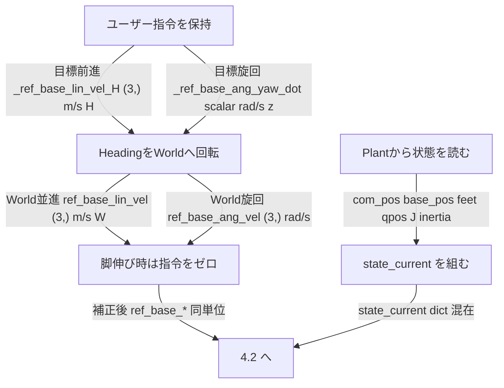
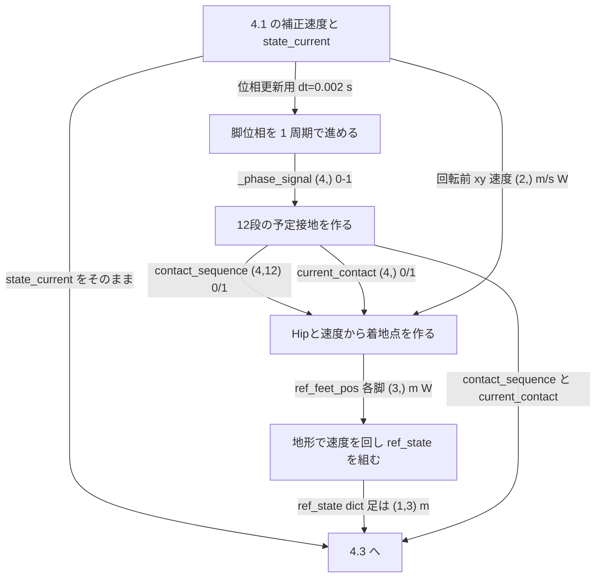
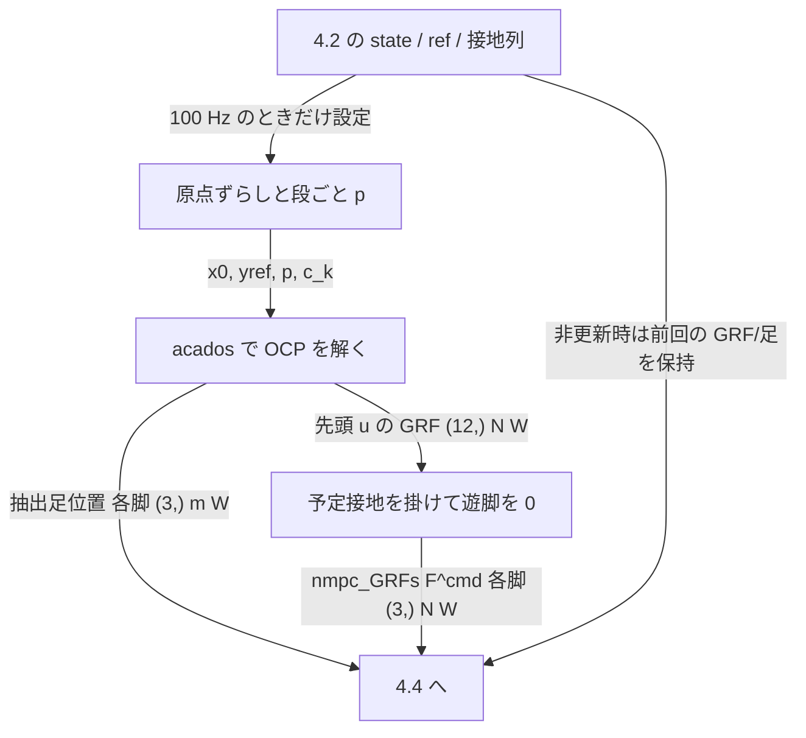
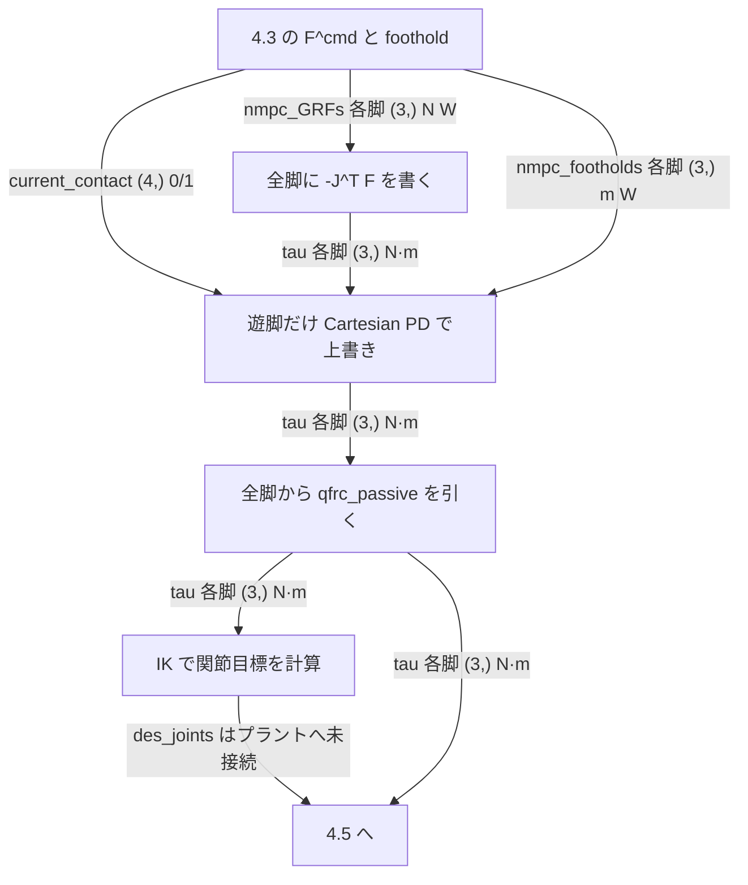
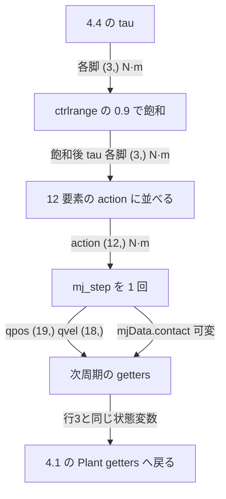

# System Architecture and Dataflow

## 1. 結論

標準シミュレーションは、ユーザーが胴体**速度**を指令し、Gait Generatorが接地予定、Foothold Generatorが着地点候補、MPCがGRFと足運び、立脚・遊脚制御が12関節トルクを生成し、MuJoCoが次状態を返す閉ループである。

本章が、ユーザー指令から次周期Feedbackまでの**境界データと実行順**の正本である。関数木と無効経路は[16](16_Code_Map_and_Call_Graph.md)。変数一覧は[A](appendices/A_Variable_Dictionary.md)。各段の式はリンク先の章。

標準設定: `type='nominal'`、`gait='trot'`、`dt=0.002`、`mpc_frequency=100`、`visual_foothold_adaptation='blind'`、`optimize_step_freq=False`、`velocity_modulator=True`。

## 2. 全体フロー（実行順）

1回の`run_simulation`ループでの呼出順である。番号は処理の意味、矢印はコード上の前後である。詳細は[16](16_Code_Map_and_Call_Graph.md)。

1. **User command**: 保持しているHeading速度を読む。初期化は`_sample_ref_vel()`。`_key_callback()`は`render()`登録時だけ。[03](03_User_Command_and_Reference_Generation.md)
2. **Heading/World変換**: `target_base_vel()`。[03](03_User_Command_and_Reference_Generation.md)
3. **Plant getters**: `feet_pos`、`com_pos`、`qpos`、`J`など。続く`state_current`の材料。
4. **Current state生成**: `update_state_and_reference`先頭で`state_current`を組む。その直前に`TerrainEstimator`（lift-off足）。[03](03_User_Command_and_Reference_Generation.md)、[05](05_Foothold_Reference_and_Terrain_Adaptation.md)
5. **Velocity modulation**: `VelocityModulator.modulate_velocities()`。標準ON。[03](03_User_Command_and_Reference_Generation.md)
6. **Gait phase更新**: `PeriodicGaitGenerator.run(0.002)`。戻り接触は捨てる。[04](04_Gait_Generator_and_Contact_Schedule.md)
7. **Contact sequence生成**: `compute_contact_sequence`。`current_contact = 先頭列`。[04](04_Gait_Generator_and_Contact_Schedule.md)
8. **Nominal foothold生成**: lift-off/touch-down更新のあと`compute_footholds_reference`。速度は地形回転**前**。[05](05_Foothold_Reference_and_Terrain_Adaptation.md)
9. **Terrain adaptation**: 標準`blind`ではVFAもHeightMapも走らない。制約は`None`。地形roll/pitchによる**速度回転**は次段で行う。[05](05_Foothold_Reference_and_Terrain_Adaptation.md)
10. **Reference state生成**: 並進指令を地形回転し`ref_state`を組む。[03](03_User_Command_and_Reference_Generation.md)
11. **MPC parameter/reference設定**: `step_num % 5 == 0`のときだけ。`perform_scaling`、遊脚足teleport、段ごと`p`。[09](09_MPC_Output_and_Receding_Horizon.md)
12. **MPC solve**: `Acados_NMPC_Nominal.compute_control`。[07](07_MPC_Formulation.md)
13. **GRF/Foothold抽出**: 先頭`u[12:24]`と足位置。[09](09_MPC_Output_and_Receding_Horizon.md)
14. **Contact mask**: \(F^{cmd}=c_{i,0}F^{MPC}\)。[09](09_MPC_Output_and_Receding_Horizon.md) §6
15. **Stance/Swing切替**: `current_contact[i]`。[10](10_Stance_and_Swing_Control.md)
16. **Stance torque**: 全脚に先に \(-J^\top F^{cmd}\)。[10](10_Stance_and_Swing_Control.md)
17. **Swing torque**: `current_contact==0`の脚が`tau`を上書き。その後全脚`tau -= qfrc_passive`。[10](10_Stance_and_Swing_Control.md)
18. **IK/Joint target**: `des_joints_*`を計算するが、標準ではプラントに足さない。[10](10_Stance_and_Swing_Control.md)
19. **Torque clipping**: `0.9 * actuator_ctrlrange`。組立の**前**。[11](11_Joint_Torque_and_MuJoCo_Closed_Loop.md)
20. **Torque assembly**: `action[legs_tau_idx.*] = tau.*`。[11](11_Joint_Torque_and_MuJoCo_Closed_Loop.md)
21. **MuJoCo step**: `env.step` → 1回`mj_step`。[11](11_Joint_Torque_and_MuJoCo_Closed_Loop.md)
22. **Contact/GRF取得と次周期Feedback**: 次ループのgettersが`qpos`/`qvel`を読む。`mjData.contact`は渡すが制御切替には使わない。実GRFは`render`時のviewer専用。[11](11_Joint_Torque_and_MuJoCo_Closed_Loop.md)、[A](appendices/A_Variable_Dictionary.md)

`start_and_stop`、周波数候補、VFA、RTI、関節PDは標準経路に無い。到達条件は[16](16_Code_Map_and_Call_Graph.md)。

## 3. 完全な境界表

矢印上のデータは「意味 / コード変数」である。次段入力は上段出力と同じ変数である。

| 順序 | 上流処理 | 出力データの意味 | コード変数 | Shape | 単位 | Frame | 下流処理 | 更新周期 |
|---|---|---|---|---|---|---|---|---|
| 1 | `_sample_ref_vel()` または `_key_callback()` | ユーザーの目標前進速度（Heading） | `_ref_base_lin_vel_H` | `(3,)` | m/s | H | `target_base_vel()` | reset。キーはイベント |
| 1 | 同上 | ユーザーの目標旋回速度 | `_ref_base_ang_yaw_dot` | scalar | rad/s | z | 同上 | 同上 |
| 2 | `target_base_vel(frame='world')` | Worldへ回した目標並進 | `ref_base_lin_vel` | `(3,)` | m/s | W | VM、Foothold（xyは回転前） | 500 Hzで読む |
| 2 | 同上 | World zの目標旋回 | `ref_base_ang_vel` | `(3,)` | rad/s | `[0,0,ψ̇]` | VM、`ref_state` | 500 Hzで読む |
| 3 | `QuadrupedEnv` getters | Plantの位置・速度・足・Jacobian・慣性 | `com_pos`, `base_*`, `feet_*`, `qpos`, `qvel`, `J`, `inertia` | [A](appendices/A_Variable_Dictionary.md) | 混在 | 主にW。角速度B | `update_state_and_reference` | 500 Hz |
| 4 | `TerrainEstimator` + dict組立 | MPCへ渡す現在胴体・足 | `state_current` | dict | 混在 | 主にW。角速度B | `compute_control` | 500 Hz |
| 5 | `VelocityModulator.modulate_velocities` | 脚が伸び過ぎなら指令をゼロにした速度 | 同名`ref_base_lin_vel`, `ref_base_ang_vel` | 同型 | 同単位 | W / W-z | Foothold、のち地形回転 | 500 Hz |
| 6 | `PeriodicGaitGenerator.run(0.002)` | 進めた脚位相 | `_phase_signal` | `(4,)` | 0–1 | なし | 接地列 | 500 Hz |
| 7 | `compute_contact_sequence` | 12段先までの予定接地 | `contact_sequence` | `(4,12)` | 0/1 | なし | MPC `p`、Mask | 500 Hz生成、MPCは100 Hzで読む |
| 7 | 先頭列抽出 | いま立脚か遊脚かの予定 | `current_contact` | `(4,)` | 0/1 | なし | Mask、Stance/Swing | 500 Hz |
| 8 | `compute_footholds_reference` | 幾何Heuristicの着地点 | `ref_feet_pos.*` | 各`(3,)` | m | W。zはlift-off z | `ref_state`足 | 500 Hz |
| 9 | 標準`blind` | 地形で足を動かさない | `ref_feet_constraints.*` | `None` | — | — | `ref_state` | 500 Hz |
| 10 | 地形回転 + dict組立 | MPC参照（速度は回転後、xy位置参照は0） | `ref_state` | dict。足`(1,3)` | 混在 | 並進速度は地形付き | `compute_control` | 500 Hz |
| 11–13 | `Acados_NMPC_Nominal.compute_control` | 内部目標GRFと足 | `optimal_GRF` / foothold配列 | `(12,)` / 4×`(3,)` | N / m | W | Mask | 100 Hz。非更新時は保持 |
| 14 | `SRBDControllerInterface` Mask | 遊脚をゼロにした指令GRF | `nmpc_GRFs.*` | 各`(3,)` | N | W | Stance | 100 Hz更新、500 Hzで使用 |
| 14 | 同上（抽出） | Swing終点の足位置 | `nmpc_footholds.*` | 各`(3,)` | m | W | Swing / IK | 同上 |
| 16 | 全脚 `-J.T @ nmpc_GRFs` | 立脚相当トルク（遊脚は次で上書き） | `tau.*` | 各`(3,)` | N·m | 関節 | Swing、clip | 500 Hz |
| 17 | Cartesian swing（遊脚のみ） | 上書き後の脚トルク | `tau.*` | 各`(3,)` | N·m | 関節 | clip | 500 Hz |
| 18 | IK | 関節目標（プラント未使用） | `des_joints_pos/vel` | 各`(3,)` | rad, rad/s | 関節 | コメントアウトPD | 500 Hz計算 |
| 19 | `np.clip` | 飽和した脚トルク | `tau.*` | 各`(3,)` | N·m | 関節 | 組立 | 500 Hz |
| 20 | index代入 | 12アクチュエータ指令 | `action` | `(12,)` | N·m | FL,FR,RL,RR × hip,thigh,calf | `env.step` | 500 Hz |
| 21 | `mj_step` | 次の配置と速度 | `qpos`, `qvel` | `(19,)`, `(18,)` | 混在 | MuJoCo | 次周期getters | 500 Hz |
| 21 | 接触ソルバー | 実接触列（制御切替には未使用） | `mjData.contact` | 可変 | 混在 | 接触 | 次周期引数。ESDは標準OFF | 500 Hz |
| 21 | `feet_contact_state(..., True)` | 実GRF（表示だけ） | `feet_GRF` | 各`(3,)` | N | W | viewer。MPCへ戻さない | `render`時のみ |
| 22 | 次ループ getters | 更新されたPlant状態 | 行3と同じ | 同左 | 同左 | 同左 | 行4へ | 500 Hz |

`ref_linear_velocity`はWorldのままでは入らない。Footholdは回転前xy、MPC参照は回転後。[03](03_User_Command_and_Reference_Generation.md)。

## 4. 分割Mermaid

各図は上から下。Optionalは図の外に書く。実GRFは図5の破線相当（制御へ戻らない）。

### 4.1 User commandから現在状態・補正速度

Optional: `_key_callback`はviewer登録時だけ。`start_and_stop`は標準未到達。

### 4.2 GaitとFoothold

Optional: 非`blind`のVFA/HeightMap。標準は`ref_feet_constraints=None`。

### 4.3 MPC内部

Optional: `optimize_step_freq`、RTI、`type!='nominal'`。[16](16_Code_Map_and_Call_Graph.md)。3段の意味は[09](09_MPC_Output_and_Receding_Horizon.md) §6。

### 4.4 Stance/Swing

Optional: 関節PD加算、関節空間Swing、ESD/Reflex。いずれも標準無効。

### 4.5 TorqueとMuJoCo Feedback

Optional / 非制御: `render=True`かつ壁時計約30 Hzのとき`feet_contact_state(..., True)`で実GRFを描く。制御ループへは戻さない。

## 5. 処理周期

既定は`simulation_params['dt']=0.002`、`mpc_frequency=100`。コードで読んだ値だけを書く。

| 処理 | 周期 | dt | 更新条件 | 非更新周期の保持値 |
|---|---|---|---|---|
| MuJoCo `mj_step` | 500 Hz | 0.002 s | 毎`env.step`で1回 | 次状態が`mjData`に残る |
| State取得（getters） | 500 Hz | 0.002 s | 毎`run_simulation`ループ | 無し（毎回読み直し） |
| Gait位相 `pgg.run` | 500 Hz | 0.002 s | 毎`update_state_and_reference` | `_phase_signal`が累積 |
| Contact sequence | 500 Hz生成 | lookaheadは 0.02 s×12 | 同上。MPCは100 Hzで読む | 生成は毎周期。solveは古い列を使わない（生成済み最新） |
| Foothold | 500 Hz | 0.002 s | 同上 | 無し（毎回再計算） |
| TerrainEstimator | 500 Hz | 内部フィルタあり | 同上 | roll/pitch/heightのフィルタ状態 |
| MPC solve | 100 Hz | OCP刻み 0.02 s | `step_num % round(1/(100*0.002)) == 0` すなわち `% 5 == 0` | `nmpc_GRFs`, `nmpc_footholds`, `nmpc_predicted_state` |
| Stance/Swing torque | 500 Hz | 0.002 s | 毎`compute_actions` | GRF/Footholdは保持値。`J`とSwing時間は現在値 |
| Rendering | 壁時計約30 Hz | — | `render=True`かつ`time.time()-last_render_time > 1/30`、または`step_num==1` | 前回のgeom id |
| Logging（メモリ） | 500 Hz | 0.002 s | 毎stepで`ep_*_history.append` | リストに蓄積 |
| Logging（H5） | episode末 | — | `recording_path is not None`のとき`append_trajectory` | 標準`__main__`は`recording_path`未指定で`h5py_writer is None` |

`state_obs_names = []`のため、`env.step`が返す`state`は観測を積んでいない。`get_obs()`は毎step呼ばれる。

## 6. 最終確認

1. **ユーザー入力は速度**である。目的地ではない。`ref_position`のxyは0。[03](03_User_Command_and_Reference_Generation.md)
2. **Trot位相を決めるのは PeriodicGaitGenerator**である。MPCは`c_{i,k}`を最適化しない。[04](04_Gait_Generator_and_Contact_Schedule.md)、[08](08_Gait_MPC_Coupling.md)
3. **MPCが決めるもの**: 予測ホライズン上の胴体・足位置と、先頭段の目標GRFおよび遊脚足の使い方（足速度入力）。出力として使うのはMask後GRFとFoothold。[09](09_MPC_Output_and_Receding_Horizon.md)
4. **MPCが決めないもの**: ユーザー速度指令、Trot位相、標準ではstep frequency、接触時刻の自由変更、12関節トルク、実接触力。[08](08_Gait_MPC_Coupling.md)、[12](12_Speed_Frequency_Duty_and_Stride.md)
5. **Stance脚のTorque**: \(\tau=-J^\top F^{cmd}\)。`F^{cmd}`はMask後`nmpc_GRFs`。[10](10_Stance_and_Swing_Control.md)
6. **Swing脚のTorque**: Cartesian軌道PD（同じPDが二重）で`tau`を上書き。その後全脚から`qfrc_passive`を引く。[10](10_Stance_and_Swing_Control.md)
7. **MPC GRFとMuJoCo GRF**: 前者はOCPの目標（Mask後が指令）。後者は接触ソルバーの\(\lambda\)で、viewer専用。制御へ戻さない。[11](11_Joint_Torque_and_MuJoCo_Closed_Loop.md)
8. **関節PDなしの立位閉ループ**: 胴体誤差 → \(F^{MPC}\) → \(F^{cmd}\) → \(\tau\) → 接触 → 次の胴体状態。[11](11_Joint_Torque_and_MuJoCo_Closed_Loop.md)
9. **Footholdだけでは足りない不整地条件**: 着地点が \(\mathcal S_{terrain}\cap\mathcal R_{kin}\cap\mathcal R_{time}\) の外にあるとき。標準blindは交差を取らない。速度・周波数・接地時刻の再計画が要る場合がある。[13](13_Feasibility_on_Rough_Terrain.md)
10. **周波数候補評価は目標速度を決めない**。標準はOFF。有効時も接触列と周波数penaltyであり、`v^{ref}`の決定ではない。[12](12_Speed_Frequency_Duty_and_Stride.md) §6

## 7. 標準実装にない上位機能

次は現行標準経路に無い。追加する場合は **推奨改善** である。

- 目的地からのGlobal path
- 障害物を避けるLocal path
- 地形に応じた速度再計画
- 速度域に応じた完全なGait自動切替
- 接触時刻とFootholdの完全同時最適化

足す場合の最低境界は`ref_base_lin_vel`と`ref_base_ang_vel`。[03](03_User_Command_and_Reference_Generation.md) §7。

## 8. Cursor確認課題

`compute_actions()`の全引数について、生成行と[A](appendices/A_Variable_Dictionary.md)の差分を、コード更新時に再照合する。
