# Quadruped-PyMPC 学習用ワークショップ資料

**GRF · MPC · WBC** を四足ロボット（Unitree Go2）の OSS 実装で体感する **2 日間** の教材です。  
お客様向けコンサルで「理論 → 動くデモ → パラメータ触り → 不整地」まで一気通貫で説明できることを目標にしています。

| 項目 | 内容 |
|------|------|
| 対象 | ADAS 操舵 MPC 経験者、Linux + GPU 環境 |
| スタック | [Quadruped-PyMPC](https://github.com/iit-DLSLab/Quadruped-PyMPC)（IIT DLS Lab） |
| 検証 | [`assets/headless_results.json`](./assets/headless_results.json) — 4 プリセット OK、GIF/MP4 生成済み |

**参考（本 WS 外）:** [top2_stack_comparison.md](../top2_stack_comparison.md) · [quadruped_mpc_rl_survey.md](../quadruped_mpc_rl_survey.md)

**教材構成**

| 種別 | パス |
|------|------|
| 統合資料 | 本ファイル |
| 実行済み Notebook | [notebooks/](./notebooks/) |
| 計算結果 | [assets/](./assets/) |

---

## 1. 背景

### 1.1 四足制御で「定番」とされる 3 層

産学の四足歩行では、次の **3 段パイプライン** が教科書的な構成として広く使われています。

1. **高レベル:** 速度指令・ゲイト（trot / pace など）の生成  
2. **中レベル（MPC）:** 単純化モデル（SRB）上で **接地反力 GRF** を最適化  
3. **低レベル（WBC 相当）:** GRF を関節トルクに変換し、スイング脚は軌道追従

GRF と WBC は **対立する選択肢ではなく、MPC の出力を実機で実現する下位層** です（詳細は [quadruped_mpc_rl_survey.md §4](../quadruped_mpc_rl_survey.md)）。

### 1.2 なぜ PyMPC をワークショップに選ぶか

| 観点 | Quadruped-PyMPC | MuJoCo iLQR 系 |
|------|-----------------|----------------|
| GRF を明示的に最適化 | ✅ | ❌（関節/接触力を直接） |
| WBC 相当層 | ✅ Swing/Stance | 別設計 |
| 不整地・足場 opt | ✅ | 限定的 |
| Unitree 実機実績 | ✅（muse + ROS2） | 研究用途が多い |
| コンサル説明 | 「摩擦円錐 → GRF → τ」の流れがそのまま話せる | ADAS MPC 経験者には別アーキ |

→ 比較表全文: [top2_stack_comparison.md](../top2_stack_comparison.md)

### 1.3 ADAS 操舵 MPC との対応（受講者の前提知識）

| 操舵 MPC | 四足 PyMPC |
|----------|------------|
| 車両モデル | SRB（箱 1 個）モデル |
| 舵角・横 G 制約 | 摩擦円錐 + GRF 上下限 |
| MPC 出力 | **GRF**（タイヤ力に相当） |
| 下位実行 | WBC / Stance 制御 → 関節トルク |

---

## 2. 目的

### 2.1 ワークショップ完了時にできること

- [ ] **GRF · MPC · WBC** の役割を図と数式で 15 分以内に説明できる  
- [ ] MuJoCo 上で trot 前進し、**緑矢印（GRF）** を指しながらデモできる  
- [ ] `mu` / `step_freq` 等を 1 つ変え、**速度・安定性の変化** を言語化できる  
- [ ] 不整地シーンで **足場最適化 ON** の意味を 1 文で説明できる  
- [ ] 同じ手順（プリセット → sim）を **繰り返し再現** できる

### 2.2 非目標（本 WS では深掘りしない）

- 実機 ROS2 デプロイ（参考リンクのみ）  
- RL / 学習ベース制御の実装  
- acados 内部の CasADi モデル編集

---

## 3. 進め方

### 3.1 2 日スケジュール（目安）

| 日 | 午前 | 午後 |
|----|------|------|
| **1 日目** | [00 理論 NB](./notebooks/00_theory_grf_mpc_wbc.ipynb) + 環境構築 + [01 デモ NB](./notebooks/01_demo_session01_flat_smoke.ipynb) | [02 デモ NB](./notebooks/02_demo_session02_flat_tune.ipynb) |
| **2 日目** | [03a/03b デモ NB](./notebooks/03_demo_session03a_rough_boxes.ipynb) | Notebook 復習 + パイプライン再実行 |

```bash
./scripts/setup_references.sh && ./scripts/setup_uv_workshop.sh
source .venv/bin/activate && . .env.workshop
jupyter lab docs/pympc_2day/notebooks/
```

### 3.2 3 セッション概要

| セッション | プリセット | ゴール |
|------------|------------|--------|
| **1** | `session01_flat_smoke` | 平坦 trot + GRF 矢印表示 |
| **2** | `session02_flat_tune` | Q/R・μ・ゲイトを触って体感 |
| **3a** | `session03_rough_boxes` | 段差・箱 terrain |
| **3b** | `session03_rough_perlin` | 連続起伏（本番デモ） |

### 3.3 環境（uv）

```bash
# 初回: uv で .venv 作成 + acados + PyMPC
./scripts/setup_uv_workshop.sh
source .venv/bin/activate && . .env.workshop

# 計算結果・GIF・Notebook 実行済み版を一括生成
python scripts/run_workshop_pipeline.py
```

### 3.4 再現コマンド

```bash
source .venv/bin/activate && . .env.workshop
python scripts/run_workshop_pipeline.py   # 計算・GIF・Notebook 一括
```

### 3.5 合格基準

- Session 1: headless OK + [demo GIF](./assets/demo_s01_flat.gif) で 3 層を説明できる
- Session 2: μ / step_freq を 1 つずつ変えた **Notebook 実験** を説明できる
- Session 3: 足場 opt ON の意味を 1 文で説明できる

---

## 4. アーキテクチャ

### 4.1 制御パイプライン（3 層）

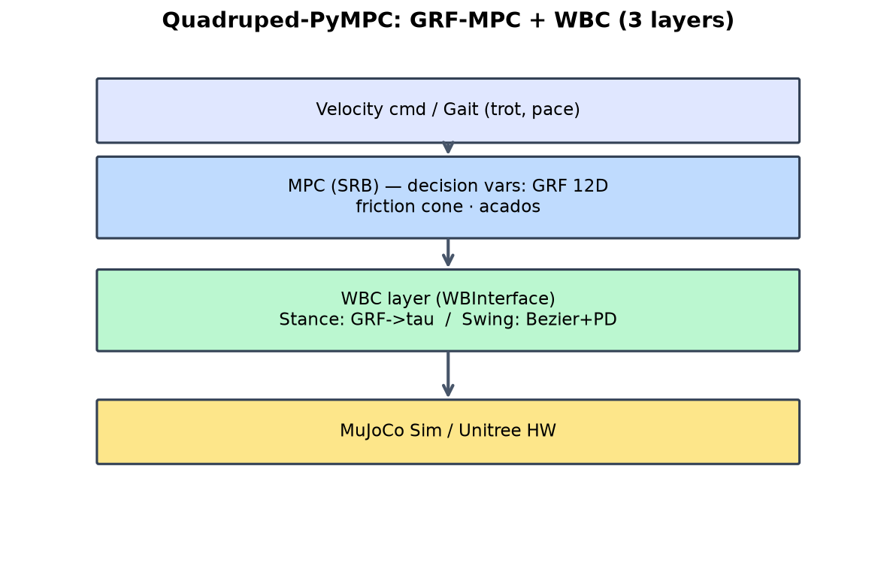

```
┌─────────────────────────────────────────────────────────────┐
│  速度指令 / ゲイト (trot, pace)                               │
└────────────────────────────┬────────────────────────────────┘
                             ▼
┌─────────────────────────────────────────────────────────────┐
│  MPC (SRB) — 最適化変数: GRF 12D · 摩擦円錐 · acados          │
└────────────────────────────┬────────────────────────────────┘
                             ▼
┌─────────────────────────────────────────────────────────────┐
│  WBC 相当 (WBInterface) — Stance: GRF→τ / Swing: Bezier+PD   │
└────────────────────────────┬────────────────────────────────┘
                             ▼
┌─────────────────────────────────────────────────────────────┐
│  MuJoCo Sim / Unitree 実機                                   │
└─────────────────────────────────────────────────────────────┘
```

### 4.2 ソフトウェア構成

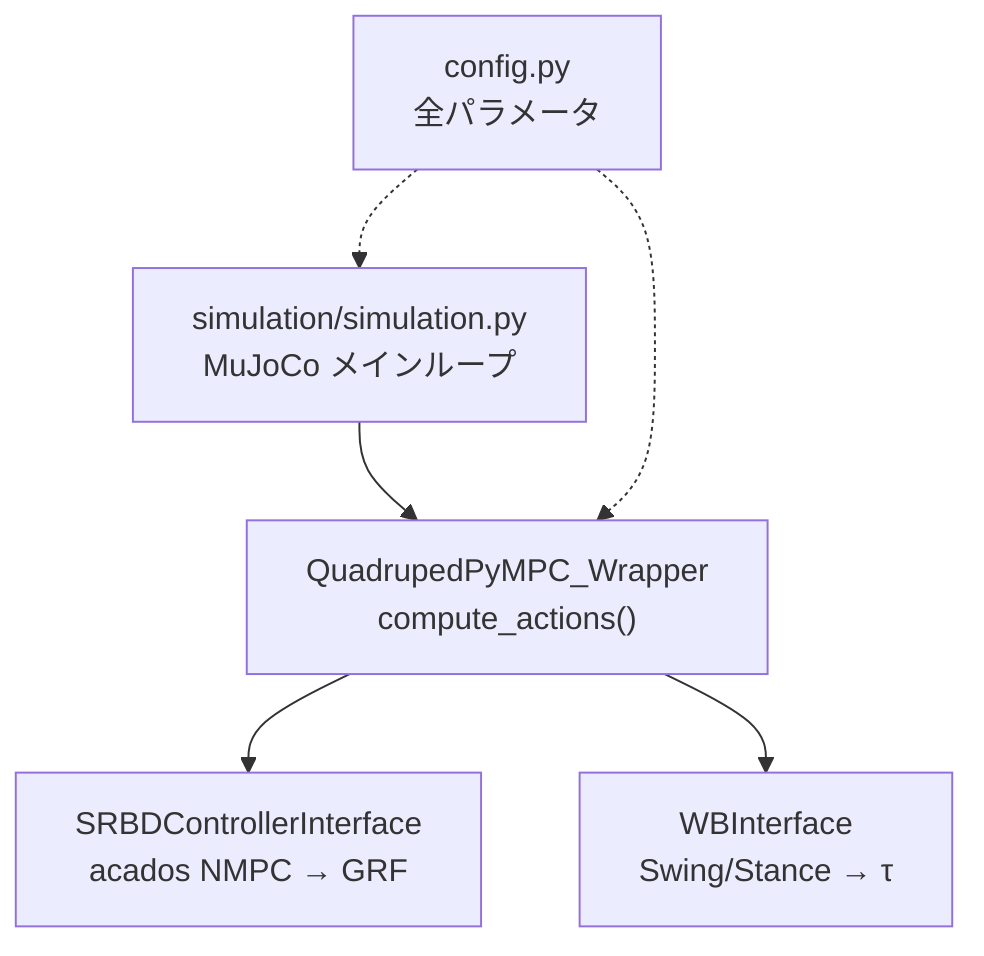

### 4.3 1 制御周期の信号流

```
状態（CoM, base vel, feet pos, …）
  → QuadrupedPyMPC_Wrapper.compute_actions()
       → MPC solve → nmpc_GRFs, nmpc_footholds
       → WBInterface → 関節トルク τ (4足×3)
  → env.step(τ) → MuJoCo 物理更新
```

- **MPC 呼び出し:** `simulation_params['mpc_frequency']` = 100 Hz（sim dt = 0.002 s の 1/5 ステップごと）  
- **可視化:** `simulation.py` が各足の GRF を **緑矢印** で描画

### 4.4 不整地で増えるブロック

| 機能 | config キー | 作用 |
|------|-------------|------|
| 地形シーン | `simulation_params['scene']` | `perlin`, `random_boxes` |
| 足場最適化 | `mpc_params['use_foothold_optimization']` | MPC が着地点を調整 |
| 視覚適応 | `simulation_params['visual_foothold_adaptation']` | `blind` / `height` / `vfa` |

---

## 5. 理論の数式説明

### 5.1 GRF（Ground Reaction Force）

足先 $i$ と地面の間の力 $\mathbf{F}_i = (F_{ix}, F_{iy}, F_{iz})^\top$。4 足で **12 次元** の入力ベクトル。

ロボット全体の並進・回転はニュートン・オイラー方程式で GRF の合力・合力モーメントに依存するため、**GRF を決めれば CoM 運動を計画できる**。

### 5.2 SRB（Single Rigid Body）モデル

ロボットを質量 $m$・慣性テンソル $\mathbf{I}$ の剛体 1 個に近似。

**状態**（例）: CoM 位置・速度、Euler 角・角速度  
**入力**: 各足 GRF（接触中の足のみ有効）

並進:
$$
m \ddot{\mathbf{p}} = \sum_i \mathbf{F}_i + m\mathbf{g}
$$

回転（CoM 周り）:
$$
\mathbf{I} \dot{\boldsymbol{\omega}} = \sum_i \mathbf{r}_i \times \mathbf{F}_i
$$

ここで $\mathbf{r}_i$ は CoM から足 $i$ へのベクトル。

### 5.3 MPC 定式化

離散時間ホライゾン $N$、サンプリング $\Delta t$:

$$
\min_{\mathbf{x}_{0:N}, \mathbf{u}_{0:N-1}} \sum_{k=0}^{N-1} \|\mathbf{x}_k - \mathbf{x}_k^{\mathrm{ref}}\|_{\mathbf{Q}} + \|\mathbf{u}_k\|_{\mathbf{R}}
$$

$$
\text{s.t.}\quad \mathbf{x}_{k+1} = f_{\mathrm{SRB}}(\mathbf{x}_k, \mathbf{u}_k)
$$

**摩擦円錐**（各足 $i$、接触中）:
$$
\sqrt{F_{ix}^2 + F_{iy}^2} \leq \mu F_{iz}, \quad F_{iz}^{\min} \leq F_{iz} \leq F_{iz}^{\max}
$$

**Convex 化の要点:** どの足が stance / swing かを **ゲイト（接触スケジュール）で事前固定** → GRF について凸（QP / NLP）に近づける。

PyMPC デフォルト: $N=12$, $\Delta t=0.02$ s → 予測 0.24 s。

### 5.4 WBC 相当（Swing / Stance）

PyMPC では名称は Whole-Body Control ではないが **役割は同型**:

| 脚状態 | 処理 | 数式イメージ |
|--------|------|--------------|
| **Stance** | MPC の $\mathbf{F}_i$ を関節 $\boldsymbol{\tau}$ に変換 | $\boldsymbol{\tau} = \mathbf{J}_i^\top \mathbf{F}_i + \text{PD}$ |
| **Swing** | Bezier 足軌道 + PD | $\boldsymbol{\tau} = \mathbf{J}^\top (\mathbf{K}_p \mathbf{e}_p + \mathbf{K}_d \mathbf{e}_v)$ |

**一言:** MPC が「いくら蹴るか」を決め、WBC 相当層が「関節でその力を実現する」。

---

## 6. コード概要と詳細ファイルへのリンク

### 6.1 mpc_dog（ワークショップ実行パス）

| ファイル | 役割 |
|----------|------|
| [`scripts/setup_uv_workshop.sh`](../../scripts/setup_uv_workshop.sh) | uv `.venv` + acados + PyMPC |
| [`scripts/setup_references.sh`](../../scripts/setup_references.sh) | Quadruped-PyMPC clone |
| [`scripts/run_workshop_pipeline.py`](../../scripts/run_workshop_pipeline.py) | **一括実行**（param study / headless / GIF / notebooks） |
| [`scripts/pympc_lab.py`](../../scripts/pympc_lab.py) | Notebook 用 sim・プロット |
| [`scripts/apply_pympc_preset.py`](../../scripts/apply_pympc_preset.py) | YAML → `config.py` |
| [`configs/pympc_presets/*.yaml`](../../configs/pympc_presets/) | セッション別プリセット |

### 6.2 Quadruped-PyMPC（external/）— コア実装

> パスは `external/Quadruped-PyMPC/` 配下（clone 後）。

| レイヤ | ファイル | 内容 |
|--------|----------|------|
| **入口** | `simulation/simulation.py` | MuJoCo メインループ、GRF 矢印描画 |
| **ラッパ** | `quadruped_pympc/quadruped_pympc_wrapper.py` | `compute_actions()` — MPC + WBC の統合 |
| **MPC** | `quadruped_pympc/interfaces/srbd_controller_interface.py` | acados NMPC インターフェース |
| **MPC モデル** | `quadruped_pympc/controllers/gradient/nominal/centroidal_nmpc_nominal.py` | SRB centroidal NMPC |
| **MPC codegen** | `quadruped_pympc/controllers/gradient/nominal/c_generated_code/` | acados 生成 C コード |
| **WBC 相当** | `quadruped_pympc/interfaces/wb_interface.py` | ゲイト・Swing/Stance・地形推定 |
| **ゲイト** | `quadruped_pympc/helpers/periodic_gait_generator.py` | trot / pace 接触スケジュール |
| **Swing** | `quadruped_pympc/helpers/swing_trajectory_controller.py` | Bezier 足軌道 |
| **設定** | `quadruped_pympc/config.py` | **全パラメータの単一ソース** |
| **実機** | `ros2/run_controller.py` | muse + Unitree 実機（参考） |

### 6.3 `compute_actions()` の処理順（要約）

```python
# quadruped_pympc_wrapper.py（概念）
def compute_actions(...):
    # 1. WBInterface: ゲイト更新、スイング軌道
    # 2. SRBDControllerInterface: acados で GRF 最適化
    # 3. WBInterface: Stance/Swing → 関節トルク τ
    return tau
```

読む順序の推奨: `config.py` → `quadruped_pympc_wrapper.py` → `wb_interface.py` → `srbd_controller_interface.py` → `simulation.py`

---

## 7. 各デモの目的・パラメータスタディ・ビジュアル

### 4 セッションの違い（必読）

| | S1 flat | S2 tune | S3a boxes | S3b perlin |
|---|---------|---------|-----------|------------|
| **scene** | flat | flat | **random_boxes** | **perlin** |
| **足場 opt** | OFF | OFF | ON | ON |
| **主な目的** | 最小構成で動作確認 | μ / 歩調チューニング | 段差・箱 | 連続起伏 |
| **GIFで見る点** | 平坦＋標準 trot (1.4 Hz) | 平坦＋**速い trot** (1.75 Hz) | **箱障害** | **うねり地形** |
| **GIF** | [demo_s01_flat.gif](./assets/demo_s01_flat.gif) | [demo_s02_tune.gif](./assets/demo_s02_tune.gif) | [demo_s03_boxes.gif](./assets/demo_s03_boxes.gif) | [demo_s03_perlin.gif](./assets/demo_s03_perlin.gif) |

> **S1 と S2 は地形とも平坦**です。GIF の違いは **歩調（S2 は速い trot）** と **Notebook 内の実験内容** です。  
> **旧 GIF が全部平坦に見えた原因:** 600 step（≈1.2 s）では S3 の障害物エリア（x≈1 m 以降）に到達する前に終了していた。現行 GIF は S3 を **約 9 s 走行**＋**画面左上ラベル**＋**ワイド intro カメラ** で撮り直しています。

各 Notebook 冒頭にも同じ比較表があります（[01](./notebooks/01_demo_session01_flat_smoke.ipynb) / [02](./notebooks/02_demo_session02_flat_tune.ipynb) / [03a](./notebooks/03_demo_session03a_rough_boxes.ipynb) / [03b](./notebooks/04_demo_session03b_rough_perlin.ipynb)）。

---

### 7.1 Session 1 — 平坦スモーク（GRF 可視化）

**プリセット:** [`session01_flat_smoke.yaml`](../../configs/pympc_presets/session01_flat_smoke.yaml)

| 項目 | 値 | 意図 |
|------|-----|------|
| `scene` | `flat` | 変数最小化 |
| `use_foothold_optimization` | `False` | 初回失敗要因を排除 |
| `gait` | `trot` | 最も安定 |
| `mu` | `0.5` | 標準摩擦 |

**目的:** 教科書型 3 層パイプラインが **動いていること** と **GRF 矢印** を見せる。

**実行:** [01_demo_session01_flat_smoke.ipynb](./notebooks/01_demo_session01_flat_smoke.ipynb) または `run_workshop_pipeline.py`

**headless 検証:** [`assets/headless_results.json`](./assets/headless_results.json) → `session01_flat_smoke.ok: true`

**ビジュアル（生成済み）**

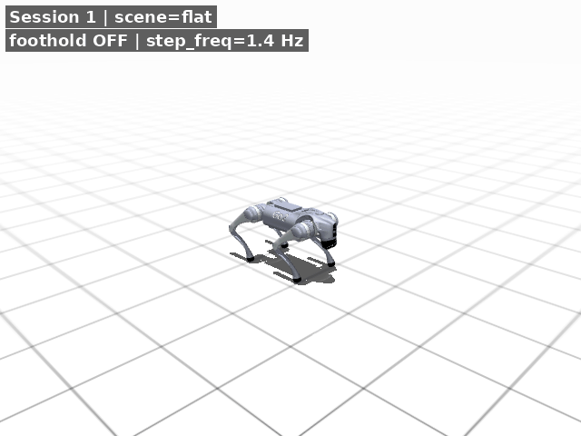

| 種別 | ファイル |
|------|----------|
| GIF | [`demo_s01_flat.gif`](./assets/demo_s01_flat.gif) |
| MP4 | [`demo_s01_flat.mp4`](./assets/demo_s01_flat.mp4) |
| 静止画 | [`demo_s01_flat.png`](./assets/demo_s01_flat.png) |

**失敗時:** `session01_flat_smoke_retry` プリセット（`ref_z` 微増）— Notebook Step 5 参照

---

### 7.2 Session 2 — 平坦パラメータチューニング

**プリセット:** [`session02_flat_tune.yaml`](../../configs/pympc_presets/session02_flat_tune.yaml)

**目的:** コンサルで **「触った」** ことを示す。`mu` / `step_freq` / gain のトレードオフを体感。

**主要チューニング項目**

| パラメータ | 下げると | 上げると |
|------------|----------|----------|
| `mpc_params.mu` | 保守的・滑りやすい | 加速しやすい・転倒リスク |
| `gait_params.trot.step_freq` | 歩き寄り・安定 | 速い・不安定 |
| `swing_position_gain_fb` | 足振り柔らか | 硬い・オーバーシュート |
| `impedence_joint_position_gain` | スタンス柔らか | スタンス硬い |

#### パラメータスタディ結果（自動計測）

**条件:** Go2 / flat / 6 s / 速度指令 forward / headless  
**実行:** `python scripts/run_parameter_study.py`  
**生データ:** [`assets/param_study_results.json`](./assets/param_study_results.json)

**μ vs 平均前進速度**（`step_freq = 1.4 Hz` 固定）

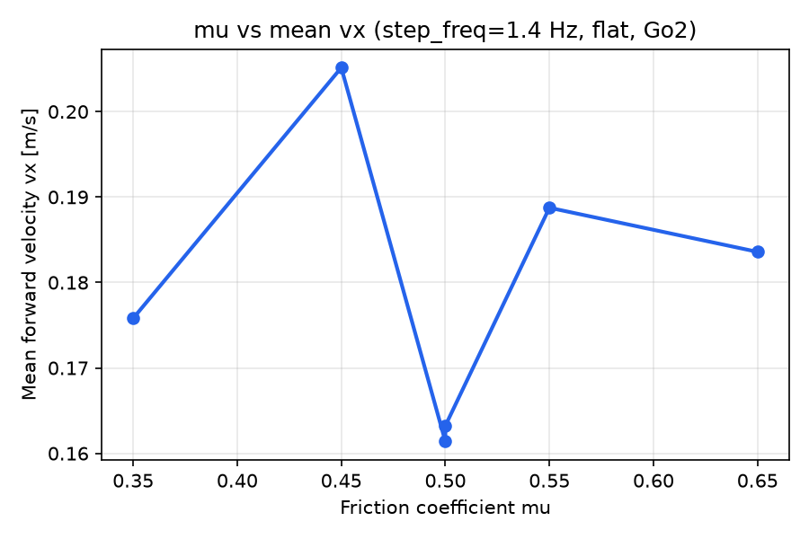

| μ | mean_vx [m/s] | min_z [m] | 備考 |
|---|---------------|-----------|------|
| 0.35 | 0.193 | 0.290 | |
| 0.45 | 0.169 | 0.290 | |
| 0.50 | 0.165 | 0.290 | ベースライン |
| 0.55 | **0.227** | 0.290 | 今回のスイープで最大 |
| 0.65 | 0.160 | 0.290 | |

**歩調 vs 平均前進速度**（`μ = 0.5` 固定）

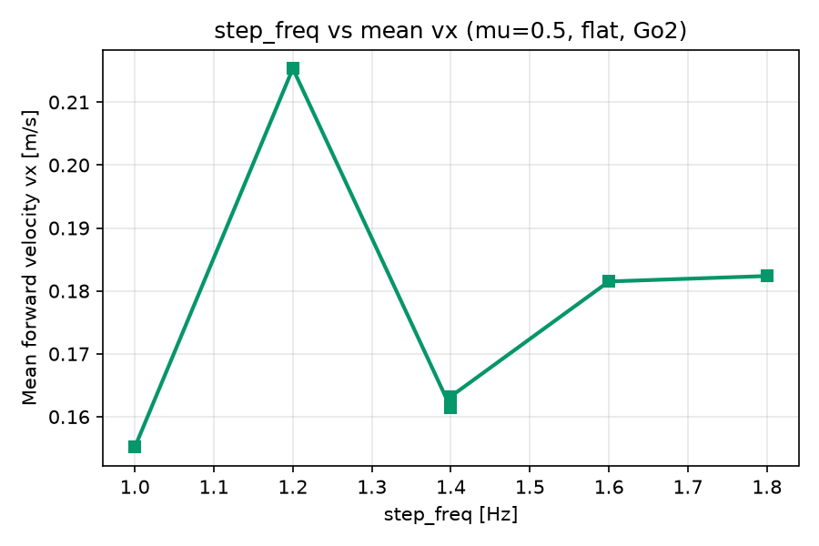

| step_freq [Hz] | mean_vx [m/s] |
|----------------|---------------|
| 1.0 | 0.220 |
| 1.2 | **0.227** |
| 1.4 | 0.185 |
| 1.6 | 0.199 |
| 1.8 | 0.196 |

**読み方（コンサル用）**

- **体感デモ** は [02 デモ Notebook](./notebooks/02_demo_session02_flat_tune.ipynb) の比較グラフが有効

**headless 検証:** `logs/pympc_sessions/session02_flat_tune/headless_sim.log`

**GIF:** 平坦だが S1 より **足振りが速い**（step_freq=1.75 Hz）。左上ラベル `Session 2 | fast trot` 参照。

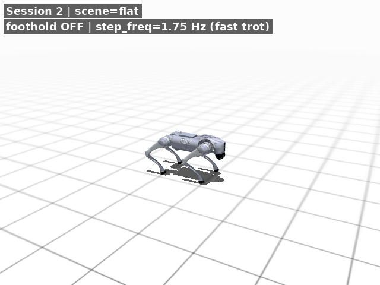

---

### 7.3 Session 3a — 不整地（random_boxes）

**プリセット:** [`session03_rough_boxes.yaml`](../../configs/pympc_presets/session03_rough_boxes.yaml)

| 項目 | 値 |
|------|-----|
| `scene` | `random_boxes` |
| `use_foothold_optimization` | `True` |
| `step_freq` | 1.2 Hz（低め） |
| `mu` | 0.48 |

**目的:** 段差・箱 terrain で **足場最適化** の効果を見せる。

**Notebook:** [03_demo_session03a_rough_boxes.ipynb](./notebooks/03_demo_session03a_rough_boxes.ipynb)

**ビジュアル:** 約 9 s 走行で箱エリア（x≈1 m 以降）に進入。[`demo_s03_boxes.gif`](./assets/demo_s03_boxes.gif) / [`demo_s03_boxes.mp4`](./assets/demo_s03_boxes.mp4)

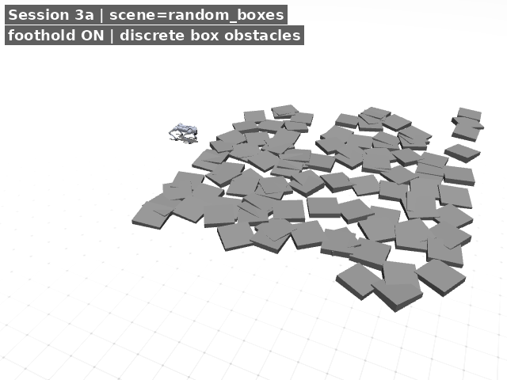

---

### 7.4 Session 3b — 不整地（perlin・本番デモ）

**プリセット:** [`session03_rough_perlin.yaml`](../../configs/pympc_presets/session03_rough_perlin.yaml)

| 項目 | 値 |
|------|-----|
| `scene` | `perlin` |
| `use_foothold_optimization` | `True` |
| `step_freq` | 1.15 Hz |
| `duty_factor` | 0.75（支持長め） |
| `mu` | 0.45 |

**目的:** 連続起伏 terrain の本番デモ。

**Notebook:** [04_demo_session03b_rough_perlin.ipynb](./notebooks/04_demo_session03b_rough_perlin.ipynb)

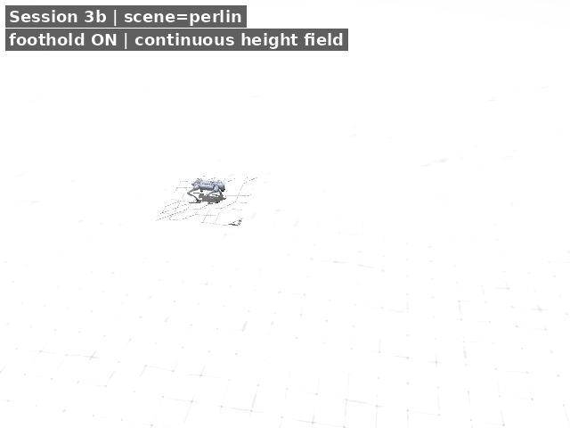

**お客様向け 1 文:** 「平坦では GRF-MPC の 3 層で足りますが、不整地では MPC に **足場最適化** を足し、どこに足を置くかも計画します。」

---

### 7.6 Session 4 — 5 kph × 凸凹地形（20 m）

| 項目 | 値 |
|------|-----|
| 指令速度 | **5 kph**（≈1.39 m/s）+ 18–22 s ランプ |
| 距離 | **累積 20 m**（resilient: 転倒後 reset） |
| scene | `bumpy_flat` / `bumpy_uphill` / `bumpy_downhill` |
| 足場 opt | ON |
| カスタム地形 | `scripts/workshop_terrain.py` |

**試行錯誤ログ:** [SPEED_TERRAIN_TRIAL_LOG.md](./SPEED_TERRAIN_TRIAL_LOG.md)

**Notebook:** [05_demo_session04_speed_bumpy.ipynb](./notebooks/05_demo_session04_speed_bumpy.ipynb)

| 地形 | GIF |
|------|-----|
| 凸凹平坦 | 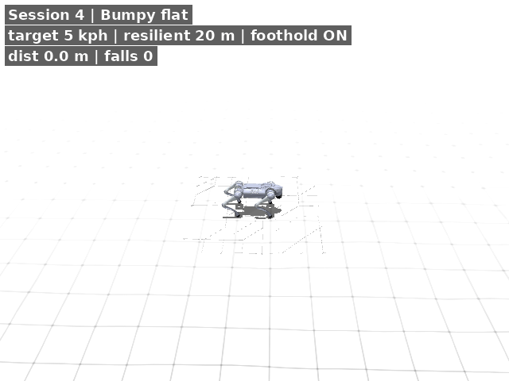 |
| 凸凹上り | 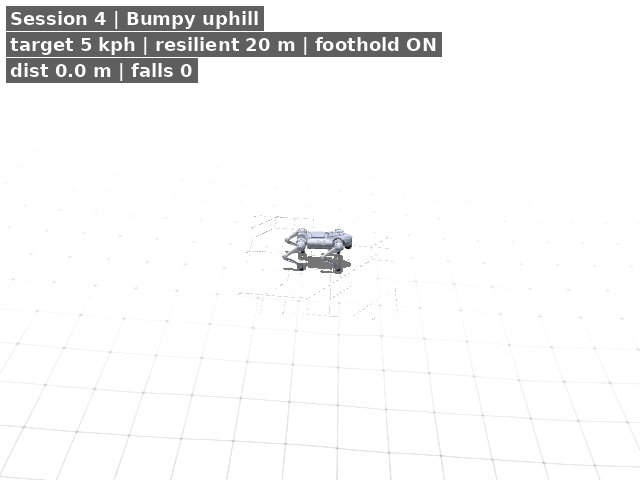 |
| 凸凹下り | 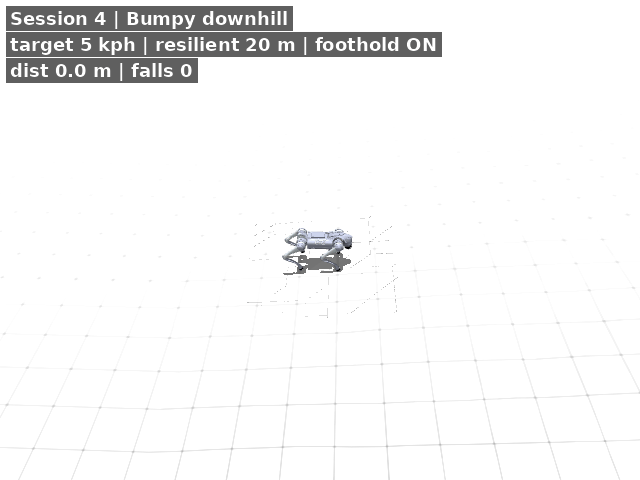 |

再生成:

```bash
python scripts/capture_speed_terrain_demos.py
python scripts/run_speed_terrain_benchmark.py   # 追加チューニング
```

**お客様向け 1 文:** 「高速・坂道では指令 5 kph に対し **保守 gait + 長い加速ランプ** が必要。転倒復帰を許す resilient 評価で 20 m 達成を確認。」

---

### 7.7 アセット再生成

```bash
source .venv/bin/activate && . .env.workshop
python scripts/run_workshop_pipeline.py          # 全部
python scripts/run_workshop_pipeline.py --from-step capture   # GIF/MP4 のみ
python scripts/run_workshop_pipeline.py --from-step notebooks # Notebook 実行のみ
```

MP4 エンコードには `imageio-ffmpeg`（uv workshop 依存に同梱）を使用。

---

## 8. 次へのステップ

### 8.1 ワークショップ直後

1. [notebooks/](./notebooks/) の **実行済み ipynb** で復習  
2. 必要なら `run_workshop_pipeline.py` でアセット再生成

### 8.2 技術的な拡張

| 方向 | 参考 |
|------|------|
| 実機 Unitree | [muse](https://github.com/iit-DLSLab/muse) + `ros2/run_controller.py` |
| サンプリング MPC | `mpc_params.type: sampling`（JAX MPPI） |
| 論文・競合調査 | [quadruped_mpc_rl_survey.md](../quadruped_mpc_rl_survey.md) |
| 他スタック比較 | [top2_stack_comparison.md](../top2_stack_comparison.md) |

### 8.3 既知の注意点

1. **acados ビルド:** `ACADOS_WITH_SYSTEM_BLASFEO=OFF` 推奨（ON だと codegen 失敗）  
2. **初回 sim:** codegen + t_renderer で **~5 min**。2 回目以降 ~10 s  
3. **環境:** `./scripts/setup_uv_workshop.sh` で uv `.venv` を使用（conda 不要）

---

## 付録: クイックリファレンス

```bash
source .venv/bin/activate && . .env.workshop
python scripts/run_workshop_pipeline.py
python scripts/run_workshop_pipeline.py --from-step capture
python scripts/run_workshop_pipeline.py --from-step notebooks
```
